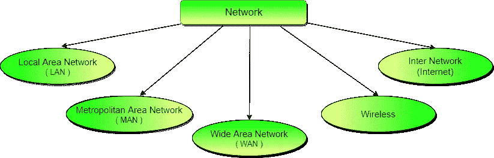
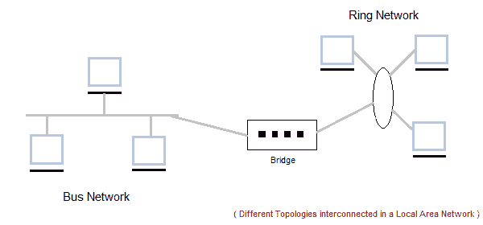
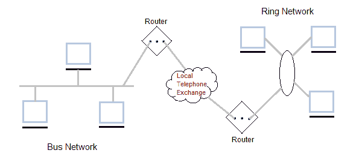
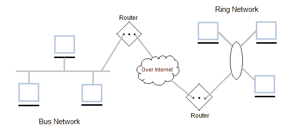
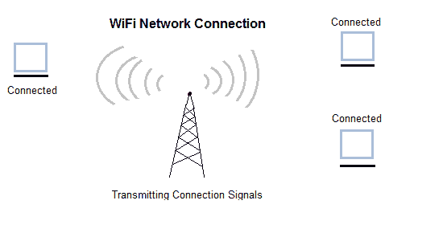
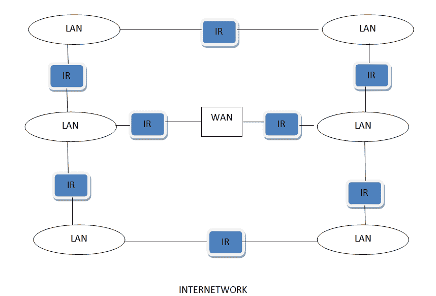

# 通信网络的类型

> 原文：<https://www.studytonight.com/computer-networks/types-of-networks>

通信网络可以分为以下 5 种类型:

1.  局域网
2.  城域网
3.  广域网
4.  无线电
5.  互联网

* * *

## 局域网

它也被称为局域网，设计用于小型物理区域，如办公室、一组建筑物或工厂。局域网被广泛使用，因为它易于设计和故障排除。个人计算机和工作站通过局域网相互连接。我们可以通过局域网使用不同类型的拓扑，它们是星形、环形、总线、树形等。

局域网可以是一个简单的网络，就像连接两台计算机一样，在彼此之间共享文件和网络，同时它也可以像互连整个建筑一样复杂。

局域网也被广泛用于共享资源，如打印机、共享硬盘等。

* * *

### 局域网的特点

*   局域网是私有网络，不受关税或其他监管控制。
*   与典型的广域网相比，局域网的运行速度相对较高。
*   局域网中有不同类型的媒体访问控制方法，最突出的是以太网、令牌环网。
*   它将计算机连接在一个建筑物、街区或校园中，即它们在一个有限的地理区域内工作。

* * *

### 局域网的应用

*   网络中的一台计算机可以成为一台服务器，服务于所有剩余的称为客户机的计算机。软件可以存储在服务器上，其余的客户端也可以使用。
*   本地连接一个建筑中的所有工作站，让它们在没有任何互联网接入的情况下在本地相互通信。
*   共享打印机等公共资源是局域网的一些常见应用。

* * *

### 局域网的优势

*   **资源共享:**打印机、调制解调器、DVD-ROM 驱动器和硬盘等计算机资源可以在局域网的帮助下共享。这降低了成本和硬件购买。
*   **软件应用程序共享:**通过网络使用相同的软件比通过网络为每个客户端购买单独的许可软件更便宜。
*   **简单廉价的通信:**数据和消息可以通过联网的计算机轻松传输。
*   **集中数据:**所有网络用户的数据都可以保存在服务器计算机的硬盘上。这将帮助用户使用网络中的任何工作站来访问他们的数据。因为数据不是本地存储在工作站上。
*   **数据安全:**由于数据集中存储在服务器计算机上，只需在一个地方管理数据就很容易，数据也更安全。
*   **互联网共享:**局域网提供了在所有局域网用户之间共享单一互联网连接的设施。在网吧，单一的互联网连接共享系统使上网费用更便宜。

* * *

### 局域网的缺点

*   **安装成本高:**虽然局域网由于共享计算机资源会随着时间的推移节省成本，但安装局域网的初始安装成本很高。
*   **隐私侵犯:**局域网管理员有权检查每个局域网用户的个人数据文件。此外，他可以查看局域网用户的互联网历史和计算机使用历史。
*   **数据安全威胁:**如果局域网管理员没有适当保护集中式数据存储库，未经授权的用户可以访问组织的重要数据。
*   **局域网维护作业:**局域网需要局域网管理员，因为局域网中存在软件安装或硬件故障或电缆干扰的问题。这项全职工作需要一名局域网管理员。
*   **覆盖有限区域:**局域网覆盖一个办公室、一栋楼或附近一组楼这样的小区域。

* * *

## 城域网

发展于 20 世纪 80 年代。基本上是更大版本的局域网。它也被称为城域网，使用与局域网相似的技术。它的设计覆盖了整个城市。它可以是将多个局域网连接成一个更大的网络，也可以是一根电缆。它主要由单一私营公司或上市公司持有和经营。

* * *

### 城域网的特点

*   一般覆盖城镇(50 公里)
*   用于城域网的通信介质有光纤、电缆等。
*   适合分布式计算应用的数据速率。

* * *

### 城域网的优势

*   极其高效，并通过高速载体(如光纤电缆)提供快速通信。
*   它为大型网络提供了良好的基础，并提供了对广域网的更多访问。
*   城域网中使用的双总线有助于同时双向传输数据。
*   一个人通常包括一个城市的几个街区或整个城市。

* * *

### 城域网的缺点

*   从一个地方到另一个地方的城域网连接需要更多的电缆。
*   很难使系统免受黑客和工业间谍(间谍)图形区域的攻击。

* * *

## 广域网

也叫广域网。广域网可以是专用网络，也可以是公共租赁网络。它用于覆盖大距离的网络，例如覆盖一个国家的州。设计和维护都不容易。广域网使用的通信媒介是 PSTN 或卫星链路。广域网以低数据速率运行。

* * *

### 广域网的特点

*   它通常覆盖很大的距离(州、国家、大陆)。
*   使用的通信媒介是由路由器连接的卫星公共电话网络。

* * *

### 广域网的优势

*   覆盖很大的地理区域，因此长途业务可以在一个网络上连接。
*   与连接的工作站共享软件和资源。
*   消息可以非常快速地发送给网络上的任何其他人。这些邮件可以包含图片、声音或数据(称为附件)。
*   昂贵的东西(如打印机或连接到互联网的电话线)可以由网络上的所有计算机共享，而不必为每台计算机购买不同的外围设备。
*   网络上的每个人都可以使用相同的数据。这避免了一些用户可能拥有比其他用户更老的信息的问题。

* * *

### 广域网的缺点

*   需要一个好的防火墙来限制外人进入和破坏网络。
*   建立网络可能是一项昂贵、缓慢且复杂的工作。网络越大越贵。
*   一旦建立，维护网络是一项全职工作，需要雇用网络主管和技术人员。
*   当许多不同的人有能力使用来自其他计算机的信息时，安全性是一个真正的问题。防范黑客和病毒增加了复杂性和费用。

* * *

## 无线网络

数字无线通信不是一个新的想法。早些时候，**莫尔斯电码**被用来实现无线网络。现代数字无线系统性能更好，但基本思想是一样的。

无线网络可以分为三大类:

1.  **系统互联**
2.  **无线局域网**
3.  **无线广域网**

* * *

### 系统互连

系统互连就是使用**短程无线电**将计算机的各个组件互连起来。一些公司联合起来设计了一个名为**蓝牙**的短程无线网络，将显示器、键盘、鼠标和打印机等各种组件连接到主机上，无需电线。蓝牙还允许数码相机、耳机、扫描仪和其他设备只需进入范围内就可以连接到计算机。

最简单的形式是，系统互连网络使用主从概念。系统单元通常是**主控**，与鼠标、键盘等对话。作为**的奴隶**。

* * *

### 无线局域网

在这些系统中，每台计算机都有一个**无线电调制解调器**和**天线**，通过它们可以与其他系统通信。无线局域网在小型办公室和家庭中越来越普遍，在这些地方安装**以太网**被认为太麻烦了。无线局域网有一个标准叫做 **IEEE 802.11** ，大多数系统都实现了这个标准，而且这个标准正在变得非常普遍。

* * *

### 无线广域网

用于蜂窝电话的无线电网络是低带宽无线广域网的一个例子。这个体系已经经历了三代。

*   第一代是模拟的，只用于语音。
*   第二代是数字的，只用于语音。
*   第三代是数字的，用于语音和数据。

* * *

## 英特尔网络

互联网是两个或多个网络的组合。内部网络可以通过路由器、网关和网桥等各种设备将两个或多个单独的网络连接起来而形成。

* * *

* * *