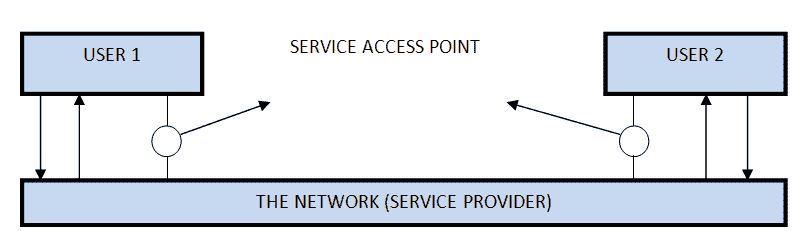

# 面向连接和无连接的服务

> 原文：<https://www.studytonight.com/computer-networks/connection-oriented-and-connectionless-service>

这是两个由层提供给它们上面的层的服务。这些服务是:

1.  面向连接的服务
2.  无连接服务

* * *

## 面向连接的服务

面向连接的服务的用户需要遵循一系列的操作。这些是:

1.  连接建立。
2.  信息被发送。
3.  连接被释放。

在面向连接的服务中，我们必须在开始通信之前建立连接。当连接建立时，我们发送消息或信息，然后释放连接。

面向连接的服务比无连接的服务更可靠。如果接收端出现错误，我们可以在面向连接的服务中发送消息。面向连接的例子是传输控制协议。

* * *

## 无连接服务

它类似于邮政服务，因为它承载着邮件(信件)的完整地址。每条消息都独立地从源路由到目的地。发送消息的顺序可以不同于接收消息的顺序。

在无连接的情况下，数据从源向目的地单向传输，而不检查目的地是否还在，也不检查它是否准备接受消息。在这种情况下不需要身份验证。无连接服务的例子是 UDP(用户数据报协议)协议。

* * *

### 区别:面向连接和无连接服务

1.  面向连接的服务需要认证，而无连接的服务不需要任何认证。
2.  面向连接的协议建立连接，检查是否收到消息，如果出现错误，则再次发送，而无连接服务协议不保证消息传递。
3.  面向连接的服务比无连接的服务更可靠。
4.  面向连接的服务接口是基于流的，无连接的是基于消息的。

* * *

### 什么是服务原语？

服务由用户进程访问服务时可用的一组原语(操作)正式指定。这些原语告诉服务执行一些动作或报告对等实体采取的动作。如果协议栈通常位于操作系统中，那么原语通常是系统调用。这些调用导致内核模式陷入陷阱，然后内核模式将机器的控制权移交给操作系统，以发送必要的数据包。可用的原语集取决于所提供服务的性质。面向连接服务的原语不同于无连接服务的原语。有五种类型的服务原语:

1.  **LISTEN :** 当服务器准备好接受传入连接时，它会执行 LISTEN 原语。它会阻止等待传入的连接。
2.  **CONNECT :** 它通过建立连接来连接服务器。等待回应。
3.  **receive:**然后 receive 调用阻塞服务器。
4.  **发送:**然后客户端执行发送原语来发送其请求，然后执行接收来获得回复。发送消息。
5.  **DISCONNECT :** 该原语用于终止连接。在这种原始状态之后，一个人不能发送任何信息。当客户端发送 DISCONNECT 数据包时，服务器也会发送 DISCONNECT 数据包来确认客户端。当客户端收到服务器包时，该过程终止。

* * *

#### 面向连接的服务原语

面向连接的服务有 5 种基本类型:

| 听 | 阻止等待传入的连接 |
| 关系 | 与等待的对等方建立连接 |
| 接收 | 阻止等待传入消息 |
| 派遣 | 向对等方发送消息 |
| 拆开 | 终止连接 |

* * *

#### 无连接服务原语

面向无连接服务有 4 种基本类型:

| 统一日期 | 这个原语发送一个数据包 |
| 设施，报告 | 用于查询网络性能的原语，如交付统计。 |

* * *

### 服务与协议的关系

在本节中，我们将了解服务和协议是如何相关的，以及它们为什么对彼此如此重要。

#### 什么是服务？

这些是在[OSI参考模型](/computer-networks/complete-osi-model)中，一个层可以向它上面的层提供的操作。它定义了操作并声明一个层已经准备好执行，但是它没有指定任何关于这些操作的实现。

#### 什么是协议？

这些是管理服务器和客户端之间交换的帧、消息或数据包的格式和含义的一组规则。

* * *

* * *