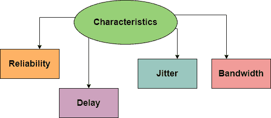

> 原文：<https://www.studytonight.com/computer-networks/quality-of-serviceqos>

# 服务质量

在本教程中，我们将介绍计算机网络中服务质量的概念。

**服务质量(QoS)** 基本上是对不同的应用、用户或数据流提供不同优先级的能力，或者是为了保证数据流有一定的性能水平。

换句话说，我们也可以将**服务质量**定义为流程想要达到的东西。

QoS 基本上是计算机网络的整体性能。网络的性能主要由网络用户来看。

让我们先了解一下流程的特征:

## 流动特性

下面给出了主要归因于流量的四种类型的特征，如下所示:

*   可靠性

*   耽搁

*   振动

*   带宽

### 可靠性

这是流量需要的主要特征之一。如果缺乏可靠性，那么这仅仅意味着丢失任何分组或丢失确认，因为这需要重传。

可靠性对于电子邮件、文件传输和互联网访问变得更加重要。

### 耽搁

流的另一个特征是源和目的地之间的传输延迟。在音频会议、电话会议、视频会议和远程会议期间，应该有最小的延迟。

### 振动

基本上属于同一流的包的延迟变化。因此，抖动基本上是数据包延迟的变化。抖动值越高意味着延迟越大，抖动越低意味着变化越小。

### 带宽

不同的应用需要不同的带宽。

## 如何实现服务质量？

让我们进入一些细节并说，您的组织想要实现服务质量，这可以通过使用一些工具和技术来完成，如**抖动缓冲**和**流量整形**。

### 抖动缓冲器

这是一个**临时存储缓冲器**，用于存储传入的数据包，它用于**基于数据包的网络**中，以确保数据流的**连续性不受干扰，它通过在网络拥塞期间**平滑数据包到达**的时间来做到这一点。**

### 流量整形

这种技术也被称为**分组整形**是一种**拥塞控制或管理技术**，通过延迟最不重要或最不必要的数据分组的流动来帮助调节网络数据传输。

当组织与其网络服务提供商签署服务级别协议时，服务质量包含在协议中，以保证所选的性能级别。

## 有两种类型的服务质量解决方案:

1.  <u>**无状态解决方案:**</u> 这里，不要求服务器将服务器信息或会话细节保存或存储到自身。**路由器**没有保持关于流量的细粒度状态，一个积极的因素是，它是**可扩展和健壮的**。但是，它的服务也很弱，因为在我们遇到的特定应用中**无法保证性能延迟的种类**。在无状态解决方案中，服务器和客户端是**松散耦合的**，可以进行操作。

2.  <u>**有状态解决方案:**</u> 在这里，服务器需要维护**当前状态和会话信息**，**路由器维护每流状态**，因为流在提供服务质量方面非常重要，服务质量提供了有保证的服务和高资源利用率等强大的服务，提供了保护，并且远没有**那么可扩展和健壮**。这里，服务器和客户端是**紧密绑定的**。

## 服务质量参数:

服务质量可以通过使用几个参数来定量测量

*   **丢包:**发生在网络链路拥塞，路由器和交换机开始丢弃数据包的时候。当这些数据包在实时通信(如音频或视频)过程中丢失时，这些会话可能会出现抖动和语音间隙。

*   **抖动:**由于网络拥塞、时间漂移和路由变化而出现。此外，过多的抖动会降低音频通信的质量。

*   **延迟:**是数据包从源传输到目的地所花费的时间延迟。对于一个优秀的系统，延迟应该尽可能低，理想情况下，应该接近零。

*   **带宽:**是网络信道在一定时间内通过信道传输最大可能数据的能力。服务质量通过管理带宽和为那些与其他应用程序相比需要更多资源的应用程序设置优先级来优化网络。

*   **平均意见得分:**这是一个音频质量评分指标，采用五分制，五分表示最高或最好的质量。

## 实施服务质量:

我们可以通过以下三种现有模式实施服务质量:

1.  **尽力而为**:如果我们应用这个模型，那么这意味着我们对所有的数据包进行同等的优先级排序。但是既然我们都这样设置优先级顺序，那么就不能保证所有的数据包都会被传递，但是它会尽最大努力传递所有的数据包。需要记住的一点是，当网络没有配置服务质量策略或网络基础设施不支持服务质量时，应采用尽力而为模式。

2.  **综合服务**:或者说 IntServ，这个 QoS 模型保留了网络上特定路径的带宽。应用程序要求网络为自己预留资源，同时网络设备监控数据包的流动，以确保网络资源能够接受数据包。需要记住的是:在实现集成服务模型时，支持 IntServ 的路由器和资源预留协议是必要的。该模型扩展性有限，网络资源消耗高。

3.  **差异化服务**:在这个 QoS 模型中，路由器、交换机等网元被配置为以不同的优先级顺序服务多类流量。公司可以根据其需求对网络流量进行分类。例如，为音频流量分配更高的优先级等。

让我们了解集成服务和差异化服务之间的区别:

| 综合服务 | 差异化服务 |
| --- | --- |
| 该体系结构主要规定了保证网络服务质量的要素。 | 该体系结构主要指定了一种简单且可扩展的机制，用于对网络流量进行分类和管理，并在现代 IP 网络上提供服务质量。 |
| 这些服务主要涉及在发送之前预先预留资源，以实现服务质量。 | 这些服务用优先级标记数据包，然后将其发送到网络，并且没有预先预留的概念。 |
| 它也被称为 IntServ。 | 它也被称为 DiffSer。 |
| 这些是不可伸缩的 | 这些是可扩展的。 |
| 这些包括每个流程的设置 | 这些涉及长期设置 |
| 在这种情况下，端到端服务范围是可用的。 | 这个领域涉及服务范围 |

* * *

* * *