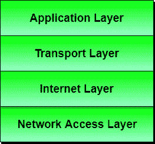

# 计算机网络中的参考模型

> 原文：<https://www.studytonight.com/computer-networks/reference-models-in-computer-networks>

在本教程中，我们将介绍计算机网络中的参考模型。

在过去的几十年中，许多构建的网络使用不同的硬件和软件实现，因此它们是不兼容的，因此使用不同规范的网络很难相互通信。

为了解决这个问题:网络不兼容，无法相互通信。OSI 研究了各种网络方案。之后，他们认识到有必要创建一个网络模型，帮助供应商创建网络的互操作实现。

现在让我们了解什么是参考模型？

## 参考模型

它是一种概念布局，主要用于描述设备之间的通信应该如何发生。

*   参考模型的主要优势之一是它定义了构建网络组件的标准，从而允许多供应商开发。

*   参考模型定义了应该在模型的每一层执行哪些功能，因此它们促进了标准化。

最重要的参考模型有:

1.  OSI 参考模型。

2.  TCP/IP 参考模型。

## OSIOSI 模型简介

有许多用户使用计算机网络，分布在世界各地。确保国家和世界范围的数据通信。)开发了这个模型。这被称为开放系统互连模型，通常被称为开放系统互连模型。OSI 模型架构由七层组成。它在一个完整的通信系统中定义了七个层次。这七层相互连接。OSI 参考模型将在另一章中详细解释。

OSI 模型的七层如下:

*   物理层

*   数据链路层

*   网络层

*   传输层

*   会话层

*   表示层

*   应用层

## TCP/IP 参考模型介绍

TCP/IP 是传输控制协议和互联网协议。协议是一套管理互联网上所有可能的通信的规则。这些协议描述了主机或互联网之间的数据移动，并提供了简单的命名和寻址方案。

TCP/IP 参考模型将在另一章中详细解释。

TCP/IP 模型中的层如下:

*   网络接入层

*   互联网层

*   传输层

*   应用层

* * *

* * *