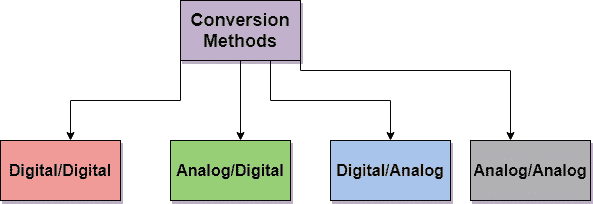
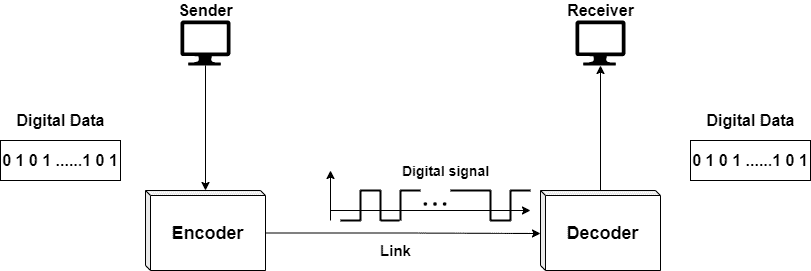
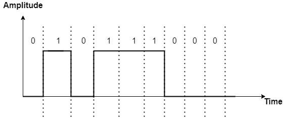
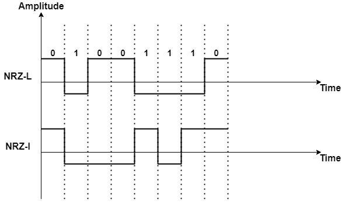
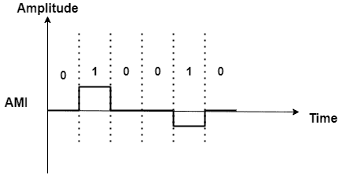
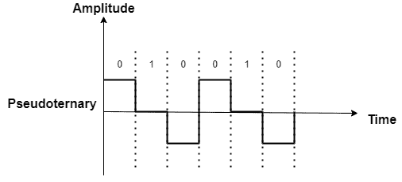
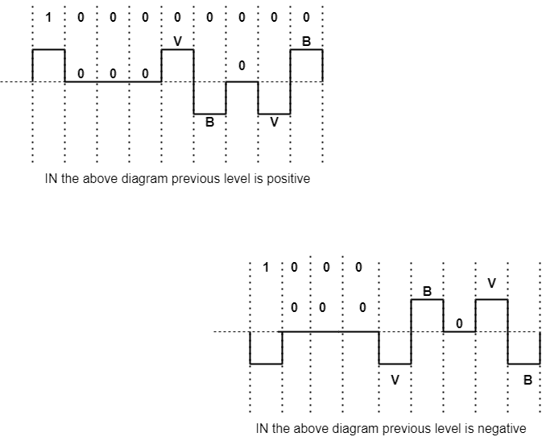
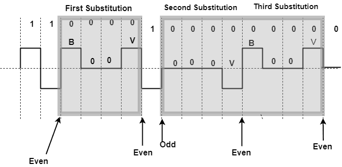

> 原文：<https://www.studytonight.com/computer-networks/digital-transmission>

# 数字传输

在本教程中，我们将介绍计算机网络中数字传输的概念。

正如我们在之前的教程中已经告诉您的那样，数据以模拟或数字两种形式表示。计算机只能理解 0 或 1 形式的二进制语言，并且还以数字形式存储信息。

因此，我们需要将数据转换成数字形式，以便计算机能够理解。

下面给出了用于数据传输的转换方法:

*   数字到数字转换

*   模数转换

*   数模转换

*   模数转换

因为我们想把数据转换成数字形式。因此，我们将讨论**数字-数字转换**和**模拟-数字转换**

## 1.数字到数字转换

正如我们已经告诉你的，数据可以是模拟形式，也可以是数字形式。因此，让我们学习如何以数字信号的形式表示数字数据。

用于这种转换的三种技术如下:

*   线路编码

*   分组编码

*   登山

## 线路编码

它是用于将数字数据转换为数字信号的过程。让我们假设数据是以文本、数字、音频或视频的形式存在的，并且它是以位序列的形式存储在计算机中的。因此，行编码过程将比特序列转换成数字信号。

在发送端，数字数据被编码成数字信号，而在接收端，数字数据通过解码数字信号被重新创建。

上图显示了线路编码和解码

线路编码方案可以大致分为五类:

*   单极的

*   极地的

*   双极的

*   多层次的

*   多重过渡

### 单极方案

在这种线路编码方案中，所有信号电平都在时间轴的一侧。它可以在上面，也可以在下面。基本上，单极方案被设计为**不归零(NRZ)** 方案，其中**正电压定义位 1** ，零电压定义位 0。

单极性方案仅使用一个电压电平。之所以称之为 **NRZ** ，是因为信号在比特中间没有归零。

单极核管制区方案

这种编码方案价格低廉，易于实现。

### 极地方案

在这种线路编码方案中，电压位于时间轴的两侧。我们举个例子:0 的电压电平可以是正的，1 的电压电平可以是负的。

因此，在极性 NRZ 编码中，我们使用了两个电平的电压幅度。

极地自然资源保护区有两个版本:

*   **NRZ-L(NRZ-level)**
    在这种情况下，电压的高低主要决定了位的值。因此，信号的电平取决于位的值。

*   **NRZ-I(NRZ-Invert)**
    在这种情况下，电压电平的变化主要决定位的值。假设如果没有变化，则该位为 0；如果有变化，该位为 1。

在上图中，如果下一位为 0，则没有反转。但是如果下一位是 1，那么将会有反转

### 双极方案

在双极方案中，有三个电压电平:正、零和负。在这种情况下，一个数据元素的电压电平为 0，而其他元素的电压电平在正和负之间交替。

下面给出了双极编码的两种变体:

*   **AMI(交替标记反转)**
    简单来说就是交替 1 反转。在这种中性状态下，零电压代表二进制 0，而二进制 1 由正负电压交替表示。

**图为双极 AMI 编码**

*   **伪三值**
    在本例中，1 位被编码为零电压，而 0 位被编码为交替的正电压和负电压

**图为双极伪三元方案**

### 多级方案

多级编码方案也称为**mBnL**；

其中:

**m** 表示二进制模式的长度。

**B** 表示二进制数据

**n** 表示信号模式的长度

**L** 表示信号中的电平数。

该方案的三个不同版本是:

*   2B1Q

*   8B6T

*   4D 粮食计划署 5

### 多重过渡(MLT-3)

这种技术使用三个级别(+V，0，-V)，并且它还使用三个以上的转换规则来在级别之间移动。

规则是:

*   如果下一位为 0，则没有跃迁。

*   如果下一个位是 1，而当前电平不是 0，那么下一个电平将是 0。

*   如果下一位是 1，并且当前电平也是 0，则下一电平与最后一个非零电平相反。

这种技术不会在长 0s 内执行自同步。

## 分组编码

线路编码的主要问题是冗余。分组码主要对一个比特块进行操作。它们利用预设的算法，获取该组比特，然后向它们添加编码部分，以使它们成为一个大块。

然后，在接收机决定接收序列的有效性之后，在接收机检查这个大块。

因此，块编码将 m 比特的块改变成 n 比特的块，其中**n>m**

这种块编码技术也被称为 mB/nB 编码。

这种技术克服了行编码的缺点，并给出了更好的性能。

块编码的不同版本如下:

*   4B/5B

*   8B/10B

## 登山

我们可以通过包括加扰来修改行和块编码。需要注意的是，与块编码相反，加扰主要是在编码时完成的。

主要是系统需要根据加扰规则插入所需的脉冲。

下面给出了两种常用的加扰技术:

*   **B8ZS(双极带 8-零替换)**
    用这种技术，八个连续的零电平电压被 **000VB0VB** 的序列替换。
    在这个序列中，V 主要表示违规，这基本上是一个打破编码 AMI 规则的非零电压。
    给定序列中的 B 表示双极性，根据 AMI 规则，双极性简单地表示非零电压电平。

下图显示了 B8ZS 置乱技术的两种情况:

*   **HDB3(高密度双极 3-零**
    这种技术比 B8ZS 更保守，在这种情况下，连续四个零电平电压被 000 伏或 B00V 的序列代替。两种不同替换的主要原因只是为了在每次替换后保持非零脉冲的偶数。
    为此，有两个规则如下:
    1。如果**最后一次替换后的非零脉冲数为奇数**，那么我们将使用 **000V** 替换模式，然后使**非零脉冲总数为偶数。**
    2**。**如果**最后一次替换后的非零脉冲数为偶数**、**、**，则使用 **B00V** 替换模式，使**非零脉冲总数为偶数。**

下图显示了 **HDB3** 置乱技术中的不同情况:

* * *

* * *