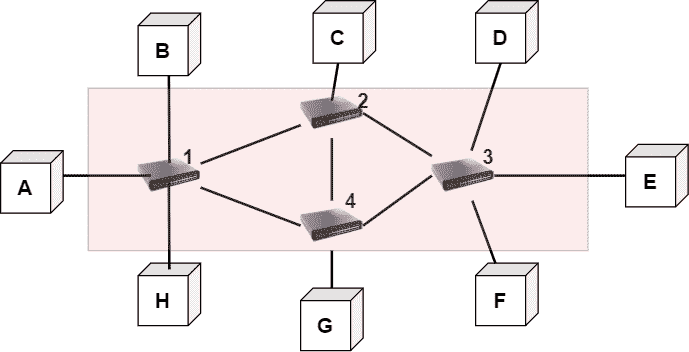
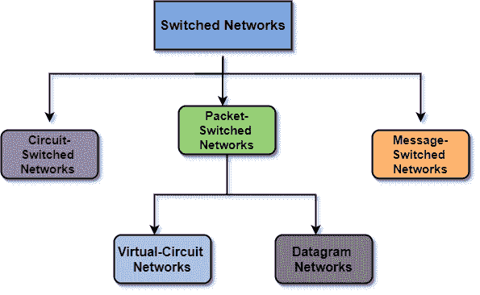

> 原文：<https://www.studytonight.com/computer-networks/switching-in-computer-networks>

# 计算机网络中的交换

在本教程中，我们将讨论计算机网络最重要的概念之一**切换**。

我们知道，网络主要是一组连接设备。但是，当我们必须连接网络中的多个设备时，就会出现连接问题，那就是如何连接它们，从而实现一对一的通信。一种解决方案是在每对设备之间建立点对点连接，或者在中央设备和其他设备之间建立点对点连接。但是这个解决方案的实际实现在大网络时代是不可能的。

这个问题比较好的解决方法是**切换**。现在让我们继续讨论交换和交换网络的概念。

在计算机网络中，交换是最重要的概念之一。

不同计算机网络和网段之间进行信息交换的机制通常被称为**交换。**

## 交换网络

交换网络基本上由一系列相互连接的节点组成。这些相互连接的节点被称为**开关。**

*   因此，在交换网络中，通常通过使用交换机来提供连接。

*   交换机是能够在两个或多个设备之间创建临时连接的设备。

*   在这个网络中，一些交换机连接到终端系统(如计算机系统或电话)，而其他交换机用于路由。

*   网络设备交换机主要是 OSI 模型的第 2 层设备。

*   交换机根据媒体访问控制地址转发数据包。

*   因此，交换机主要只将数据传输到已寻址的设备(意味着有正确的 mac 地址)。因为目的地址的验证是由交换机完成的，以便正确路由数据包。

图:交换网络

上图中；a、B、C、D、E、F、G、H 是**端系统**或者我们可以说是通讯设备。有 4 个开关标记为 1，2，3，4。此外，您可以看到每个交换机都连接到多个链路。

有效利用带宽需要交换的概念。此外，每当两个或多个设备相互通信时，网络中就有许多发生数据包冲突的机会；切换是解决这个问题的最佳方案。

## 切换方法

为了决定数据传输的最佳路由，使用了交换技术。交换技术主要以这样的方式连接系统，使得一对一的通信更加容易。

下面给出了三种切换方法，或者我们可以说有三种切换技术:

*   电路切换

*   包交换技术

*   信息交换

基于上述给定的技术，交换网络被大致分类如下:

我们将在即将到来的教程中介绍上述内容。

### 交换网络的优势

下面给出了交换网络的一些好处:

*   因为交换机有助于为网络中的每个连接创建冲突域。因此，帧冲突的可能性更小。

*   使用交换机可以提高网络的性能。

*   通过使用交换机，网络上的可用带宽增加了。

*   通过在网络中使用交换机，个人电脑上的工作负载得以减少。

*   交换机与工作站直接相连。

### 交换网络的缺点

使用开关有一些缺点:

*   因为我们在交换网络中使用交换机，所以网络变得昂贵，因为交换机很贵。

*   很难通过交换机跟踪网络中的连接问题。

*   广播流量有可能出现问题。

*   为了处理多播分组，需要适当的设计和配置。

* * *

* * *