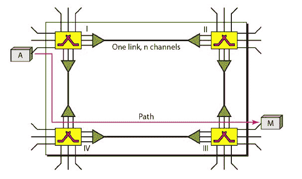
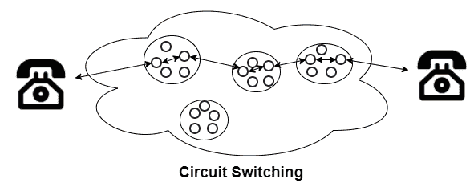

# 电路交换网络

> 原文：<https://www.studytonight.com/computer-networks/circuitswitched-networks>

在本教程中，我们将详细介绍电路交换网络。

网络由一组通过物理链路连接的交换机组成，通常称为电路交换网络。

*   每当一个设备与另一个设备通信时，就通过网络在它们之间建立专用通信路径。

*   每个连接使用的每个链路上只有一个专用信道。此外，通过使用**时分复用**(时分复用)或 **FDM** (频率除运算复用)技术，每个链路可以被容易地分成 **n 个信道**。

*   **电路交换技术**主要用于**公用电话网**进行**语音通信**以及**数据通信**。

*   数据通信不如语音通信有效。

*   电路交换技术主要发生在物理层。

*   在电路交换网络中，数据传输模式主要涉及专用的端到端连接。直到通信结束，这条专用路径一直保持。通信结束后，链路被释放。

该图显示了一个简单的电路交换网络

## 电路切换中的相位

为了使用电路交换来传输数据，需要建立一个电路(这些电路可以是永久性的，也可以是临时性的)，以便数据传输能够顺利进行。下面给出了用于实际通信的电路交换的三个阶段:

*   设置阶段

*   数据传输阶段

*   拆卸阶段

### 1.设置阶段

这是电路交换技术的第一阶段，在这一阶段，电路的建立仅仅意味着在几个交换中心或节点的帮助下，在发送方和接收方之间建立专用链路。

### 2.数据传输阶段

电路建立后，连接建立，这意味着数据传输可以在发送方和接收方之间进行。

### 3.拆卸阶段

发送方和接收方之间的通信完成后，电路断开。为了断开连接，信号由发送者或接收者发送

电路交换最好的例子之一是**电话**。假设有两个人人甲和人乙；他们都想互相交流，并且彼此相距很远。

人甲打电话给人乙这个阶段是电路切换的**设置阶段**。在建立连接之后和由人乙接电话之后；他们都可以互相交流。这是电路切换的**数据传输阶段**

一旦通信完成，其中一方可以切断通话或断开连接。这是一个**拆卸阶段。**

电路交换可以进一步分为两类:

1.空分交换

2.时分交换

让我们逐一介绍上面给出的两种类型。

## 1.空分交换

空分交换是一种电路交换技术，其中电路中的路径在空间上相互分离。

*   这项技术用于模拟和数字网络。

*   在这种情况下，以下开关用于连接:

    *   纵横制交换机:这个交换机包含 n 条输入线和 n 条输出线，它有 n2 个交叉点

    *   多级交换机:多级交换机是通过首先将纵横制交换机分成更小的单元，然后将它们互连而成的。一条路失败，就有另一条路的可能。

*   空分交换速度快，容量大。

*   空分交换包含非阻塞开关。

## 2.时分交换

这是一种数字交换技术。这种切换不需要交叉点。在时分交换中，输入信号和输出信号在不同的时隙中被接收和重新传输。

*   空分复用和时分复用的主要区别之一是交叉点的共享。空分交换中没有共享交叉点，而时分复用中交叉点的共享时间较短。

*   现代设备使用时分开关。

*   在这种技术中，在交换机内部使用时分多路复用，称为时隙交换(TSI)。

## 电路交换网络的例子

下面给出了一些电路交换网络的例子:

*   公共交换电话网

*   光网状网络

*   综合业务数字网 B 信道

*   蜂窝系统中的电路交换数据(CSD)和高速电路交换数据(HSCSD)服务，如 GSM

## 电路交换的优点

下面给出了电路交换的一些好处:

**1。提供专用变速器**

因为在发送方和接收方之间有一条专用链路。因此，电路交换网络提供了专用传输的保证。

**2。传输无延迟**

发送方和接收方之间有一条专用路径，因此不会出现延迟。

3.电路交换技术最适合长时间传输，因为它有助于发送方和接收方之间的专用链路。

## 电路切换的缺点

电路交换有一些缺点，如下所示:

*   电路交换的主要缺点之一是，由于发送方和接收方之间有专用路径；因此，该路径被这两个特定设备接收，并且不能被任何其他设备使用。

*   由于专用路径需要更多带宽，因此需要更多带宽。

*   资源的利用没有正确完成，因为资源在整个持续时间内都被分配给一个连接，因此对所有其他连接都不可用。

*   如果在发送方和接收方之间建立了连接，但它们之间没有数据传输，那么这种情况下效率会很低。

*   有时需要很长时间来建立发送方和接收方之间的连接。

*   因为在发送方和接收方之间有一条专用路径；因此，这种技术是昂贵的。

* * *

* * *