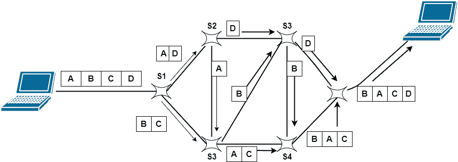

> 原文：<https://www.studytonight.com/computer-networks/packet-switching-in-computer-networks>

# 计算机网络中的分组交换

在本教程中，我们将介绍计算机网络中分组交换的概念。

分组交换是一种交换技术，在这种技术中，消息通常被分成称为分组的更小的片段。

*   每个数据包都包含一个包含目的地信息的报头。在这些知识/信息的帮助下，这些数据包找到了路由。

*   每个数据包都有一个唯一的编号，以便在接收端识别它们。

*   分组交换网络最大的例子之一是互联网。

*   数据包的报头主要由两部分组成:报头和有效载荷。

    *   其中报头主要包含路由信息。

    *   有效载荷包含要传输的数据。

*   这种切换也基于存储和转发方法。

*   在分组交换网络中，没有资源预留，资源是按需分配的。

*   正如我们所知，每个数据包的报头中都包含了源和目的地的信息。因此，所有数据包都可以在网络中独立传输。

*   与同一文件相关的数据包可能采用不同的路径，这主要取决于路径的可用性。这些数据包将在目的地重新组装。接收器节点负责重新排列接收到的分组，以便获得原始数据。

*   如果数据包以正确的顺序到达接收器，接收器将发送确认消息。

*   如果数据包丢失或损坏，消息将由接收方发送给发送方，以重新发送消息。

## 图:分组交换

用于分组交换的两种不同方法如下:

*   数据报分组交换

*   虚拟电路交换

让我们逐一讨论这两种方法:

## 数据报分组交换

在数据报交换中，数据包通常被称为**数据报**。数据报分组交换也称为无连接分组交换。在这种技术中，网络设备根据每个数据包中包含的目的地址单独路由每个数据包。

*   每个数据包基本上都是独立于其他数据包进行处理的。

*   数据报包交换在网络层完成。

*   这是无连接分组交换，因为分组交换机不保存关于连接状态的信息。

*   在数据报分组交换中，路径不是固定的。

*   路由决定由中间节点做出，以便转发数据包。

*   因此，属于同一消息的所有数据报可能通过不同的路径到达目的地。

*   在接收节点上，所有的包都被重组，以获得原始形式的消息。

*   由于缺乏资源，数据包也可能丢失或丢弃。

*   在大多数协议中，上层协议负责对数据报进行重新排序，或者在将丢失的数据报传递给应用程序之前请求它们。

## 虚拟电路交换

虚电路交换也称为面向连接的交换。这种交换包含了电路交换和数据报分组交换的特点。在这种类型的分组交换中，首先组装数据包，然后按顺序编号。现在，他们已经准备好按顺序穿越预定路线。这里不需要关于地址的信息，因为所有数据包都是按顺序发送的。

*   除了数据传输阶段，还有安装和拆卸阶段。

*   资源分配是在建立阶段完成的，就像在电路交换网络中一样，也可以像在数据报网络中一样按需完成。

*   数据是数据包的形式，就像数据报网络一样，而且每个数据包都在报头中携带目的地址。

*   与电路交换网络一样，虚拟网络中的所有数据包都遵循连接期间建立的相同路径。

*   这种交换通常在数据链路层实现。

## 分组交换的优势

下面给出了分组交换的一些好处:

*   更有效地利用带宽。

*   在分组交换中，传输延迟是最小的。

*   这种技术实现起来更便宜，因此具有成本效益。

*   同一频道可以被多个用户同时使用。

*   由于协议的改进，分组交换被许多应用程序使用，如 Skype、WhatsApp 等。
*   这种技术的容错能力在任何链路断开的情况下都更强，因为数据包可能遵循不同的路径。

*   这种技术比其他技术更可靠，因为它可以轻松检测丢失的数据包。

## 分组交换的缺点

分组交换的一些缺点如下:

*   这种技术不能被那些不能承受更多延迟的应用程序使用，比如高质量语音呼叫的应用程序。

*   该技术中使用的协议很复杂，因此它们的实现成本很高。

*   在网络过载的情况下，数据包可能会丢失或出现延迟，从而导致关键信息的丢失。

*   在接收方，需要对发送方发送的数据包进行分类。

* * *

* * *