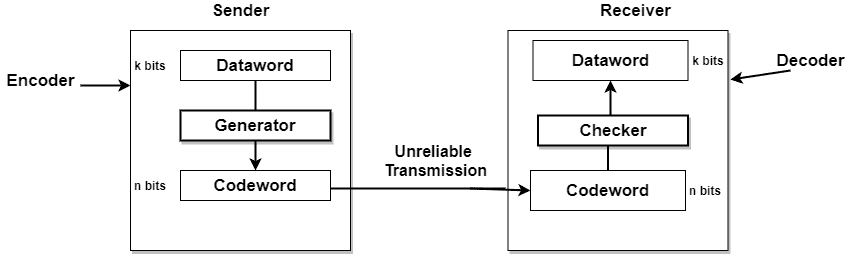
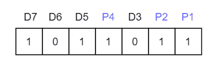
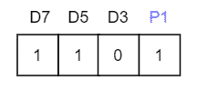
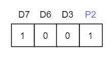
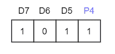
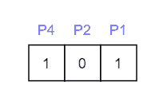
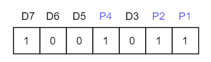

# 计算机网络中的纠错

> 原文：<https://www.studytonight.com/computer-networks/error-correction-in-computer-networks>

在本教程中，我们将介绍计算机网络中的数据链路层纠错。

在错误检测中，接收机只需要知道接收到的码字是无效的；但是在纠错中，接收器需要猜测发送的原始码字。这样，纠错比检错困难得多。

纠错期间对冗余位的需求大于检错。

让我们看看纠错中编码器和解码器的结构:

**图:纠错中编码器和解码器的结构**

为了检测或纠正错误，需要随数据一起发送一些额外的位。这些额外的位通常被称为冗余位。

正如我们在前面的教程中了解到的，原始数据被分成 k 位的段；它被称为**数据字**。当我们向每个块添加 **r** 冗余位以使长度； **n=k+r** 则称为**码字**。

有两种方法可以处理纠错:

1.  每当发现错误时，接收者可以让发送者重新发送整个数据单元。这种技术被称为**反向纠错技术**。在有线传输(如光纤)的情况下，这种技术简单而廉价；重传数据没有费用。在无线传输的情况下，重传成本太高，因此使用前向纠错技术。

2.  接收器可以使用自动包含某些错误的纠错码。这种技术被称为**前向纠错技术**。

为了纠正错误，必须知道错误的确切位置。例如，如果我们想要计算一个单比特错误，那么纠错码主要确定七个比特中的哪一个是错误的。

为了实现这一点，我们必须添加一些额外的冗余位。

假设 r(作为冗余位)和 d 表示数据位的总数。为了计算冗余位(r)，使用给定的公式；

2r= d+r+1

纠错主要是借助汉明码来完成的。

## 汉明码

这是海明开发的技术。这可以应用于任何长度的数据单元。该代码主要使用数据和冗余位之间的关系。

汉明码技术是一种检错纠错技术，由 T2 海明公司提出。每当数据包通过网络传输时，数据位都有可能在传输过程中丢失或损坏。

让我们通过一个例子来理解汉明码的概念:

假设您收到了一个 7 位汉明码，也就是`1011011`。

首先，让我们谈谈冗余位。

**冗余位**是一些不属于原始数据的额外二进制位，但它们是由添加到原始数据位的&生成的。所有这些都是为了确保数据位不会被损坏，如果损坏，我们可以恢复它们。

现在问题来了，我们如何确定要添加的冗余位数？

我们使用公式，`2r >= m+r+1;`其中 **r =冗余位** & **m =数据位**。

从公式中我们可以看出有 **4 个数据位**和 **3 个冗余位**，参考接收到的 **7 位汉明码**。

### 什么是奇偶校验位？

为了更进一步，我们需要了解**奇偶校验位**，它是附加在数据位上的一个位，确保 1 的总数是偶数(偶数奇偶校验)或奇数(奇数奇偶校验)。

检查奇偶校验时，如果 1 的总数为奇数，则写入奇偶校验位的值 **P1** (或 **P2** 等。)为 **1** (表示有错误)，如果有错误，则奇偶校验位的值为 **0** (表示无错误)。

## 差错检测中的汉明码

当我们浏览这个例子时，第一步是识别数据的比特位置&所有 2 的幂的比特位置都被标记为奇偶校验位(例如 1、2、4、8 等)。).下图将有助于可视化接收到的 7 位汉明码。

首先，我们需要检测在这个接收到的汉明码中是否有任何错误。

<u>**第一步:**</u> 校验奇偶校验位 **p 1** 使用**校验一跳过一**的方法，意思是从 P1 开始然后跳过 P2，取 D3 然后跳过 P4 再取 D5，然后跳过 D6 再取 D7，这样我们会有以下位，

因为我们可以观察到总位数是奇数，所以我们将奇偶校验位的值写成 **P1 = 1** 。这意味着存在**错误**。

<u>**第二步:**</u> 检查 p 2，但在检查 P2 的同时，我们将使用**检查两个并跳过两个**方法，这将为我们提供以下数据位。但是请记住，由于我们正在检查 P2，所以我们必须从 P2 开始计数(不应该考虑 P1)。

因为我们可以观察到 1 的个数是偶数，那么我们将写出 **P2 = 0** 的值。这意味着**没有错误**。

<u>**第三步:**</u> 检查 P4，但是在检查 P4 的同时，我们将使用**检查四个并跳过四个**方法，这将为我们提供以下数据位。但是请记住，因为我们正在检查 P4，所以我们已经开始从 P4(P1 & P2 不应该被考虑)计数。

由于我们可以观察到 1 的个数是奇数，那么我们将写出 **P4 = 1** 的值。这意味着错误是存在的。

所以，从上面的奇偶校验分析，P1 & P4 不等于 0，所以我们可以清楚地说接收到的汉明码有错误。

## 汉明码:纠错

既然我们发现收到的代码有错误，那么现在我们必须纠正它们。要更正错误，请执行以下步骤:

现在错误单词 E 将是:

现在我们要确定这个错误字 **101** 的十进制值，也就是 **5 (22 *1 + 21 * 0 + 20 *1 = 5)** 。

我们得到 **E = 5** ，表示错误在第五个数据位。要纠正它，只需反转第五个数据位。

所以正确的数据是:

* * *

* * *