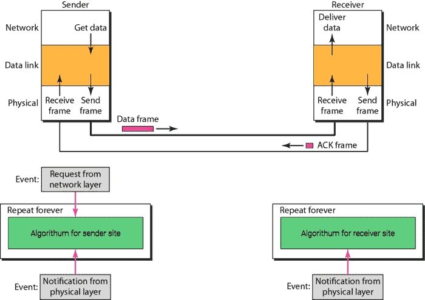

# 停止等待协议

> 原文：<https://www.studytonight.com/computer-networks/stopandwait-protocol>

在本教程中，我们将介绍在数据链路层的**无噪声**通道中使用的另一种协议。

停止等待协议用于数据链路层，以便在无噪声信道中传输。让我们首先理解为什么需要使用这个协议，然后我们将详细介绍这个协议。

我们在前面的教程中研究了最简单的协议，假设有一种情况，数据帧到达接收方站点的速度比它们能够被处理的速度快，这意味着传输速率大于帧的处理速率。另外，接收器没有足够的空间是正常的，数据也来自多个来源。那么由于所有这些，可能会出现丢弃帧或拒绝服务的情况。

为了防止接收方承受不住，需要告诉发送方减慢帧的传输速度。我们可以利用从接收者到发送者的反馈。

现在从下一节开始，我们将讨论停止等待协议的**概念。**

顾名思义，当我们在传输过程中使用该协议时，发送方发送一帧，然后停止，直到收到接收方的确认，收到确认后发送方发送下一帧。

*   数据帧有**单向通信**，但确认或确认帧从另一个方向传输。因此，这里增加了流量控制。

*   因此，停止等待是利用数据链路层提供的流控制服务的流控制协议之一。

*   对于每一个发送的帧，都需要确认，并且需要相同的传播时间才能回到发送方。

*   为了结束传输，发送方发送传输结束，这意味着(EOT 帧)。

## 停止等待协议的设计

发送方的数据链路层等待其网络层发送数据包。之后，数据链路检查它是否可以发送帧。在从物理层接收到肯定通知的情况下；数据链路层利用网络层提供的数据制作帧，然后将其发送到物理层。发送数据后，它将等待确认，然后再发送下一帧。

接收器端的数据链路层等待帧到达。当帧到达时，接收器处理该帧，然后将其传送到网络层。之后，它将发送确认，或者我们可以说，确认帧回到发送者。



## 发送方站点用于停止等待协议的算法

这是发送方站点用于停止等待协议的算法。应用程序可以用自己的编程语言来实现。

```c
while(true)                //Repeat forever
canSend=true                 //It will allow the first frame to go.
{
  WaitForEvent();                  //sleep until the occurrence of an event
  if(Event(RequestToSend) AND canSend)
   {
      GetData();
      MakeFrame();
      SendFrame();   //Send the data frame
      canSend=false;   //cannot send until the acknowledgement arrives.
}

WaitForEvent();   //sleep until the occurrence of an event
if(Event(ArrivalNotification))  //indicates the arrival of the acknowledgement
   {
     ReceiveFrame();     //Means the ACK frame received
     canSend=true;
   }
}
```

### 接收端的算法

这是在接收器端用于**停止等待协议**的算法。应用程序可以用自己的编程语言来实现。

```c
while(true)   //means Repeat forever
{
   WaitForEvent();  //sleep until the occurrence of an event
   if(Event(ArrivalNotification)) //indicates arrival of the data frame
   {
      ReceiveFrame();
      ExtractData();
      Deliver(data); //delivers the data to the network layer.
      SendFrame(); //Send the ACK frame
   }
} 
```

## 停止等待协议的流程图

下面给出了停止等待协议的流程图:


## 优势

停止等待协议的主要优点之一是提供的准确性。因为下一帧的传输仅在接收到前一帧的确认后才完成。因此，没有数据丢失的可能。

## 不足之处

下面给出了使用停止等待协议的一些缺点:

*   使用该协议，一次只能传输一帧。

*   假设在一种情况下，帧由发送方发送，但在传输过程中丢失，然后接收方既不能收到帧，也不能向发送方发回确认。如果没有收到确认，发送方将不会发送下一帧。因此，将出现两种情况，即:接收方必须等待无限长的数据时间，发送方必须等待无限长的时间才能发送下一帧。

*   在长距离传输的情况下，这是不合适的，因为传播延迟变得比传输延迟长得多。

*   以防发送方发送数据，而接收方也接收到该数据。接收到数据后，接收方发送确认，但由于某些原因，发送方会在超时后收到确认。现在因为这个确认收到的太晚了；因此，它可能被错误地认为是对另一个数据分组的确认。

*   等待每个帧的确认所花费的时间也加在总传输时间中。


* * *

* * *