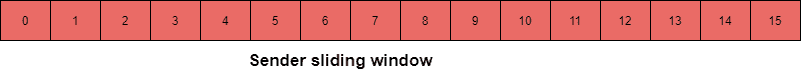

> 原文：<https://www.studytonight.com/computer-networks/sliding-window-protocol>

# 滑动窗口协议

在本教程中，我们将介绍计算机网络中**滑动窗口协议**的概念。

滑动窗口协议是那些在网络中用作传输数据的流量控制方法的协议。

*   在滑动窗口技术的帮助下，发送方可以在收到接收方的任何确认之前一次发送多个帧。

*   滑动窗口协议利用 **TCP** (传输控制协议)。

*   接收方可以使用单个**确认帧**发送发送方发送的多个帧的确认。

*   在滑动窗口协议中，术语**滑动窗口**主要是指可以容纳发送方和接收方的帧的假想盒子。

## 推拉窗

滑动窗口主要提供在要求确认之前可以传输的帧数上限。

*   即使接收器端的窗口没有完全填满，接收器也可以随时确认帧。

*   此外，即使发送方的窗口尚未满，源方也可以发送帧。

*   有窗口的具体大小，其中帧以 n 为模编号，简单的说就是帧从 **0 到 n-1** 编号。
    例如如果 **n = 10** ，帧编号为 0，1，2，3，4，5，6，7，8，9，0，1，2，3，4，5，6，7，8，9，0，1，…。

*   每当接收器发送确认(ACK)时，它还包括它期望接收的下一帧的编号。例如，为了确认在帧 6 结束的帧组，接收器需要发送包含数字 7 的确认。当发送方看到带有数字 7 的确认时，发送方知道数字 6 之前的所有帧都已成功接收。

现在让我们了解滑动窗口协议的工作原理:

在**发送端**和**接收端**都有一个有限大小的缓冲区。**发送端**的缓冲器也称为**发送窗口**，而**接收端**的缓冲器称为**接收窗口**。

*   发送窗口的大小主要用于确定出站帧的序列号。

*   假设帧的序列号是大小为 **n 位**的字段，那么序列号的分配范围是 **0 到 2？？？？？1** 。

*   结果发送窗口的大小是 **2？？？？？1** 。为了适应大小为 2 的发送窗口？？？？？1，必须选择一个 n 位序列号。

发送方发送的每个数据包都必须得到接收方的确认。发送方为每个发送的数据包维护一个计时器，如果在特定时间内有一个数据包未被确认，那么该数据包将被重新发送。

此外，发送方可以在收到窗口中第一个数据包的确认之前发送整个数据包窗口。这将导致更高的传输速率，因为发送方可能会发送多个数据包，而无需等待每个数据包的确认。

此外，接收方通告其窗口大小，这主要向发送方指示它可以接收多少数据。因此发送方不会填满接收方的缓冲区。

借助**模 n** 技术，主要对序列号进行编号。我们举一个例子，如果发送窗口的大小是 5，那么序列号将是 0，1，2，3，4，0，1，2，3，4，0，等等。

接收窗口的大小表示接收器一次可以接受的最大帧数。此大小还决定了发送方在收到确认之前可以发送的最大帧数。

在滑动窗口中，我们使用了一种称为**背负**的技术。借助捎带技术，确认与数据帧一起附加。

下面给出了属于滑动窗口类别的两个协议，如下所示；

1.  ARQ 协议

2.  选择性重复 ARQ 协议

## 滑动窗口(发送方)

为了跟踪帧，发送站发送顺序编号的帧。

*   因为要使用的序列号应该占据帧中的一个字段。因此，序列号的大小应该有限。

*   如果帧头允许 k 位，则序列号的范围从 0 到 2k-1。

*   有一个序列号列表，主要由发送方维护，依此类推；这些是允许发送者发送的。

*   发送方窗口的大小最多为 2k-1。

*   比如；如果帧允许 4 位，那么窗口的大小是 2 的幂 4-1
    16-1 = 15。

*   缓冲区提供给发送方，其大小等于窗口的大小。

## 滑动窗口(接收器侧)

接收器端的窗口大小始终为 1。

*   帧的确认是通过接收方向发送方发送一个确认帧以及下一个预期帧的序列号来完成的。

*   接收机明确宣布准备接收 N 个下一帧，从指定的数字开始。

*   该方案用于确认多个帧。

*   接收器端的窗口可以保存 2、3、4 帧，但会保存确认帧，直到第 4 帧到达。到达后，它将发送确认以及序列号为 5 的**，用它一次确认 2，3，4。**

***   接收器所需的缓冲区大小为 1。** 

 **### 推拉窗的优点

*   多个包的传输可以在没有接收到确认的情况下完成。

*   使用全双工线路可以实现捎带。

### 滑动窗口的缺点

*   本协议对序列号没有限制。

*   在某些情况下可能会浪费带宽。** 

* * *

* * *