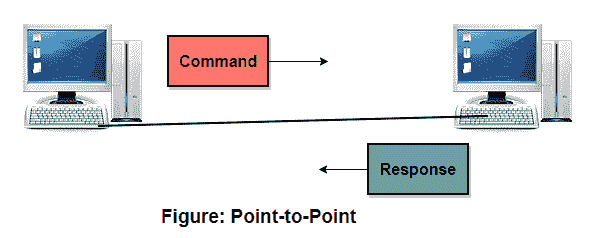
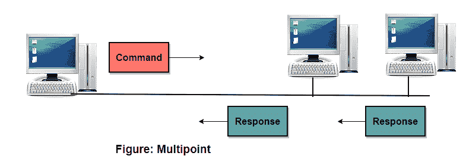
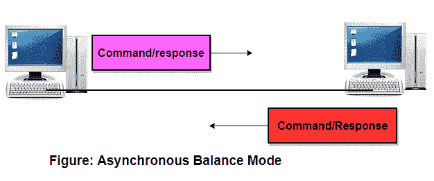
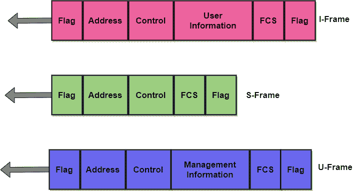

# HDLC 协议

> 原文：<https://www.studytonight.com/computer-networks/hdlc-protocol>

在本教程中，我们将介绍OSI模型数据链路层中的 HDLC 协议。

**HDLC** (高级数据链路控制)是一种面向比特的协议，用于通过**点对点和多点链路**进行通信。该协议实现了 ARQ(自动重复请求)机制。在 HDLC 协议的帮助下，全双工通信成为可能。

**HDLC** 是使用最广泛的协议，提供了可靠性、效率和高水平的灵活性。

为了使 HDLC 协议适用于各种网络配置，有三种类型的站，如下所示:

*   **主站**
    这个站主要负责管理之类的数据。在主站和次站之间通信的情况下；主站负责连接和断开数据链路。主站发出的帧通常称为命令。

*   **二级站**
    二级站在主站的控制下运行。从站发出的帧通常被称为响应。

*   **联合站**
    联合站既是一级站，也是二级站。组合站发出命令以及  响应。

## HDLC 的换乘方式

HDLC 协议提供了两种主要可用于不同配置的传输模式。这些措施如下:

*   正常响应模式(NRM)

*   异步平衡模式

现在让我们逐一讨论这两种模式:

### 1.正常响应模式(NRM)

在这种模式下，站的配置是不平衡的。有一个主站和多个从站。主站可以发送命令，次站只能响应。

该模式用于**点对点**和**多点链接。**

### 2.异步平衡模式

在这种模式下，工作站的配置是平衡的。在这种模式下，链路是点对点的，每个站都可以作为主要站和次要站。

异步平衡模式是当今常用的模式。

## HDLC 画框

以便提供支持上述模式和配置中所有可能选项所必需的灵活性。HDLC 定义了三种类型的框架:

*   **信息帧(I 帧)**
    这些帧用于传输用户数据和与用户数据相关的控制信息。如果控制字段的第一位是 0，那么它被识别为 I 帧。

*   **监控帧(S 帧)**
    这些帧仅用于传输控制信息。如果控制字段的前两位是 1 和 0，则该帧被识别为 S 帧

*   **未编号帧(U 帧)**
    这些帧主要是为系统管理预留的。这些帧用于在通信设备之间交换控制信息。

每种类型的帧主要用作传输不同类型消息的信封。

### 框架格式

每个 HDLC 帧中最多有六个场。有一个开始标志字段、地址字段、控制字段、信息字段、帧校验序列字段和结束字段。

在多帧传输的情况下，一帧的结束标志充当下一帧的开始标志。

让我们看看不同的 HDLC 框架:

现在是讨论字段以及字段在不同帧类型中的使用的时候了:

### 1.标志字段

HDLC 帧的这个字段主要是具有位模式 01111110 的 8 位序列，并且它用于识别帧的开始和结束。标志字段主要用作接收器的同步模式。

### 2.地址字段

它是 HDLC 帧的第二个字段，主要包含辅助站的地址。该字段可以是 1 字节或几个字节长，这主要取决于网络的需要。如果帧由主站发送，则该字段包含从站的地址。如果帧是从站发送的，那么这个字段包含主站的地址。

### 3.控制字段

这是 HDLC 帧的第三个字段，是帧的 1 或 2 字节段，主要用于流量控制和错误控制。该领域的比特解释主要取决于帧的类型。

### 4.信息字段

HDLC 帧的这个字段包含来自网络层的用户数据或管理信息。此字段的长度因网络而异。

### 5.现场总线控制系统

FCS 表示帧校验序列，是 HDLC 协议中的错误检测字段。有一个 16 位循环冗余码用于错误检测。

## 《HDLC 协议》的特点

以下是《HDLC 协议》的一些特点:

1.该协议使用位来填充数据中出现的标志。

2.该协议用于点对点和多点链路接入。

3.HDLC 协议是数据链路层最常见的协议之一。

4.HDLC 是一个面向比特的协议。

5.该协议实现了错误控制和流量控制。

* * *

* * *