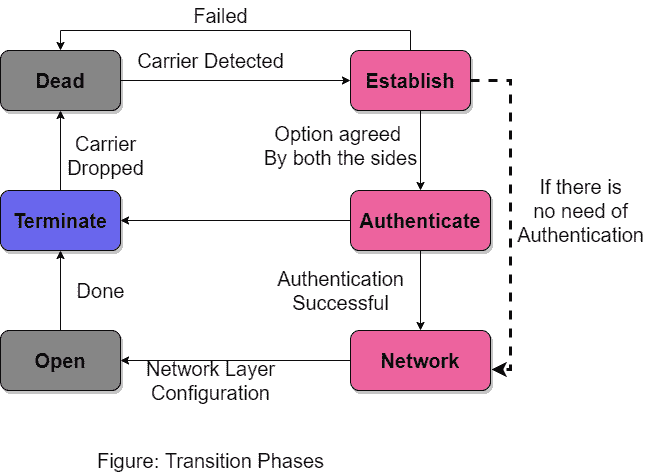
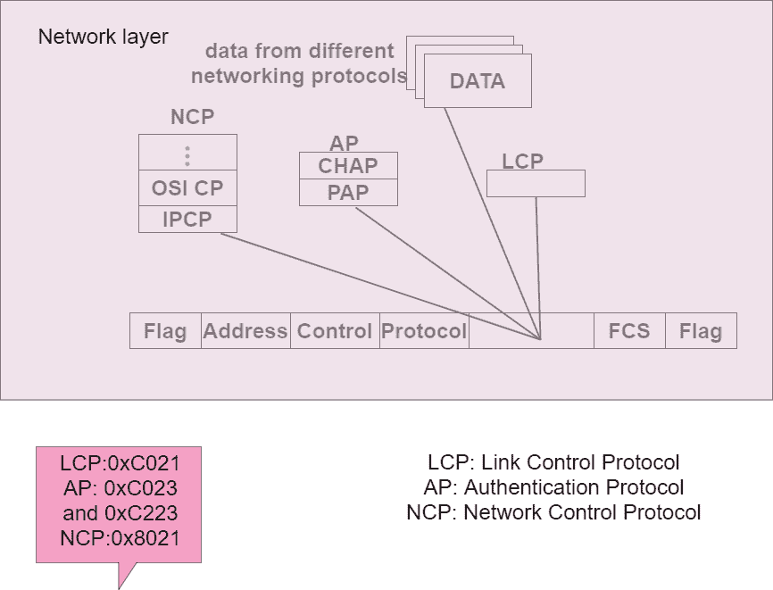

# 点对点协议

> 原文：<https://www.studytonight.com/computer-networks/pointtopoint-protocol>

在本教程中，我们将介绍数据链路层的另一种协议，即点对点协议。

**PPP** (点对点)协议是数据链路层使用的协议。 **PPP** 协议主要用于建立两个节点之间的直接连接。

点对点协议主要通过多条链路提供连接。

*   该协议定义了两台设备如何相互认证。

*   PPP 协议还定义了设备之间要交换的帧的格式。

*   该协议还定义了如何将网络层的数据封装在数据链路帧中。

*   PPP 协议定义了两台设备如何协商链路的建立，然后交换数据。

*   该协议提供网络层的多种服务，还支持各种网络层协议。

*   该协议还通过多条链路提供连接。

PPP 协议不提供的一些服务如下:

1.  该协议不提供流量控制机制。因为当使用这种协议时，发送者可以一个接一个地向接收者发送任意数量的帧，甚至不用考虑压倒接收者。

2.  该协议不提供任何寻址机制来处理多点配置中的帧。

3.  PPP 协议提供了一种非常简单的错误控制机制。有一个循环冗余校验字段可以检测错误。如果有一个损坏的帧，那么它会被无声地丢弃。

在 PPP 协议中，成帧是使用面向字节的技术完成的。

## 购买力平价帧格式

下图显示了购买力平价框架的格式:

让我们逐一讨论 PPP 帧格式的每个字段:

### 1.旗

PPP 帧主要以 1 字节标志字段开始和结束，该字段具有位模式:01111110。需要注意的是，这种图案与 HDLC 使用的国旗图案相同。但是也有一个区别，那就是 PPP 是一个面向字节的协议，而 HDLC 是一个面向比特的协议。

### 2.地址

PPP 协议中该字段的值为常量，设置为 111111111，即广播地址。双方可以协商，可以省略这个字节。

### 3.控制

该字段的值也是 11000000 的常数值。我们已经告诉您，PPP 不提供任何流量控制，错误控制仅限于错误检测。双方可以协商，可以省略这个字节。

### 4.草案

此字段定义数据字段中携带的内容。它可以是用户信息，也可以是其他信息。默认情况下，该字段为 2 字节长。

### 5.有效载荷字段

该字段携带网络层的数据。该字段的最大长度为 1500 字节。这也可以在通信端点之间进行协商。

### 6.火控系统(Fire Control System)

它只是一个 2 字节或 4 字节的标准循环冗余校验。

## 购买力平价中的字节填充

正如我们已经告诉您的那样，PPP 和 HDLC 的主要区别在于 PPP 是一种面向字节的协议。这意味着 PPP 中的标志是一个字节，无论它出现在帧的数据部分的什么地方，都需要进行转义。

转义字节是 011111101，这意味着每当数据中出现类似标志的模式时，就会填充额外的字节，主要告诉接收器下一个字节不是标志。

## 公私伙伴关系协议的过渡阶段

PPP 协议必须经历不同的阶段，如下图所示；

### 死亡的

在这个阶段，链接没有被使用。物理层没有活动载波，线路很安静。

### 建立

如果其中一个节点开始通信，则连接进入建立阶段。在这一阶段，双方就选择进行谈判。如果协商成功，则系统进入身份验证阶段(如果需要身份验证，则进入网络阶段。)

这里交换了几个包。

### 鉴定

这是一个可选阶段。在建立阶段，两个节点可以决定不跳过这个阶段。如果两个节点决定继续进行身份验证，那么它们会发送几个身份验证数据包。

如果结果是成功的，则连接进入网络阶段，否则进入终止阶段。

### 网络

在这个阶段，网络层协议的协商发生。PPP 协议规定，在网络层的数据可以交换之前，两个节点建立网络层的协议。背后的原因是 PPP 在网络层支持多种协议。

如果任何节点同时在网络层运行多个协议，那么接收节点需要知道哪个协议将接收数据。

### 打开

在这个阶段，数据传输发生。只要连接达到这个阶段，就可以开始交换数据包。连接保持在这个阶段，直到通信中的一个端点终止连接。

### 结束的

在此阶段，连接终止。两端交换几个数据包，用于房屋清洁，然后关闭链接。

## 公私伙伴关系/公私伙伴关系堆栈的组件

基本上，PPP 是一种分层协议。PPP 协议有三个组成部分，如下所示:

*   链路控制协议

*   认证协议

*   网络控制协议

### 链路控制协议

该协议主要负责建立、维护、配置和终止链路。链路控制协议提供了协商机制，以便在两个端点之间设置选项。

在建立链接之前，链接的两个端点必须就选项达成一致。

### 认证协议

该协议在 PPP 协议中起着非常重要的作用，因为 PPP 是为在需要验证用户身份的拨号链路上使用而设计的。因此，该协议主要用于验证端点以供其他服务使用。

有两种身份验证协议:

*   密码认证协议

*   挑战握手认证协议

### 网络控制协议

网络控制协议主要用于协商网络层的参数和设施。

对于 PPP 协议支持的每一个更高层协议；有一种网络控制协议。

PPP 的一些网络控制协议如下:

1.  互联网协议控制协议(IPCP)

2.  互联网分组交换控制协议

3.  decnet 第四阶段控制协议

4.  网络基本输入输出系统帧控制协议

5.  IPv6 控制协议

* * *

* * *