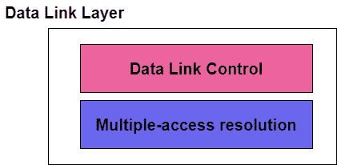
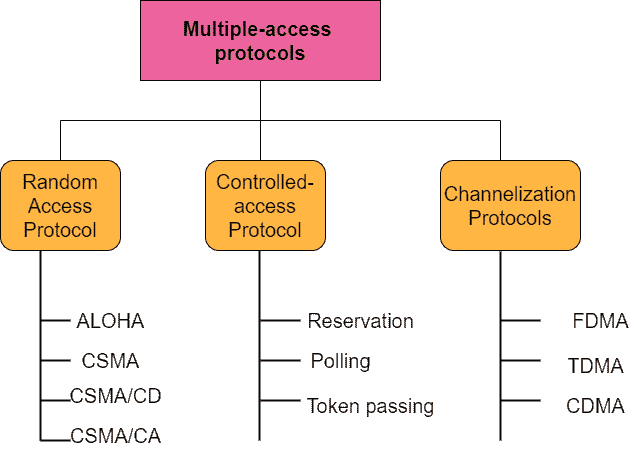

# 数据链路层的多址接入

> 原文：<https://www.studytonight.com/computer-networks/multiple-access-in-data-link-layer>

在本教程中，我们将介绍现场视察模型的数据链路层中的多路访问。

数据链路层可视为两个子层，其中上层子层主要负责数据链路控制，下层负责解决对共享介质的访问。

如果在这种情况下有专用信道，则不需要较低的子层。

数据链路层的上层子层主要负责流量控制和差错控制，也称为逻辑链路控制(LLC)；而下层主要负责多址解析，因此被称为媒体访问控制层。

多址协议的主要目标是优化传输时间、最小化冲突和避免串扰。

多址协议主要允许多个节点访问共享网络信道。源自几个节点的几个数据流通过多点传输信道传输。

多址协议分类如下。让我们来看看它们:

## 随机接入协议

在随机接入中，没有这样的站优于另一个站，并且没有一个站被分配对另一个站的控制。没有一个站允许另一个站发送。

每个站可以随时发送，条件是它遵循包括介质测试状态的预定程序。

下面给出了属于随机接入协议类别的协议:

1.  欢迎

2.  CSMA(载波侦听多路访问)

3.  CSMA/光盘(带冲突检测的载波侦听多路访问)

4.  CSMA/加州(载波侦听多路访问，避免冲突)

## 受控访问协议

当使用受控访问协议时，站点可以相互协商，以便找到哪个站点有权发送数据。任何电台在得到其他电台授权之前都不能发送。

三种主要的受控访问方法如下:

1.  保留

2.  投票

3.  令牌传递

## 信道化协议

信道化是用于多址接入的另一种方法，其中链路的可用带宽在时间、频率上共享，或者通过不同站之间的代码共享。

使用的三种信道化协议如下:

*   FDMA(频分多址)

*   时分多址

*   码分多址

我们将在即将到来的教程中介绍所有上述协议。

* * *

* * *