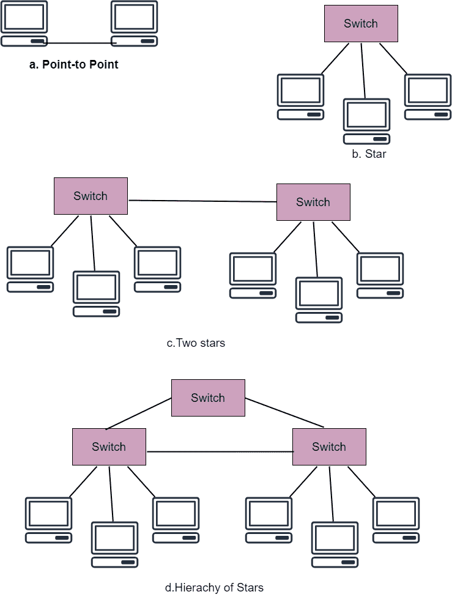
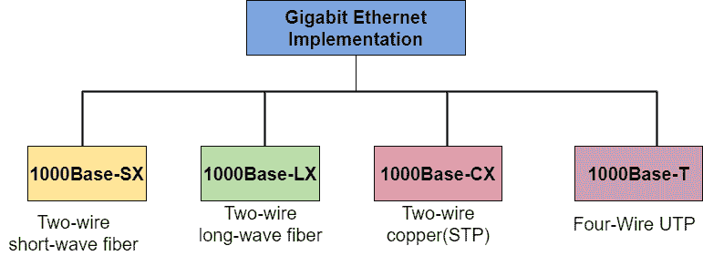

# 千兆以太网

> 原文：<https://www.studytonight.com/computer-networks/gigabit-ethernet>

在本教程中，我们将在计算机网络中详细介绍千兆以太网的概念。

以太网基本上是局域网的物理和数据链路层技术。千兆以太网是在 1998 年 6 月开发的。

*   千兆以太网提供 1000 Mbps 的数据速率，或者我们可以说 1Gbps。

*   千兆以太网(IEEE 802.3z)解决了 OSI 参考模型的两层问题:

    *   第 2 层(数据链路层)主要描述数据如何以帧的形式组织，然后通过网络发送。

    *   第 1 层(物理层)主要描述网络的媒介和信令规范。

## 千兆以太网设计

千兆以太网的设计可以通过以下几点进行总结:

1.它与标准或快速以太网兼容。

2.它提供 1 Gbps 的数据速率。

3.它使用 8 位地址。

4.提供自动协商的支持。

5.它保持相同的最小和最大帧长度。

## 媒体访问控制子层

随着以太网的发展，主要关注的是保持媒体访问控制层不变。但是为了达到 1Gbps 的数据速率，这是不可能的。

千兆以太网有两种不同的方法来访问介质:

*   半双工

*   全双工

千兆以太网的所有实现都遵循全双工方法。

### 全双工方法

在这种方法中，有一个中央交换机连接到所有计算机或其他交换机。每台交换机的每个输入端口都有缓冲区，数据在传输前存储在这里。

在这种情况下，不使用 CSMA/光盘，因为不会发生碰撞。由于没有碰撞，因此这意味着电缆的最大长度由电缆中的信号衰减决定。

### 半双工方法

这是千兆以太网使用的另一种方法。在这种方法中，交换机通常由集线器代替，集线器主要充当公共电缆；因此有可能发生碰撞。这种方法利用了 CSMA/裁谈会。

这种方法的最大长度主要取决于最小帧大小。

定义了三种方法:

*   传统的

*   运营商扩展

*   帧突发

**传统**

在这种方法中，帧的最小长度与传统以太网相同(即 512 位)。千兆以太网的时隙时间为 **512 位×1/1000 秒**，等于 **0.512 秒**

时隙的减少意味着冲突被提前 100 次检测到。

因此，网络的最大长度是 25 米。如果所有的站都在一个房间里，这可能是合适的，但它甚至可能不够长，不足以在一个办公室里连接计算机。

**载波扩展**

为了允许更长的网络，最小帧长度被增加。这种方法主要定义帧的最小长度等于 512 字节(即等于 4096 位)；这意味着最小长度是 8 倍长。

这种方法基本上迫使站向任何大小小于 4096 位的帧添加扩展位(即填充)。

**帧突发**

如果有一系列短帧要发送，那么上述方法(即载波扩展)在这种情况下效率不高。每个帧序列还携带冗余数据。为了提高效率，提出了这种方法。

在这种方法的帮助下，发送多个帧，而不是给每个帧添加一个扩展。

## 千兆以太网中的物理层

在千兆以太网中，物理层更加复杂。

千兆以太网主要是为了连接两个或多个站点而设计的。如果只有两个站点，那么它们可以点对点连接。在三个或更多站点的情况下，我们可以通过使用中心的集线器或交换机来使用 start 拓扑。

还有一种可能的配置，可以连接多个星型拓扑。

### 履行

千兆以太网的分类可以通过使用双线或四线实现来完成。

*   双线实现使用光缆(1000Base-SX，短波或 1000Base-LX)，或 STP(1000Base-CX)。

*   四线版本使用 5 类双绞线电缆(1000Base-T)。

| 名字 | 电缆 | 最大值段 |
| --- | --- | --- |
| 1000Base-CX | 2 对 STP | 25 米 |
| 1000Base-SX | 光纤电缆 | 550 米 |
| 1000Base-LX | 光纤电缆 | 5000 米 |
| 1000Base-T | 4 双 UTP | 100 米 |

## 千兆以太网的优势

下面给出了使用千兆以太网的一些好处:

*   带宽增加，性能提高。

*   获得和拥有的成本很低。

*   它提供了完全的兼容性。

*   通过使用全双工方法，有效带宽实际上增加了一倍。

*   它可以通过网络快速传输大量数据。

## 千兆以太网的缺点

*   1000Base-T 需要 4 对接线来传输数据。

*   1000Base-T 不支持全双工模式。

* * *

* * *