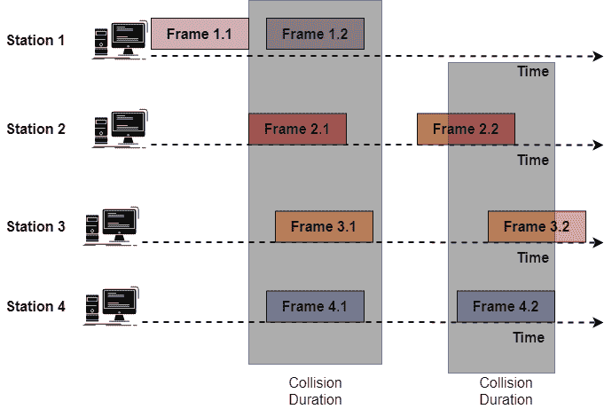
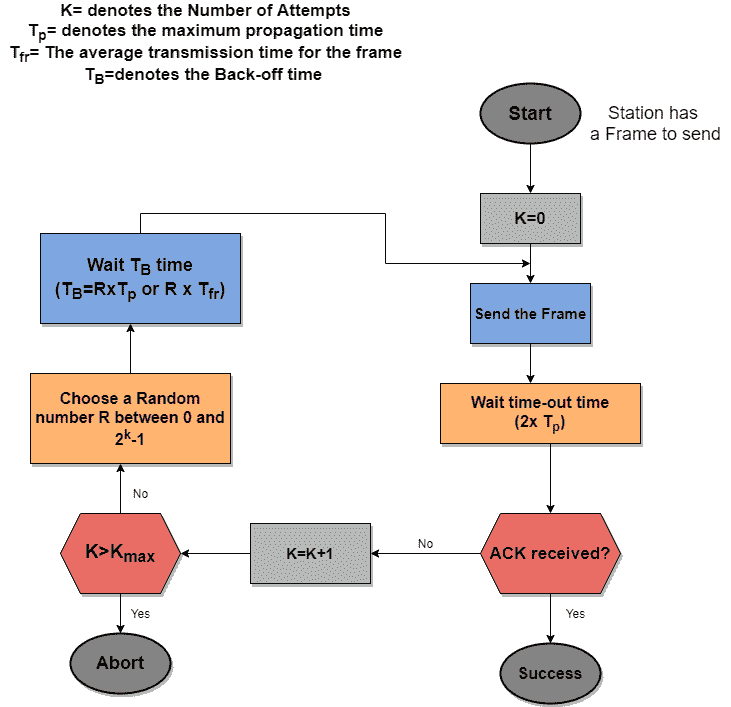
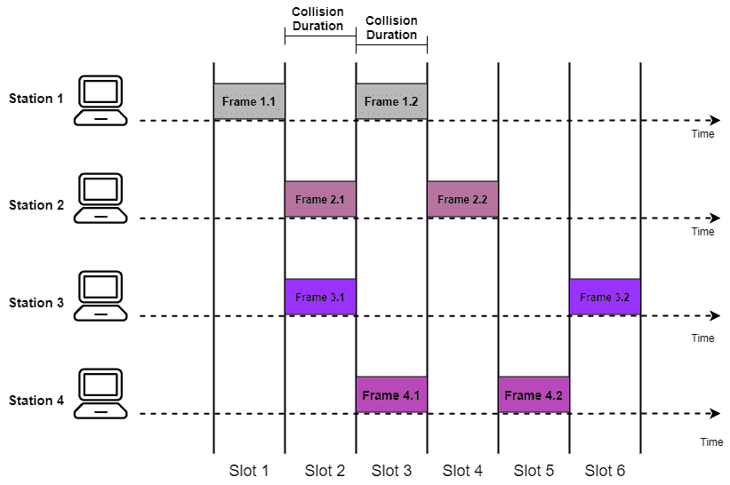

# 随机接入协议

> 原文：<https://www.studytonight.com/computer-networks/random-access-protocol>

在本教程中，我们将介绍计算机网络中数据链路层的随机接入协议。

在随机接入方法中，没有一个站优于另一个站，也没有一个站被分配对另一个站的控制权。它只是意味着没有一个站允许另一个站发送。

*   有数据要发送的站主要利用协议定义的过程来决定是否发送数据。

*   这个决定主要取决于介质的状态，因为介质可以是空闲的，也可以是繁忙的。

*   没有为任何站安排传输数据的时间，传输在所有站之间是随机的；这就是为什么这些方法被称为 ***随机访问。**T3】*

*   没有关于哪个站下一步应该发送数据的规则，所有站为了访问媒体而相互竞争。因此这些方法也被称为**争用方法。**

*   如果有两个或两个以上的站点试图发送数据，则在访问中发生冲突，这被称为**冲突**。

下面给出了属于**随机接入协议**类别的协议:

1.  纯 ALOHA 和时隙 ALOHA

2.  载波侦听多路访问(Carrier Sense Multiple Access)

3.  CSMA/CD

4.  csma/AC

## 欢迎

最早用于随机访问的方法是 **ALOHA** ，它是在 1970 年早期**在**夏威夷大学**开发的。ALOHA 主要是为无线电/无线局域网设计的，但它也可以用于共享介质。**

 **由于媒体在站点之间共享，当一个站点发送数据时，另一个站点可能会同时尝试这样做。因此，来自两个站点的数据会发生冲突。

最初的 ALOHA 简称为**“纯 ALOHA”**。

## 纯 ALOHA

*   这个协议非常简单，但同时也很优雅。

*   该协议背后的主要思想是，每当有帧要发送时，每个站都会发送一个帧。

*   正如我们已经告诉你的，媒体是在不同的站点之间共享的，因此来自不同站点的帧之间存在冲突的可能性。

现在让我们看看纯 ALOHA 网络中的帧:

上图显示有 4 个站点，每个站点发送两个帧，因此共享介质上总共有 8 个帧。这 8 帧中，有一些帧相互碰撞。

因此，站 1 的帧 1.1 是唯一存活的帧。

我们需要重新发送那些在传输过程中被破坏的帧。纯 ALOHA 方法依赖于来自接收器的确认，无论何时任何站点发送帧，它都期望接收器发送确认。如果超时后没有收到确认，则该站认为该帧或确认被破坏，并以这种方式重新发送该帧。

在冲突中，主要涉及两个或多个站，如果超时后所有站都尝试重新发送帧，那么所有帧将再次冲突。

因此，在纯 ALOHA 中，当超时周期过去时，每个站在重新发送其帧之前等待随机的时间量，这种随机性有助于避免更多的冲突，并且这个时间被称为退避时间 *(TB)* 。

下面给出了用于纯 ALOHA 协议的程序:

### 效率

纯 ALOHA 的效率如下所示:

其中 G 表示愿意传输数据的站的数量。

由于大量的冲突，纯 ALOHA 的最大效率非常低。放 G=(1/2)时最大效率为 **18.4%** 。

### 脆弱的时候

是有碰撞可能的时候。

在纯 ALOHA 的情况下，脆弱时间为:`2 x T fr`

## 开槽 ALOHA

顾名思义，在时隙 ALOHA 中，共享信道的时间被简单地划分为离散的时间间隔，通常称为时隙。

*   在时隙 ALOHA 中，每个站只在时隙开始时发送数据。

*   由于只允许一个站在时隙的开始发送数据，如果任何站错过了这个时刻，那么它必须等到下一个时隙的开始。

*   如果两个站试图在同一时隙的开始发送，那么就有可能发生冲突

## 效率

时隙 ALOHA 的效率如下所示:

其中 G 表示愿意在同一时隙开始时发送数据的站的数量。

对于时隙 ALOHA 的最大效率，将 G 的值设为 1，则效率为 **36.8%。**

因此，由于冲突数量较少的原因，时隙 ALOHA 的最大效率很高。

现在让我们来看看纯 ALOHA 和开槽 ALOHA 之间的区别:

<caption>**Pure ALOHA vs Slotted ALOHA**</caption>
| 纯 ALOHA | 开槽 ALOHA |
| --- | --- |
| 在纯 ALOHA 中，只要站有数据要发送，站就可以发送数据帧。 | 在这种情况下，站只能在时隙开始时发送数据。 |
| 在纯 ALOHA 的情况下，时间是连续的 | 在时隙 ALOHA 的情况下，时间是离散的，并且是以时隙的形式。 |
| 使用 Pure ALOHA 的一个主要优点是这个方法的实现简单。 | 与纯 ALOHA 相比，使用时隙 ALOHA 的主要优点之一是冲突数量减少，效率提高。简单来说，碰撞减少了一半，而效率增加了一倍。 |
| 纯 ALOHA 提供的效率为 18.4%。 | 时隙 ALOHA 提供的效率是 36.8% |
| 数据包成功传输的概率等于 `G x e-2G` | 数据包成功传输的概率等于 `G x e-G` |
| 纯 ALOHA 提供的脆弱时间是`2 x T fr` | 时隙 ALOHA 提供的脆弱时间是 `T fr` |** 

* * *

* * *