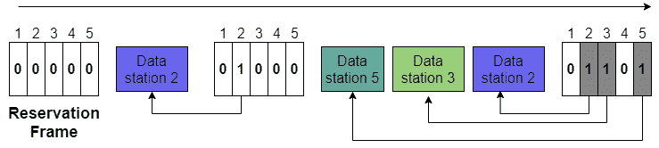
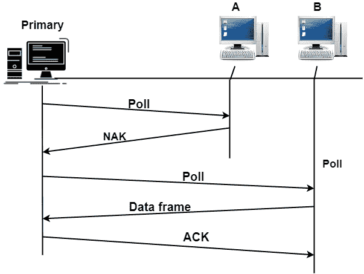
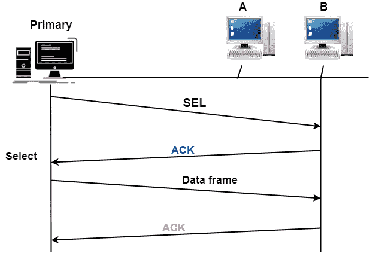
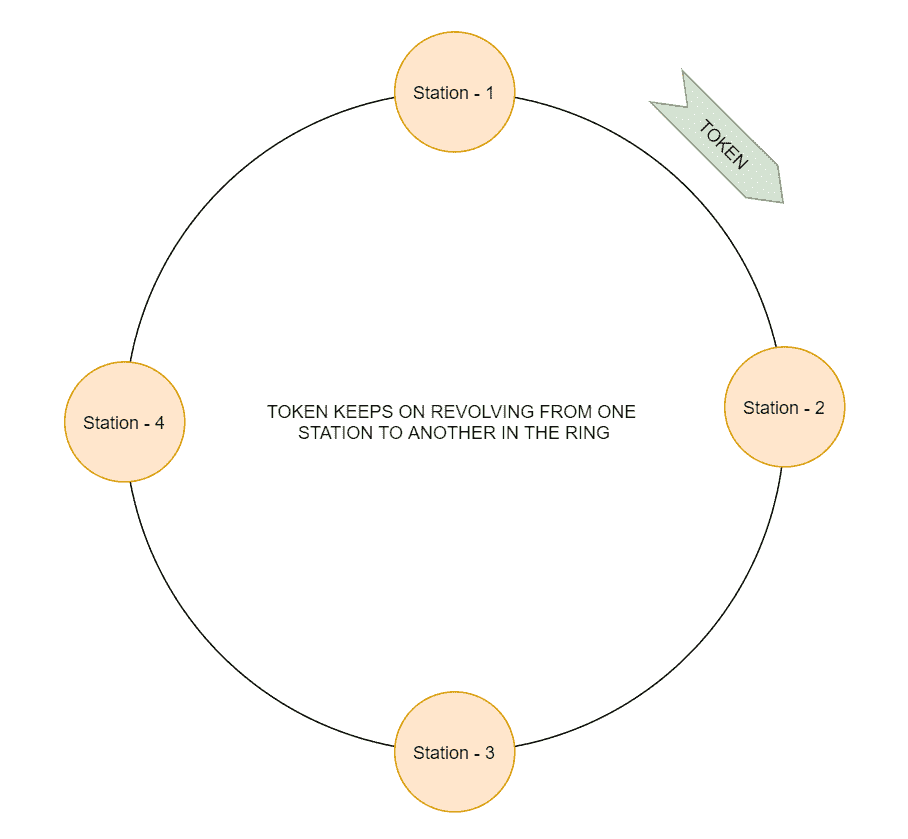

# 受控访问协议

> 原文：<https://www.studytonight.com/computer-networks/controlled-access-protocols>

在本教程中，我们将介绍计算机网络中受控访问协议的概念。

在受控接入技术中，所有站点都需要相互协商，以确定哪个站点有权发送数据。

*   受控访问协议主要授予一次只发送一个节点的权限；从而避免共享介质之间的冲突。

*   除非得到其他站的授权，否则任何站都不能发送数据。

受控访问类别下的协议如下:

1.  保留

2.  投票

3.  令牌传递

让我们逐一讨论每个协议:

## 1.保留

在这种方法中，站需要在发送数据之前进行预约。

*   时间主要分为区间。

*   此外，在每个间隔中，预留帧在该间隔中发送的数据帧之前。

*   假设系统中有**‘N’**个站点，那么在预留帧中正好有**‘N’**个预留微时隙；每个迷你剧都属于一个电视台。

*   每当一个站需要发送数据帧时，该站就在自己的微时隙中进行预约。

*   然后，已经预约的站可以在预约帧之后发送它们的数据。

**例**

让我们以 5 个站点和一个 5 微时隙预留帧为例。在第一个间隔中，站 2、3 和 5 已经进行了预订。而在第二间隔中，只有站 2 进行了预订。

## 2.投票

轮询方法主要适用于一台设备被指定为主站而另一台设备被指定为从站的拓扑结构。

*   所有数据交换都必须通过主设备进行，即使最终目的地是辅助设备。

*   因此，对独立用户的网络施加命令，并在网络中建立一个站作为控制器并定期轮询所有其他站，简称为**轮询**。

*   主设备主要控制链路，而辅助设备遵循主设备的指令。

*   主要设备负责确定在给定时间允许哪个设备使用信道。

*   因此，主设备始终是会话的发起者。

### 轮询功能

如果主设备想要接收数据，它通常会询问辅助设备是否有要发送的内容。这就是俗称的**轮询功能**。

*   有一个**轮询功能**，主要由主设备使用，以便从辅助设备请求传输。

*   当主设备准备好接收数据时，它必须依次询问(轮询)每个辅助设备是否有什么要发送的。

*   如果辅助设备有数据要传输，则发送数据帧，否则发送**否定确认(NAK)** 。

*   之后，如果出现否定响应，主服务器会以同样的方式轮询下一个辅助服务器，直到找到要发送数据的那个。当主设备接收到肯定响应(即数据帧)时，主设备读取该帧，然后返回确认**(确认)**帧，

### 选择功能

在这种情况下，如果主设备想要发送数据，它会通知辅助设备准备接收数据。这就是通常所说的**选择功能**。

*   因此**选择功能**由主设备在有东西要发送时使用。

*   我们已经告诉过你**主设备**总是**控制链接。**

*   在发送数据帧之前，选择 **(SEL)帧是由主设备创建和发送的**，SEL 帧的一个字段包括预期辅助设备的地址。

*   主设备提醒辅助设备即将到来的传输，然后等待辅助设备的确认。

### 投票的优势

下面给出了轮询技术的一些好处:

1.  信道上的最小和最大访问时间和数据速率是可预测和固定的。

2.  有优先级的分配，以确保从一些次要的更快的访问。

### 缺点

轮询方法有以下缺点:

*   对控制器的可靠性有很高的依赖性

*   周转时间的增加导致信道在低负载下的数据速率降低。

## 3.令牌传递

在令牌传递方法中，所有站点都以逻辑环的形式组织起来。我们也可以说，每个站都有一个前身和一个继承者。

*   前身是环中逻辑上在站之前的站；而后继站是在环中的站之后的站。现在正在访问频道的电台是**当前电台**。

*   基本上，以某种预定顺序从一个站循环到下一个站的特殊位模式或小消息通常被称为**令牌**。

*   拥有令牌主要是赋予电台访问频道和发送数据的权利。

*   当任何站点有一些数据要发送时，它会一直等待，直到从它的前身收到令牌。收到令牌后，它保存令牌，然后发送数据。当任何站点没有更多数据要发送时，它会释放令牌，然后将令牌传递给环中的下一个逻辑站点。

*   此外，在下一轮再次收到令牌之前，工作站无法发送数据。

*   在令牌传递中，当一个站点收到令牌并且没有要发送的数据时，它只是将令牌传递给下一个站点。

*   令牌传递技术导致的问题是令牌的重复或丢失。为了令牌传递技术的正确和可靠操作，还需要处理新站的插入和站的移除。

令牌环的性能由两个参数控制，即延迟和吞吐量。

**延迟**是对时间的度量；它是准备传输的数据包与传输时间之间的时间差。因此，将令牌发送到下一站所需的平均时间为 a/N

**吞吐量**是通信信道中成功流量的度量。

**吞吐量，对于一个< 1** 来说，S = 1/ (1 + a/N)

**S = 1/【a(1+1/N)】对于 a > 1，这里 N =站数& a = Tp/Tt**

**Tp =传播延迟& Tt =传输延迟**

在下图中，当站 1 拥有令牌时，它开始传输队列中的所有数据帧。现在，在传输之后，站-1 将令牌传递给站-2，依此类推。现在，只有当网络中的所有站点都传输了数据并通过令牌时，站点 1 才能再次传输数据。

<u>**注**</u> :需要注意的是，A 令牌只能在生成它的那个通道工作，不能为其他任何通道工作。

* * *

* * *