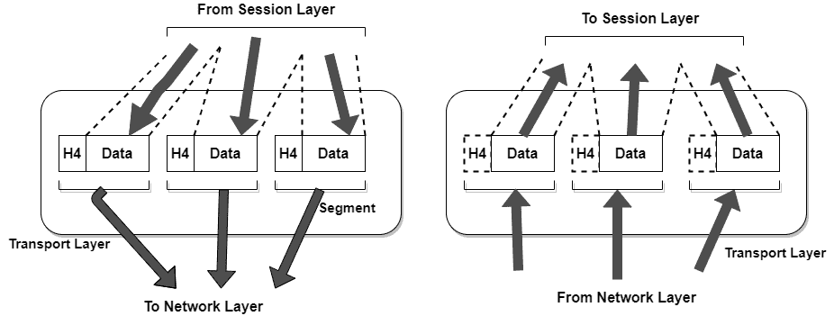

# 计算机网络中的传输层

> 原文：<https://www.studytonight.com/computer-networks/transport-layer-in-computer-networks>

在本教程中，我们将详细介绍现场视察参考模型中传输层的概念。

传输层是现场视察参考模型的第 4 层。传输层主要负责整个消息的进程间传递。进程基本上是运行在主机上的应用程序。

传输层的基本功能是接受来自上一层的数据，将其拆分成更小的单元，将这些数据单元传递到网络层，并确保所有数据块都正确到达另一端。

此外，所有这些都必须高效地完成，并且要将上层与硬件技术中不可避免的变化隔离开来。

传输层还决定向会话层以及最终向网络用户提供何种类型的服务。最流行的传输连接类型是**无错误点对点通道**，它按照消息或字节的发送顺序发送消息或字节。

传输层是真正的端到端层，从源一直到目的地。换句话说，源机器上的程序使用消息头和控制消息与目标机器上的类似程序进行对话。

*   传输层还识别错误，如损坏的数据包、丢失的数据包和重复的数据包，并提供足够的纠错技术。

*   网络层的协议只在终端系统中实现，而不在网络路由器中实现。

*   传输层的协议提供了许多服务，如多路复用、多路分解、可靠的数据传输、带宽保证。

该层主要提供终端用户之间的透明数据传输，也提供数据到上层的可靠传输。

### 

**图:传输层**

## 传输层的功能

1.  **服务点寻址:**传输层报头包括服务点地址，即端口地址。这一层将消息发送到计算机上的正确进程，而不像网络层那样将每个数据包发送到正确的计算机。

2.  **分段和重组:**一条消息被分成多个段(可传输的段)；每个段包含一个序列号，这使得该层能够重组消息。消息到达目的地后会被正确重组，并替换传输中丢失的数据包。

3.  **连接控制:**包括 2 种类型:

    *   无连接传输层:每个网段都被视为一个独立的数据包，并在目的机器上传送到传输层。

    *   面向连接的传输层:在传递数据包之前，在目的机器上与传输层建立连接。

4.  **流量控制:**在该层中，流量控制是端到端执行的，而不是跨单个链路执行的。

5.  **差错控制:**在本层进行**端到端**的差错控制，确保完整的报文无差错到达接收传输层。纠错是通过重传完成的。

现在让我们了解传输层的流程到流程交付。

## 流程到流程交付的说明

因此，传输层主要负责将消息从一个进程传递到另一个进程。

### 传输层的设计问题

*   接受来自会话层的数据，将其分割成段，并将其发送到网络层。

*   确保高效地正确交付数据。

*   将上层与技术变革隔离开来。

*   错误控制和流量控制。

* * *

* * *