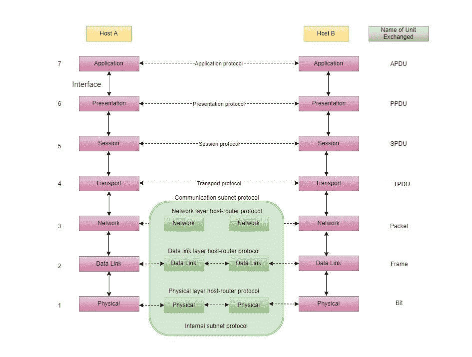
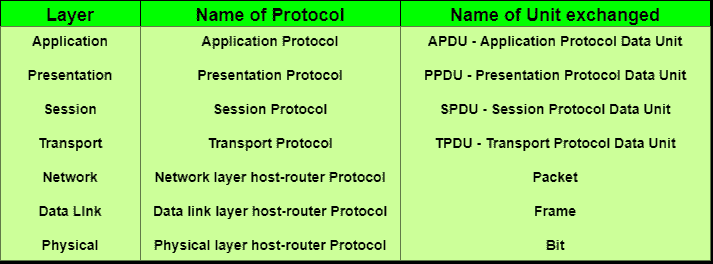

# 现场视察模型——特点、原则和层次

> 原文：<https://www.studytonight.com/computer-networks/complete-osi-model>

有`n`数量的用户使用计算机网络，分布在世界各地。因此，为了确保国家和世界范围内的数据通信，必须开发相互兼容的系统。国际标准化组织代表**国际标准化组织**。这被称为**开放系统互连** (OSI)的模型，通常被称为 OSI 模型。

国际标准化组织现场视察模型是一个七层架构。它在一个完整的通信系统中定义了七个层次。它们是:

1.  [应用层](osi-model-application-layer)
2.  [表示层](osi-model-presentation-layer)
3.  [会话层](osi-model-session-layer)
4.  [传输层](osi-model-transport-layer)
5.  [网络层](osi-model-network-layer)
6.  [数据链路层](osi-model-datalink-layer)
7.  [物理层](osi-model-physical-layer)

下面我们有现场视察模型的完整表示，展示了所有层以及它们如何相互通信。

在下表中，我们指定了现场视察模型各层使用的**协议**和交换的**数据单元**。

* * *

## 现场视察模型的特点

1.  通过这种现场视察模型，可以理解网络通信的全貌。
2.  我们看到了硬件和软件是如何协同工作的。
3.  随着新技术的发展，我们可以理解它们。
4.  分开网络更容易排除故障。
5.  可用于比较不同网络上的基本功能关系。

* * *

## 现场视察参考模型的原则

OSI [参考模型](reference-models)有 7 层。用于达到七个层次的原则可以简单总结如下:

1.  应该在需要不同抽象的地方创建一个层。
2.  每一层都应该执行明确定义的功能。
3.  选择每一层的功能时，应着眼于定义国际标准化的协议。
4.  应该选择层边界来最小化通过接口的信息流。
5.  层的数量应该足够大，以至于不同的功能不需要出于必要而被放在同一个层中，并且足够小，以至于架构不会变得笨拙。

* * *

## 不同层的功能

以下是现场视察模型各层执行的功能。这只是一个介绍，我们将在接下来的教程中详细介绍每一层。

### 现场视察模型第 1 层:物理层

1.  [物理层](osi-model-physical-layer)是 OSI 模型的最底层。
2.  它激活、维护和停用物理连接。
3.  它负责通过网络传输和接收非结构化原始数据。
4.  传输所需的电压和数据速率在物理层定义。
5.  它将数字/模拟位转换成电信号或光信号。
6.  数据编码也在这一层完成。

* * *

### 现场视察模型第 2 层:数据链路层

1.  [数据链路层](osi-model-datalink-layer)同步要通过物理层传输的信息。
2.  该层的主要功能是确保数据在物理层上从一个节点到另一个节点的传输没有错误。
3.  按顺序发送和接收数据帧由该层管理。
4.  这一层发送和期望分别接收和发送的帧的确认。未确认接收帧的重新发送也由该层处理。
5.  该层在两个节点之间建立逻辑层，并管理网络上的帧流量控制。当帧缓冲区已满时，它会向发送节点发送停止信号。

* * *

### 现场视察模型第 3 层:网络层

1.  [网络层](osi-model-network-layer)通过不同的通道将信号从一个节点路由到另一个节点。
2.  它充当网络控制器。它管理子网流量。
3.  它决定数据应该走哪条路线。
4.  它将传出的消息分成数据包，并将传入的数据包组装成更高级别的消息。

* * *

### 现场视察模型第 4 层:传输层

1.  [传输层](osi-model-transport-layer)决定数据传输应该在并行路径还是单路径。
2.  数据的多路复用、分段或分割等功能由该层完成
3.  它从上面的会话层接收消息，将消息转换成更小的单元，并将其传递到网络层。
4.  传输层可能非常复杂，具体取决于网络要求。

传输层将消息(数据)分成小单元，以便网络层更有效地处理它们。

* * *

### 现场视察模型第 5 层:会话层

1.  [会话层](osi-model-session-layer)管理和同步两个不同应用之间的对话。
2.  从源到目标的数据传输会话层数据流会被标记并正确地重新同步，这样就不会过早地切断消息的结尾，从而避免数据丢失。

* * *

### 现场视察模型第 6 层:表示层

1.  [表示层](osi-model-presentation-layer)注意数据的发送方式，使接收方理解信息(数据)，并能够使用数据。
2.  在接收数据的同时，表示层转换数据，为应用层做好准备。
3.  两种交流系统的语言(语法)可能不同。在这种情况下，表示层起着翻译的作用。
4.  它具有数据压缩、数据加密、数据转换等功能。

* * *

### 现场视察模型第 7 层:应用层

1.  [应用层](osi-model-application-layer)是最顶层。
2.  干扰用户结果的文件传输也在这一层完成。邮件服务、目录服务、网络资源等是应用层提供的服务。
3.  该层主要保存应用程序，以对接收和发送的数据进行操作。

* * *

## 现场视察参考模型的优点

1.  现场视察模型很好地区分了服务、接口和协议。
2.  OSI 模型的协议隐藏得非常好。
3.  随着技术的变化，协议可以被新的协议所取代。
4.  支持面向连接的服务和无连接服务。

* * *

## 现场视察参考模型的缺点

1.  模型是在协议发明之前设计出来的。
2.  协议的拟合是一项乏味的任务。
3.  只是作为参考模型。

* * *

* * *