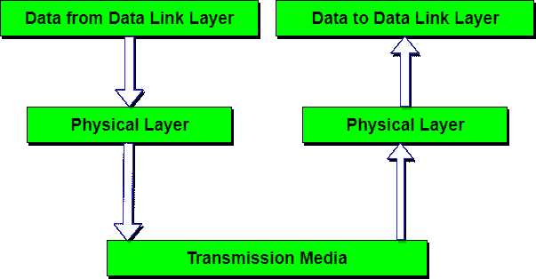

# 物理层-OSI 参考模型

> 原文：<https://www.studytonight.com/computer-networks/osi-model-physical-layer>

物理层是 OSI 参考模型的最低层。它负责将比特从一台计算机发送到另一台计算机。这一层与比特的含义无关，它处理与网络的物理连接的建立以及信号的发送和接收。

* * *

## 物理层的功能

以下是 OSI 模型物理层执行的各种功能。

1.  **位的表示:**该层中的数据由位流组成。这些比特必须编码成信号才能传输。它定义了编码的类型，即 0 和 1 是如何变成信号的。
2.  **数据速率:**该层定义传输速率，即每秒的位数。
3.  **同步:**处理发射机和接收机的同步。发送方和接收方在位级同步。
4.  **接口:**物理层定义设备与传输介质之间的传输接口。
5.  **线路配置:**该层将设备与介质连接:点对点配置和多点配置。
6.  **拓扑:**设备必须使用以下拓扑连接:网状、星形、环形和总线。
7.  **传输模式:**物理层定义两个设备之间的传输方向:单工、半双工、全双工。
8.  处理基带和宽带传输。

* * *

### 物理层的设计问题

*   物理层负责在通信信道上传输原始比特。
*   设计问题与确保当一方发送一个`1`位时，另一方接收的是一个`1`位而不是一个`0`位有关。
*   **这里典型的问题有:**
    *   一个`1`位应该用多少伏，一个`0`应该用多少伏？
    *   一位能持续多少纳秒？
    *   传输是否可以在两个方向同时进行？
    *   传输是否可以在两个方向同时进行？
    *   网络连接器有多少个引脚，每个引脚用于什么？
*   这里的设计问题主要涉及机械、电气和定时接口，以及位于物理层之下的物理传输介质。

* * *

* * *