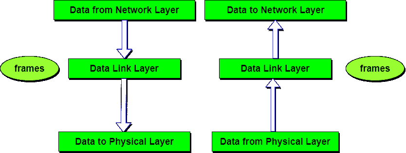

# 数据链路层-现场视察模型

> 原文：<https://www.studytonight.com/computer-networks/osi-model-datalink-layer>

数据链路层执行最可靠的节点到节点的数据传递。它将从网络层收到的数据包形成帧，并将其提供给物理层。它还同步了要通过数据传输的信息。错误控制很容易做到。编码的数据然后被传递到物理。

数据链路层使用错误检测位。它还可以纠正错误。传出消息被组装成帧。然后，系统等待在传输之后接收到确认。发送消息是可靠的。

**数据链路层**的主要任务是将原始传输设施转换为一条线路，该线路对于网络层来说似乎没有未检测到的传输错误。它通过让发送方将输入数据分解成**数据帧**(通常是几百或几千字节)并顺序传输帧来完成这一任务。如果服务可靠，接收器通过发回一个**确认帧**来确认每个帧的正确接收。

* * *

## 数据链路层的功能

1.  **成帧:**帧是从网络层接收的比特流，分成可管理的数据单元。这种比特流的划分是由数据链路层完成的。
2.  **物理寻址:**如果要将帧分发到网络上的不同系统，数据链路层会为帧添加一个报头，以定义帧的发送方或接收方的物理地址。
3.  **流量控制:**流量控制提供了一种流量控制机制，通过缓冲额外的位来避免快速发送器运行慢速接收器。这可以防止接收器端的交通堵塞。
4.  **差错控制:**差错控制是通过在帧尾增加一个拖车来实现的。使用这种机制还可以防止帧重复。数据链路层增加了防止帧重复的机制。
5.  **访问控制:**当两个或多个设备连接到同一条链路时，该层的协议决定了在任何给定时间哪个设备对该链路拥有控制权。

* * *

### 数据链路层的设计问题

*   数据链路层(以及大多数更高层)中出现的问题是如何防止快速发射机淹没慢速接收机。经常需要一些流量调节机制来让发射机知道接收机此刻有多少缓冲空间。通常，流量调节和错误处理是集成的。
*   广播网络在数据链路层还有一个额外的问题:如何控制对共享信道的访问。数据链路层的一个特殊子层，媒体访问控制子层，处理这个问题。

* * *

* * *