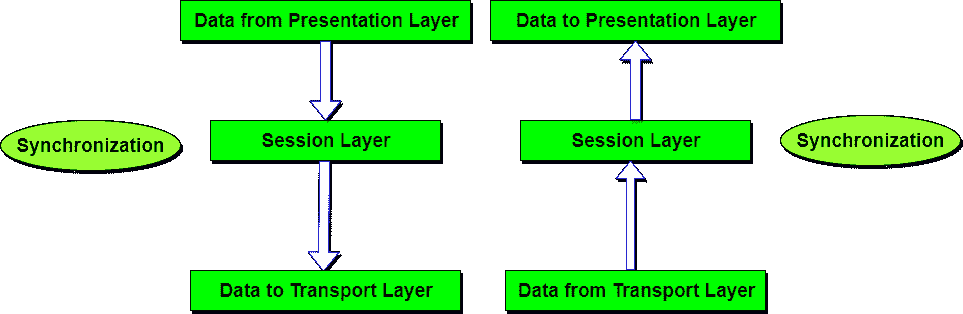

# 会话层-OSI模型

> 原文：<https://www.studytonight.com/computer-networks/osi-model-session-layer>

会话层允许不同机器上的用户在他们之间建立活动的通信会话。

它的主要目的是建立、维护和同步通信系统之间的交互。会话层管理和同步两个不同应用程序之间的对话。在会话层，数据流会被标记并正确地重新同步，这样就不会过早地切断消息的结尾，避免数据丢失。

* * *

## 会话层的功能

1.  **对话控制:**该层允许两个系统以半双工或全双工方式开始相互通信。
2.  **令牌管理:**该层防止双方同时尝试相同的关键操作。
3.  **同步:**该层允许进程将被视为同步点的检查点添加到数据流中。示例:如果系统正在发送一个 800 页的文件，建议每隔 50 页添加一个检查点。这确保了 50 页单元被成功接收和确认。这在崩溃时是有益的，就好像崩溃发生在第 110 页；没有必要重传 1 到 100 页。

* * *

### 会话层的设计问题

*   允许机器以无缝方式在它们之间建立会话。
*   为用户提供增强的服务。
*   管理对话框控件。
*   提供**令牌管理**、**同步**等服务。

* * *

* * *