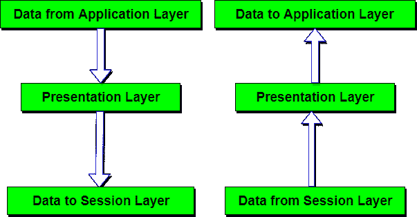

# 表示层-OSI 模型

> 原文：<https://www.studytonight.com/computer-networks/osi-model-presentation-layer>

该层的主要目标是处理两个通信系统之间交换的信息的**语法**和**语义**。表示层注意数据的发送方式，以便接收者理解信息(数据)并能够使用数据。两种交流系统的语言(语法)可能不同。在这种情况下，表示层扮演着翻译的角色。

为了使具有不同数据表示的计算机能够进行通信，可以以**抽象**的方式定义要交换的数据结构。表示层管理这些**抽象数据结构**，并允许定义和交换更高级别的数据结构(例如:银行记录)。

* * *

## 表示层的功能

1.  **翻译:**在传输之前，字符和数字形式的信息应该改为比特流。表示层负责编码方法之间的互操作性，因为不同的计算机使用不同的编码方法。它在网络要求的格式和计算机要求的格式之间转换数据。
2.  **加密:**在发送端进行加密，在接收端进行解密。
3.  **压缩:**进行数据压缩，降低待传输数据的带宽。数据压缩的主要作用是减少要传输的位数。它在传输音频、视频、文本等多媒体时非常重要。

* * *

### 表示层的设计问题

*   管理和维护所传输信息的**语法**和**语义**。
*   **以约定的标准方式编码数据**。字符串、双精度、日期等。
*   在线上执行**标准编码**。

* * *