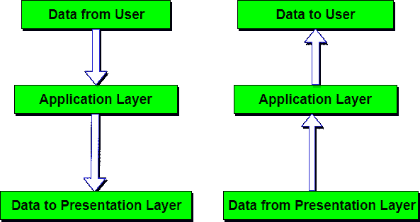

# 应用层-现场视察模型

> 原文：<https://www.studytonight.com/computer-networks/osi-model-application-layer>

它是现场视察模型的最顶层。数据(信息)的各种操作都是在这一层完成的，这使得用户或软件能够访问网络。该层提供的一些服务包括:电子邮件、传输文件、向用户分发结果、目录服务、网络资源等。

应用层包含用户通常需要的各种协议。一个广泛使用的应用协议是 **HTTP(超文本传输协议)**，它是万维网的基础。当浏览器想要一个网页时，它会使用 HTTP 向服务器发送它想要的网页名称。然后，服务器将该页面发回。

其他使用的应用协议有:**文件传输协议(FTP)** 、**普通文件传输协议(TFTP)** 、**简单邮件传输协议(SMTP)** 、 **TELNET** 、**域名系统(DNS)** 等。

* * *

## 应用层的功能

1.  **邮件服务:**该层为电子邮件转发和存储提供基础。
2.  **网络虚拟终端:**允许用户登录远程主机。该应用程序在远程主机上创建终端的软件仿真。用户的计算机与软件终端对话，软件终端又与主机对话，反之亦然。然后，远程主机认为它正在与自己的一个终端通信，并允许用户登录。
3.  **目录服务:**该层提供对各种服务的全局信息的访问。
4.  **文件传输、访问和管理(FTAM):** 它是访问文件和管理文件的标准机制。用户可以访问远程计算机中的文件并对其进行管理。他们还可以从远程计算机检索文件。

* * *

### 应用层的设计问题

应用层协议的设计和实现中经常会出现问题，这些问题可以通过几种不同模式语言的模式来解决:

*   应用层通信协议的模式语言
*   服务设计模式
*   企业应用程序架构的模式
*   面向模式的软件架构

* * *

* * *