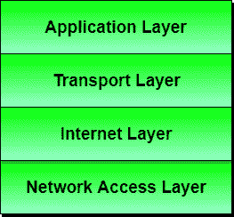
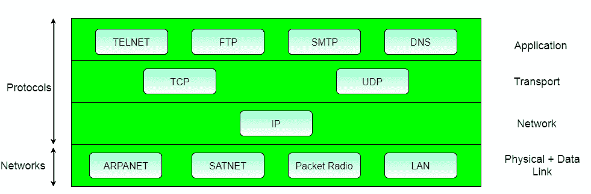

# TCP 参考模型

> 原文：<https://www.studytonight.com/computer-networks/tcp-ip-reference-model>

TCP/IP 是指传输控制协议和互联网协议。它也是当前互联网架构中使用的网络模型。**协议**是管理网络上每一个可能的通信的一组规则。这些协议描述了源和目的地或互联网之间的数据移动。它们还提供简单的命名和寻址方案。

TCP/IP 模型中的协议和网络:

* * *

## TCP/IP 参考模型概述

TCP/IP 即传输控制协议和互联网协议是由**国防部的项目研究机构** (ARPA，后来的 DARPA)开发的，作为连接远程机器的网络互连研究项目的一部分。

在研究过程中，导致制作 TCP/IP 参考模型的突出特点是:

*   支持灵活的架构。向网络中添加更多机器很容易。
*   网络是健壮的，并且连接保持完整，直到源和目标机器运行。

总的想法是允许一台计算机上的一个应用程序与运行在不同计算机上的另一个应用程序对话(发送数据包)。

* * *

## 不同层次的 TCP/IP 参考模型

下面我们讨论了构成 TCP/IP 参考模型的 4 层:

### 第 1 层:主机到网络层

1.  最底层的。
2.  协议用于连接到主机，以便通过主机发送数据包。
3.  因主机和网络而异。

* * *

### 第二层:互联网层

1.  基于无连接网间层的分组交换网络的选择称为网间层。
2.  它是将整个架构联系在一起的层。
3.  它帮助数据包独立到达目的地。
4.  接收数据包的顺序不同于发送数据包的方式。
5.  这一层使用的是网际协议。
6.  互联网层执行的各种功能有:
    *   传送 IP 数据包
    *   执行路由
    *   避免拥堵

* * *

### 第 3 层:传输层

1.  它决定数据传输应该在并行路径还是单路径上。
2.  数据的多路复用、分段或分割等功能由传输层完成。
3.  应用程序可以读写传输层。
4.  传输层向数据添加报头信息。
5.  传输层将消息(数据)分成小单元，以便网络层更有效地处理它们。
6.  传输层还会按顺序排列要发送的数据包。

* * *

### 第 4 层:应用层

TCP/IP 规范描述了许多位于协议栈顶端的应用程序。其中有 TELNET、FTP、SMTP、DNS 等。

1.  **TELNET** 是一种双向通信协议，允许连接到远程机器并在其上运行应用程序。
2.  **FTP 协议**(FTP 协议)是一种协议，允许通过网络连接的计算机用户之间传输文件。它可靠、简单、高效。
3.  **SMTP** (简单邮件传输协议)是一种协议，用于通过路由在源和目的地之间传输电子邮件。
4.  **域名系统**(域名服务器)为通过网络连接的主机将一个 IP 地址解析为一个文本地址。
5.  它允许对等实体进行对话。
6.  它定义了两个端到端协议:TCP 和 UDP
    *   **TCP(传输控制协议):**它是一种可靠的面向连接的协议，处理从源到目的地的字节流，没有错误和流量控制。
    *   **UDP(用户数据报协议):**它是一种不可靠的无连接协议，不需要 TCP、定序和流量控制。一次性请求-回复服务。

* * *

## TCP/IP 模式的优点

1.  它独立运作。
2.  它是可扩展的。
3.  客户端/服务器架构。
4.  支持多种路由协议。
5.  可用于在两台计算机之间建立连接。

* * *

## 传输控制协议的缺点

1.  在这种情况下，传输层不能保证数据包的传送。
2.  该模型不能用于任何其他应用程序。
3.  替换协议并不容易。
4.  它还没有明确地将其服务、接口和协议分开。

* * *

* * *