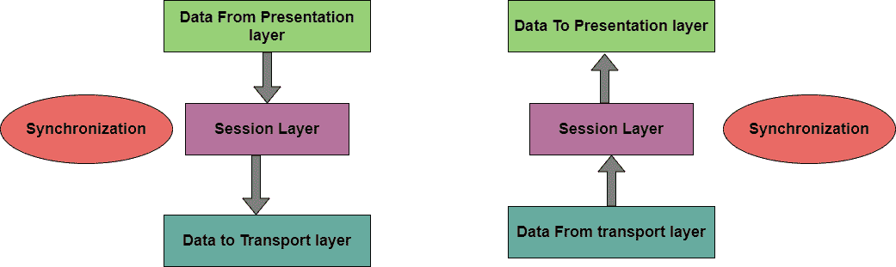

# 会话层

> 原文：<https://www.studytonight.com/computer-networks/session-layer>

在本教程中，我们将介绍**会话层**，即计算机网络中 OSI 参考模型的第 5 层。

是 OSI 参考模型的**第 5 层。会话层是网络对话控制器**

这一层主要允许不同机器上的用户在他们之间建立主动通信会话。

该层的主要目的是建立、维护和同步通信系统之间的交互。会话层管理并同步两个不同应用程序之间的对话。在会话层，数据流会被标记并正确地重新同步，这样就不会过早地切断消息的结尾，从而避免数据丢失。

该层是 OSI 模型的重要组成部分之一，被许多计算机和应用程序定期使用。

*   该层主要定义如何启动、控制和结束不同应用程序之间的对话。

*   会话层响应表示层的服务请求，然后向传输层发出服务请求。

*   这一层主要负责同步和对话控制。

*   该层提供以下服务:

    *   全双工，

    *   半双工，

    *   单工操作，

    *   建立检查点，

    *   休庭程序，

    *   终止程序，

    *   和重启程序。

*   该层的实现是通过使用远程过程调用在应用程序环境中显式完成的。

*   该层还负责通过正确的连接查找和发送数据。

*   为了建立和断开连接，会话层主要与传输层通信。

## 会话层中的协议

下面给出了会话层中使用的一些协议:

*   远程过程调用协议

*   会话控制协议

*   PPTP(点对点隧道协议)

*   密码认证协议

*   RTCP(实时传输控制协议)

## 会话层的职责

1.  **对话控制**
    该层允许两个系统以半双工或全双工方式开始相互通信。

2.  **令牌管理**
    该层防止双方同时尝试相同的关键操作。

3.  **同步**
    该层允许进程将被视为同步点的检查点添加到数据流中。**示例:**如果系统发送 800 页的文件，建议每 50 页后添加检查点。这确保了 50 页的单元被成功接收和确认。这在崩溃时是有益的，就好像崩溃发生在第 110 页；没有必要重传 1 到 100 页。

## 会话层的功能

下面给出了会话层的一些主要功能:

*   该层用于在会话实体之间建立会话。

*   这一层负责数据传输阶段。

*   该层用于选择所需的传输服务质量参数。

*   该层用于识别每个会话。

*   该层用于传输有限数量的透明用户数据。

## 会话层的设计问题

*   允许机器以无缝方式在它们之间建立会话。

*   为用户提供增强的服务。

*   管理对话框控件。

*   提供**令牌管理**、**同步**等服务。

* * *

* * *