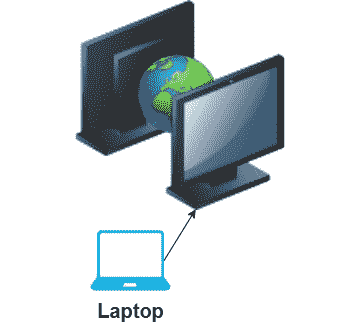
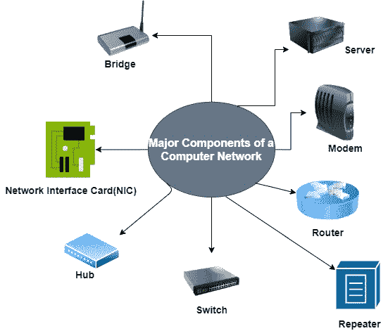

# 计算机网络组件

> 原文：<https://www.studytonight.com/computer-networks/components-of-computer-networks>

在本教程中，我们将介绍计算机网络的组件。

计算机网络基本上包括多个相互连接的计算机，以便共享信息和其他资源。多台计算机通过电缆或无线介质连接。

因此，基本上在计算机网络的帮助下，两个或多个设备被连接起来，以便共享几乎无限的信息和服务范围**，其中包括:**

 ***   音乐

*   数据库

*   网站

*   文档

*   电子邮件和消息

*   电话和会议

*   打印机和传真

上图显示了两台设备如何借助互联网相互连接，以及笔记本电脑如何借助电缆与其中一台设备连接。

现在让我们学习计算机网络的主要组成部分；

## 计算机网络组件

安装网络所需的关键部分包含在计算机网络的组件中。从简单到复杂，计算机网络中有许多类型的网络。我们需要为网络安装的组件主要取决于网络的类型。我们也可以根据需要删除一些网络组件。

例如:为了建立无线网络，不需要电缆。

下面给出了计算机网络的组件列表:

*   网络接口卡

*   中心

*   转换

*   中继器

*   路由器

*   调制解调器

*   计算机网络服务器

*   桥

我们现在将讨论计算机网络的所有上述主要组件:

## 1.网络接口卡

网卡主要提供计算机和布线之间的物理接口。网卡准备数据，发送数据，并控制数据流。它还可以接收数据并将其转换为字节，供 CPU 理解。

*   网卡是一种硬件组件，主要用于连接网络上的一台计算机和另一台计算机。

*   网卡的主要作用是将网络电缆或介质上的串行信号转换成电脑内部的并行数据流。

*   网卡支持的传输速率为 10Mb/s、100 Mb/s、1000 Mb/s。

*   服务器中使用两个或更多网卡来分担负载。

*   网卡的主要工作是控制对介质的访问。

*   网卡可以是有线或无线的。在有线网卡中，有电缆和连接器作为传输数据的介质。而在无线卡中，连接通常使用使用无线电波技术的天线进行

**选择网卡时需要考虑的因素:**

1.  准备数据

2.  发送和控制数据

3.  配置

4.  司机

5.  和睦相处

6.  表演

## 2.中心

集线器是用于将多台计算机连接在一起的设备。集线器重复一个端口传入的信号，然后复制到其他端口。

*   网络集线器基本上是网络中所有数据传输的集中分发点。

*   集线器是一个被动设备。

*   集线器接收数据，然后将数据转播给与其连接的其他计算机。Hub 主要不知道接收到的数据包的目的地。因此，需要向所有集线器连接发送数据包的副本。

*   此外，集线器会消耗更多的网络带宽，从而限制通信量。

*   使用集线器的一个缺点是，它们没有智能来找出数据包的最佳路径，从而导致效率低下和浪费。

### 集线器的类型

**1。主动中枢:**

主动集线器利用电子设备在信号广播到其他端口之前对其进行放大和净化。主动集线器主要用于扩展节点之间的最大距离。它既是布线中心，也是中继器。

**2。被动中枢:**

被动集线器是那些只连接到主动集线器的集线器。无源集线器仅用于将所有端口电连接在一起，这些端口通常不通电。这些集线器比被动集线器便宜。无源集线器既不放大信号，也不再生信号。

**3。智能集线器:**

智能集线器比主动和被动集线器具有更好的性能。如今，智能集线器被广泛使用，并且比主动和被动集线器需求更大。这些集线器主要用于连接各种设备。它支持在任何输入信号点放大和再生信号。

智能集线器沿着选择路径支撑网络。被动和主动的任务都可以由智能中枢管理。

在智能集线器的帮助下，整个网络的速度和效率都会提高，这有助于获得快速高效的网络性能。

## 3.转换

交换机主要类似于集线器。它是第 2 层设备，用于消息的智能转发。我们所说的智能是指交换机的决策能力。因为集线器的工作方式是向设备上的所有端口发送数据，而交换机只向与目的设备相连的端口发送数据。

*   交换机是网络组件，主要用于连接网络的各个部分。

*   交换机比网络集线器更智能。

*   交换机主要能够在收到数据包后立即对其进行检查，然后确定该数据包的来源和目的地，然后适当地转发该数据包。

*   交换机不同于集线器，因为它还包含不同速度的端口。

*   在将数据转发到端口之前，交换机会执行错误检查，这一功能会提高交换机的效率。

*   当交换机将消息传送到它所连接的设备时，它节省了网络带宽，并提供了比集线器更好的性能。

*   交换机最重要的特点是支持单播(一对一)、组播(一对多)和广播(一对全)通信。

*   交换机利用媒体访问控制地址将数据包发送到选定的目的端口。

交换机分为 4 类:

**1。受管交换机**
这些交换机价格昂贵，主要用于那些拥有大型复杂网络的组织。受管交换机使用简单网络管理协议(SNMP)进行配置。这些交换机提供了高级别的安全性和完整的网络管理，因此除了价格昂贵之外，它们还用于大型组织，因为它们提供了高度的可扩展性和灵活性

**2。非托管交换机**
这些交换机价格便宜，主要用于家庭网络和小型企业。不需要配置非托管交换机。只需将非受管交换机插入网络，即可轻松设置它们，插入后它们会立即开始运行。

**3。PoE 交换机**
这些被称为**以太网供电**交换机。在 PoE 技术的帮助下，这些交换机通过同一条电缆将数据和电力传输结合在一起，并且在连接到该交换机的设备的帮助下，能够通过同一条线路接收电力和数据。因此，PoE 交换机提供了更大的灵活性。

**4。局域网交换机**
局域网交换机简称局域网交换机，主要用于连接组织内部局域网中的设备。这些有助于减少网络拥塞。这些交换机的带宽分配方式使得网络中的数据包不会重叠。

## 4.中继器

中继器是物理层设备。顾名思义，中继器主要用于在同一网络上再生信号，它主要在信号被破坏或变弱之前再生。

它们被合并到网络中，以扩大覆盖范围。中继器可以利用不同类型的电缆来连接信号。

*   复读机很划算。

*   中继器非常容易安装，安装后，它们可以轻松扩展网络的覆盖范围。

*   但是中继器有一个问题，那就是它们不能连接不同类型的网络。

*   中继器无助于减少网络中的流量。

### 中继器的类型:

可用的中继器类型如下:

**1。模拟中继器**
这些仅用于放大模拟信号。

**2。数字中继器**
这些仅用于放大数字信号。

**3。有线中继器**
这些中继器主要用于有线局域网。

**4。无线中继器**
这些主要用于无线局域网和蜂窝网络。

**5。本地中继器**
它们用于连接相隔很小距离的局域网网段。

**6。远程中继器**
这些主要是用来连接那些相距很远的局域网。

## 5.路由器

路由器是一个网络组件，主要用于在计算机网络上**发送或接收数据**。将数据包从源转发到目的地的过程称为**路由。**

*   路由器是网络层(即第 3 层)设备。

*   路由器的主要职责是接收数据包，分析它们，然后在连接的计算机网络之间转发数据包。

*   每当任何数据包到达时，路由器首先检查目的地址，然后查阅其路由表，以确定最佳路由，然后沿着该路由将数据包传输到目的地。

*   路由器主要用于防止广播风暴。

*   路由器比集线器、交换机、中继器和网桥贵。

*   路由器还可以将不同的网络连接在一起，因此数据包也可以从一个网络发送到另一个网络。

*   路由器既用于局域网，也用于广域网。

*   路由器相互共享数据，以便准备和刷新路由表。

### 路由器的类型:

不同类型的路由器如下:

**1。核心路由器**
核心路由器主要由服务提供商(如 AT & T、沃达丰)或云提供商(如亚马逊、微软、谷歌)使用。核心路由器提供最大带宽，以便连接额外的路由器或交换机。大型组织使用核心路由器。

**2。边缘路由器**
边缘路由器也称为网关路由器或简称网关。网关是网络与外部网络的最外层连接点，也包括**互联网。**这些路由器主要用于优化带宽，旨在连接到其他路由器，以便向最终用户分发数据。边界网关协议主要用于边缘路由器的连接。

这些进一步分为两类:

*   用户边缘路由器

*   标记边缘路由器。

**3。**
brouters 的意思是桥接路由设备。这些是特殊的路由器，它们也提供网桥的功能。它们执行网桥和路由器的功能；像网桥一样，这些路由器有助于在网络之间传输数据，像路由器一样，它们在网络设备内路由数据。

**4。宽带路由器**
它是一种网络设备，主要允许最终用户从互联网服务提供商(ISP)访问宽带互联网。互联网服务提供商通常为最终用户提供和配置宽带路由器。

**5。分布路由器**
这些路由器主要通过有线连接从边缘路由器(或网关)接收数据，然后在无线网络的帮助下将其发送给最终用户。

**5。无线路由器**
这些路由器结合了边缘路由器和分布路由器的功能。这些路由器主要为笔记本电脑、智能手机等 WiFi 设备提供 WiFi 连接。这些路由器还提供标准的以太网路由。对于室内连接，这些路由器的范围是 150 英尺，而对于室外连接是 300 英尺。

## 6.调制解调器

调制解调器基本上是一个硬件组件，主要允许计算机或任何其他设备(如路由器、交换机)连接到互联网。调制解调器基本上是调制解调器的简写形式。

调制解调器最重要的功能之一是将模拟信号转换成数字信号，反之亦然。此外，该设备是两个设备的组合:**调制器**和**解调器**。**调制器**主要在计算机发送数据时将数字数据转换成模拟数据。

**解调器**基本上在计算机接收模拟数据信号时将其转换成数字数据。

## 7.计算机网络服务器

服务器基本上是一台向其他设备提供数据的计算机。服务器可以在互联网的帮助下通过局域网或广域网向其他设备或计算机提供数据。可以有虚拟服务器、代理服务器、应用服务器、网络服务器、数据库服务器、文件服务器等等。

因此，服务器主要用于服务其他设备的请求。可以是硬件，也可以是软件。

## 8.桥

它是计算机网络的另一个重要组成部分。网桥也是第 2 层(即数据链路层设备)。网桥主要用于将两个或多个局域网连接在一起。这些主要用于帮助快速传输数据。

但是这些并不像路由器那样通用。

因此，网桥可以主要在不同协议(即令牌环网和以太网)之间传输数据，并且如上所述，在 OSI(开放系统互连)网络参考模型的数据链路层或第 2 层运行。

桥梁进一步分为两种:

*   **本地桥**
    这些都是普通的桥。

*   **远程网桥**
    这些主要用于连接相距较远的网络。通常在两个网桥之间提供广域网

一些网桥协议是生成树协议、源路由协议和源路由透明协议。** 

* * *

* * *