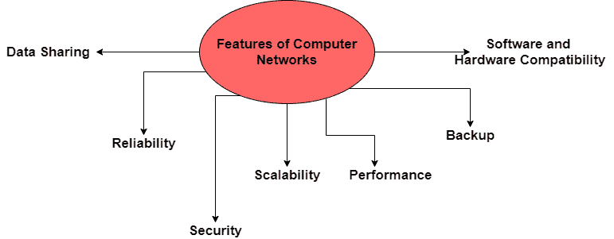

# 计算机网络的特点

> 原文：<https://www.studytonight.com/computer-networks/features-of-computer-networks>

在本教程中，我们将介绍计算机网络的特性。

基本上，计算机网络是通过介质连接的两个或多个设备的连接，以交换信息。借助计算机网络，您可以轻松地向计算设备发送数据或从计算设备接收数据。

现在是时候介绍计算机网络的重要特性了:

*   数据共享

*   可靠性

*   可量测性

*   安全

*   表演

*   支持

*   软件和硬件兼容性

我们将在下一节中逐一讨论每个特性:

## 1.数据共享

计算机网络最重要的特点之一是，在它们的帮助下，您可以在通过传输介质相互连接的不同系统之间轻松共享数据。

因此，资源可以通过网络在两个或多个设备之间轻松共享。

## 2.可靠性

在计算机网络的帮助下，发生故障的机会更少，如果出现任何故障，恢复也更快。

## 3.安全

安全性是计算机网络的主要特征之一，因此计算机网络应该是安全的，这样通过网络传输的数据应该是安全的，不会受到任何未经授权的访问。

此外，**发送节点**发送的数据应该在**接收节点**接收，这简单地意味着在数据传输期间不应该有数据丢失。

## 4.可量测性

计算机网络的另一个特点是可扩展性。计算机网络的可扩展性仅仅意味着我们可以轻松地向网络添加新的节点或组件。任何计算机网络都必须是可扩展的，因此我们可以通过添加新节点来轻松扩展它。向网络中添加新节点后，连接速度会降低，从而导致数据传输速度降低。因此，由于所有这些，有更多的机会出现错误。

这个问题可以在路由设备的帮助下解决。

让我们举一个例子:假设一家公司有 50 台电脑，每台电脑对应 50 名员工。假设公司再雇佣 100 名员工，然后公司在现有局域网上增加 100 台计算机，那么在这种情况下，局域网应该允许同样的情况。

## 5.表演

计算机网络的性能通过响应时间和数据传输速度来衡量。为了获得更好的性能，从一个节点向另一个节点发送和接收数据的响应时间应该最短。

## 6.支持

计算机网络必须有一个中央服务器，该服务器必须保留网络上共享的所有数据的备份。当网络出现故障时，该中央服务器有助于更快的恢复。

## 7.软件和硬件兼容性

在计算机网络中，不能对计算机网络中的所有计算机使用相同的软件和硬件有任何限制。

相反，计算机网络应该允许不同软件和硬件配置之间更好的兼容性。

在计算机网络的帮助下，我们所有人与他人分享我们的知识和想法变得非常容易。例如:通过电子邮件，通过互联网上的视频会议，一切都变得容易。

## 结论

因此，我们已经涵盖了计算机网络的不同特征，并且在计算机网络的帮助下，通信变得容易和高效。计算机网络的另一个特点是，它们通过避免数据丢失、避免未经授权访问数据、减少数据传输延迟以及管理数据流量来提供服务质量。

* * *

* * *