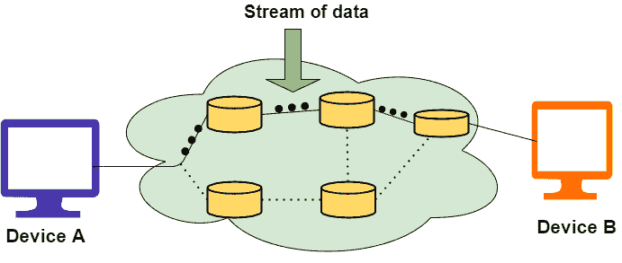
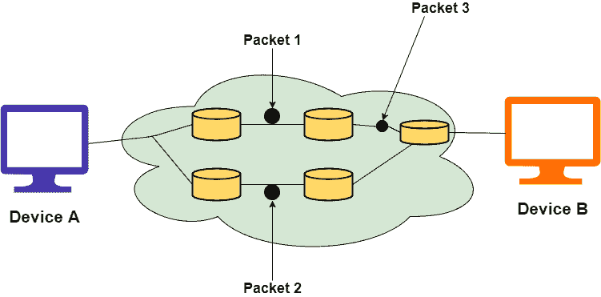

# 面向连接和无连接的服务

> 原文：<https://www.studytonight.com/computer-networks/connection-oriented-and-connectionless-services>

在本教程中，我们将介绍在计算机网络中建立面向连接和无连接服务两种连接方式的区别。

为了在两个或多个设备之间建立连接，计算机网络中有一些服务。有两种服务是由这些层提供给它们上面的层的。这些服务如下:

1.  面向连接的服务

2.  无连接服务

## 面向连接的服务

面向连接的服务的用户需要遵循一系列的操作。这些是:

1.  连接已经建立。

2.  信息被发送。

3.  连接被释放。

在面向连接的服务中，我们必须在开始通信之前建立连接。当连接建立时，我们发送消息或信息，然后释放连接。

面向连接的服务比无连接的服务更可靠。如果接收端出现错误，我们可以在面向连接的服务中发送消息。面向连接的一个例子是 **TCP(传输控制协议)协议**。

在上图中，设备 A 和设备 B 之间的实线表示存在数据流在它们之间传输的专用链路。在这个链接的帮助下，接收者可以向发送者发送关于数据包状态的确认。

### 优势

面向连接的服务的优势如下:

*   面向连接的服务是可靠的。

*   数据包没有重复。

*   没有拥堵的可能。

*   这些适用于长连接。

*   数据包的顺序是有保证的。

### 不足之处

面向连接服务的缺点如下:

*   这种资源分配在沟通之前是强制性的。

*   连接速度较慢。建立和放弃连接需要花费同样多的时间。

*   在网络拥塞或路由器故障的情况下，没有其他方法可以继续通信。

## 无连接服务

它类似于邮政服务，因为它承载着邮件(信件)的完整地址。每条消息都独立地从源路由到目的地。发送消息的顺序可以不同于接收消息的顺序。

在无连接的情况下，数据从源向目的地单向传输，而不检查目的地是否还在，也不检查它是否准备接受消息。在这种情况下不需要身份验证。无连接服务的一个例子是 **UDP(用户数据报协议)协议**。

### 优势

无连接服务的优势如下:

*   通常费用很低。

*   面向连接的服务有助于向多个接收者广播或多播消息。

*   在这种情况下，没有电路设置。因此，建立连接只需要几分钟的时间。

*   在网络拥塞或路由器故障的情况下，它有另一条数据传输路径。

### 不足之处

连接较少服务的缺点如下:

*   这些容易受到网络拥塞的影响。

*   这是不可靠的，因为有可能丢失数据包、错误传送数据包或复制数据。

*   在这种情况下，每个数据包都需要很长的字段，因为这些字段应该包含所有的目的地址和路由信息。

让我们了解上述两种服务之间的区别:

| 面向连接的服务 | 无连接服务 |
| --- | --- |
| 面向连接的服务是基于**电话系统**设计的。 | 无连接服务基于**邮政系统**。 |
| 在这种类型的服务中，需要建立**优先连接**。 | 在这种类型的服务中，**不需要预先连接**。 |
| 这些服务确保了**数据的可靠传输**。 | 因为这些服务是尽力服务，但是**的可靠性在这些服务中没有保证**。 |
| 不存在**拥堵的可能性**。 | 使用这些服务时**有可能发生拥堵**。 |
| 在这种情况下**在将数据包发送到接收器之前需要**认证。 | 在这种情况下，在将数据包发送到接收器之前不需要**认证**。 |
| 这些服务适用于**长时间稳定的**变速器。 | 这些服务适用于**突发**传输。 |
| 在此**连接通过**发信号**的过程建立** | 没有**这样的信号概念**存在。 |
| 在这种类型的服务中，数据包以顺序方式向其目的节点**传输。** | 在这种类型的服务中，数据包以**随机方式向目的节点传输。** |
| **丢失数据位的重传是可能的**。 | 在这种情况下，是**不可能的。** |
| **传递信息时延迟较多**。但是在连接建立之后，这些服务提供了**信息的快速传递**。 | 由于**没有连接建立阶段，**没有**延迟。** |

### 什么是服务原语？

服务由用户进程访问服务时可用的一组原语(操作)正式指定。这些原语告诉服务执行一些动作或报告对等实体采取的动作。如果协议栈通常位于操作系统中，那么原语通常是系统调用。这些调用导致内核模式陷入陷阱，然后内核模式将机器的控制权移交给操作系统，以发送必要的数据包。可用的原语集取决于所提供服务的性质。面向连接服务的原语不同于无连接服务的原语。有五种类型的服务原语:

1.  **LISTEN:** 当服务器准备好接受传入的连接时，它会执行 LISTEN 原语。它会阻止等待传入的连接。

2.  **CONNECT:** 它通过建立连接来连接服务器。等待答复。

3.  **receive:**然后 receive 调用阻塞服务器。

4.  **发送:**然后客户端执行发送原语来发送其请求，然后执行接收来获得回复。发送消息。

5.  **DISCONNECT:** 该原语用于终止连接。在这种原始状态之后，一个人不能发送任何信息。当客户端发送 DISCONNECT 数据包时，服务器也会发送 DISCONNECT 数据包来确认客户端。当客户端收到服务器包时，该过程终止。

### 面向连接的服务原语

面向连接的服务有 5 种基本类型:

| 听 | 阻止等待传入的连接 |
| 关系 | 与等待的对等方建立连接 |
| 接收 | 阻止等待传入消息 |
| 派遣 | 向对等方发送消息 |
| 拆开 | 终止连接 |

### 无连接服务原语

面向无连接服务有 4 种基本类型:

| 统一日期 | 这个原语发送一个数据包 |
| 设施，报告 | 用于查询网络性能的原语，如交付统计。 |

### 服务与协议的关系

在本节中，我们将了解服务和协议是如何相关的，以及它们为什么对彼此如此重要。

### 什么是服务？

这些是在[OSI 参考模型](https://www.studytonight.com/computer-networks/complete-osi-model)中，一个层可以向它上面的层提供的操作。它定义了操作并声明一个层已经准备好执行，但是它没有指定任何关于这些操作的实现。

### 什么是协议？

这些规则控制着服务器和客户端之间交换的帧、消息或数据包的格式和含义。

* * *

* * *