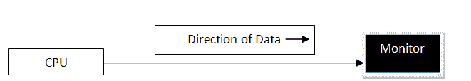

# 计算机网络中的传输模式

> 原文：<https://www.studytonight.com/computer-networks/transmission-modes-in-computer-networks>

在本教程中，我们将介绍计算机网络中传输模式的概念。

传输模式是指通过网络连接的两个设备之间传输数据的机制。也叫**通信模式**。这些模式指引着信息流的方向。

在开放系统互连(OSI)模型中，**物理层**即第 1 层主要用于网络中的数据传输。它主要决定数据到达接收系统所需行进的数据方向。

有三种传输模式。它们是:

1.  单工模式

2.  半双工模式

3.  全双工模式

## 单工模式

在这种类型的传输模式下，数据只能在一个方向上发送，即通信是单向的。我们无法将消息发送回发件人。单向通信是在单工系统中完成的，在单工系统中，我们只需要发送一个命令/信号，不需要任何回应。

单工模式的例子有扬声器、电视广播、电视和遥控器、键盘和监视器等。

单工模式不是那么流行的传输模式。这种模式更类似于单行道。这种传输方式的主要用途是在不需要任何相应回复的销售等业务领域。

### 单工模式的优点

以下是单工模式的一些优点:

*   与单工模式一样，数据向一个方向流动。因此，最少或没有数据流量问题。

*   单工模式利用数据传输时通信信道的全部容量。

### 单工模式的缺点

单工模式的一些缺点如下:

*   由于通信本质上是单向的，因此设备之间不可能相互通信。

*   信息无法传输回发送方；因此没有确认的机制

## 半双工模式

半双工数据传输意味着数据可以在信号载波上双向传输，但不能同时传输。在半双工传输模式下，信道的全部容量可以用于每个方向。在这种模式下，传输线可以双向传输数据，但一次只能向一个方向发送数据。

**例如**，在使用半双工传输技术的局域网上，一个工作站可以在线路上发送数据，然后立即从刚刚传输数据的同一方向在线路上接收数据。因此，半双工传输意味着双向线路(可以双向传输数据)，但一次只能向一个方向发送数据。

半双工的一个例子是对讲机，其中一次发送一条消息，但消息是双向发送的。

半双工传输模式可用于不需要同时在两个方向上进行通信的情况。当发送方未发送或接收方未正确接收数据时，该模式也可用于错误检测。

### 半双工模式的优势

以下是半双工模式的一些优点:

*   借助半双工模式，通信信道的使用得到了优化。

*   这种模式提供双向通信

### 半双工模式的缺点

半双工模式的一些缺点如下:

*   半双工模式支持双向通信，但这种通信不能同时建立，因此这是使用这种模式的主要缺点。

*   传输有延迟的可能，因为有时只有单向通信是可能的。

## 全双工模式

在全双工系统中，我们可以同时双向发送数据，换句话说，数据可以同时双向发送。

这种传输模式支持双向通信，其中两个站可以同时发送和接收数据。因此，全双工模式提供了最好的性能。

全双工的一个例子是电话网络，其中两个人通过电话线进行通信，两个人可以同时通话和收听。

在全双工系统中，可以有两条线，一条用于发送数据，另一条用于接收数据。

全双工模式的带宽是半双工模式的两倍。当需要同时双向通信时，使用该模式。

### 全双工模式的优势

以下是全双工模式的一些优势:

*   借助这种模式，双向通信可以同时在两个方向上进行。

*   这种模式是设备之间最快的通信模式之一

### 全双工模式的缺点

全双工模式的一些缺点如下:

1.  在这种模式下，信道带宽的利用是不适当的，这是因为两个通信设备有两条独立的路径。

2.  没有专用的数据传输路径。通信信道的容量也分为两部分。

* * *

* * *