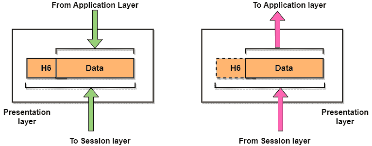

> 原文：<https://www.studytonight.com/computer-networks/presentation-layer>

[← Prev](/computer-networks/comparison-of-osi-and-tcpip-reference-model "OSI Vs TCP/IP")[Next →](/computer-networks/http-protocol "HTTP Protocol")

<nav aria-label="breadcrumb">

1.  [家](/)
2.  [计算机网络](/computer-networks)
3.  表示层

</nav>

<article>

# 表示层

在本教程中，我们将介绍计算机网络中现场视察参考模型的**表示层**。

表示层是 OSI 参考模型的**层-6。该层主要响应来自应用层(即第 7 层)的服务请求，并向第 6 层(即会话层)发出服务请求。**

这一层主要充当网络的翻译者。表示层的另一个名称是语法层。

该层的主要目标是处理两个通信系统之间交换的信息的**语法**和**语义**。表示层注意数据的发送方式，以便接收方理解信息(数据)并能够使用数据。两种交流系统的语言(语法)可能不同。在这种情况下，表示层扮演着翻译的角色。

为了使具有不同数据表示的计算机能够进行通信，可以以**抽象**的方式定义要交换的数据结构。表示层管理这些**抽象数据结构**，并允许定义和交换更高级别的数据结构(例如:银行记录)。

我们可以说，表示层可以以各种方式(如数据压缩、数据加密)表示或编码数据。但是接收设备主要将编码的消息解码或转换成其原始形式。

对于相同的数据，发送方和接收方必须就一种通常被称为**表示格式的消息格式达成一致。**

另外，表示层是操作系统的一部分，主要将数据从一种表示格式转换为另一种表示格式。

## 表示层使用的协议

下面给出了表示层使用的一些协议:

*   苹果灌装协议

*   安全套接字层

*   文件传输协议

*   用于远程联接服务的标准协议或者实现此协议的软件(可为动词)

*   轻量级表示协议(LPP)

*   安全外壳

## 表示层的功能

1.  **翻译:**在传输之前，字符和数字形式的信息应该改为比特流。表示层负责编码方法之间的互操作性，因为不同的计算机使用不同的编码方法。它在网络要求的格式和计算机的格式之间转换数据。

2.  **加密:**在发送端进行加密，在接收端进行解密。

3.  **压缩:**进行数据压缩，降低待传输数据的带宽。数据压缩的主要作用是减少要传输的位数。它在传输音频、视频、文本等多媒体时非常重要。

## 表示层的设计问题

*   管理和维护所传输信息的**语法**和**语义**。

*   **以标准的约定方式编码数据**。**例如:字符串、双精度、日期等。**

*   在线上执行**标准编码**。

</article>

* * *

* * *