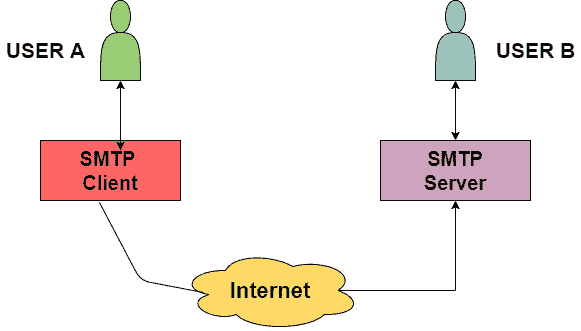
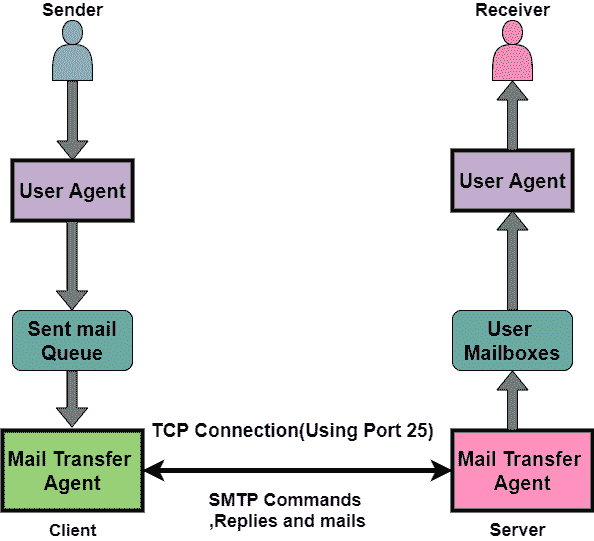

# SMTP 协议

> 原文：<https://www.studytonight.com/computer-networks/smtp-protocol>

在本教程中，我们将介绍OSI模型应用层中的 SMTP 概念。

**SMTP** 主要代表简单邮件传输协议。基本上，邮件的实际传输是通过邮件传输代理(MTA)完成的。因此，为了发送邮件，系统必须具有**客户端 MTA** ，并且为了接收邮件，系统必须具有服务器 MTA。

*   为了定义互联网上的 **MTA 客户端**和**服务器**，有一种正式的方式，被称为**简单邮件传输协议(SMTP)** 。

*   SMTP 还利用 TCP/IP 来发送和接收电子邮件。

*   SMTP 基于客户机/服务器模型。

*   SMTP 最初的标准端口是端口 25。

*   使用该协议，想要发送电子邮件的客户端首先打开到 SMTP 服务器的 TCP 连接，然后通过 TCP 连接发送电子邮件。需要注意的是，SMTP 服务器始终处于侦听模式。只要监听到来自任何客户端的 TCP 连接，连接就会在端口 25 上启动，连接成功后，客户端会立即发送电子邮件/消息。

发送电子邮件时，SMTP 被使用两次:

1.  发件人和发件人的邮件服务器之间

2.  在发送者的邮件服务器和接收者的邮件服务器之间

需要注意的是，为了接收或下载电子邮件，

*   在接收者的邮件服务器和接收者之间需要另一种协议。

*   常用的协议有 POP3 和 IMAP。因此，这两个是邮件访问代理。

## SMTP 的体系结构

所有用户都使用**用户代理(UA)** 。邮件传输代理 **(MTA)** 主要帮助发送方和接收方使用 TCP/IP 交换所有邮件。系统管理员有权配置本地 MTA 的设置，因此发送电子邮件的用户不需要处理 MTA。

MTA 将队列保存在消息池中，如果此时接收者不可用，那么 MTA 可以安排重复发送所有消息。

MTA(邮件用户代理)将电子邮件转发到用户本地系统的邮箱中，然后用户代理(UA)可以随时下载这些邮件。

SMTP 客户端和 SMTP 服务器都有两个主要组件，它们是:

*   用户代理

*   MTA(邮件传输代理)

现在让我们来看看发送方和接收方之间的通信:

发送方的用户代理准备好消息，然后将其发送到 MTA。MTA 的任务是通过网络将电子邮件传输到接收者 MTA。此外，为了发送电子邮件，系统必须有客户端 MTA，为了接收电子邮件，系统必须有服务器 MTA。

## 发送电子邮件

使用一系列请求和响应消息在发送方和接收方之间发送电子邮件。一封邮件主要由两部分组成**一个标题和正文**。电子邮件的正文部分表示主要的消息区域。它是要由接收器读取的实际信息。标题主要包含发件人和收件人的地址，还包含电子邮件的主题。

为了终止电子邮件的标题，有一个空行，空行之后的所有内容都被认为是邮件的正文。

## 接收电子邮件

邮箱由服务器端的用户代理在特定的时间间隔进行检查。如果收到任何信息，它会通知收件人有关电子邮件的信息。

当用户试图阅读电子邮件时，MTA 主要在邮箱中显示带有简短描述的电子邮件列表。如果用户选择了任何一封电子邮件，那么就可以轻松地查看电子邮件中的内容。

## SMTP 协议方法

1.  **存储转发方法**
    存储转发方法在组织内使用。

2.  **端到端方法**
    端到端方法主要用于不同组织之间的沟通

SMTP 客户端是想要发送邮件的客户端，并且为了将电子邮件发送到目的地，它肯定会直接联系目的地的主机 SMTP。此外，会话由客户端 SMPT 启动。

另一方面，SMTP 服务器将保持邮件不变，直到邮件在接收方成功复制到 SMTP。服务器 SMTP 主要响应会话请求。

因此，会话由客户端-SMTP 启动，服务器-SMTP 将响应发送者的请求。

## SMTP 的特点

让我们来看看 SMTP 的特点:

*   SMTP 使用端口 25。

*   它利用持久的 TCP 连接，因此可以同时发送多封电子邮件。

*   这是一个无状态协议。

*   这是一个面向连接的协议。

*   它在传输层利用了 TCP。

*   这是一个推送控制协议。

## SMTP 的优点

让我们看看简单邮件传输协议(SMTP)提供的优势:

*   SMTP 在发送电子邮件方面提供了可靠性。

*   它是网络中不同计算机之间通过电子邮件进行通信的最简单形式。

*   在特定消息没有成功传递的情况下，SMTP 服务器总是尝试重新发送相同的消息，直到**传输**变为**成功**。

## SMTP 的缺点

*   SMTP 不提供良好的安全性。

*   它仅限于 7 位 ASCII 字符。

*   超过特定长度，电子邮件会被 SMTP 服务器拒绝。

*   SMTP 的实用性受到其简单性的限制。

*   在 SMTP 的帮助下，可执行文件和二进制文件在转换成文本文件之前是不可能传输的。

* * *

* * *