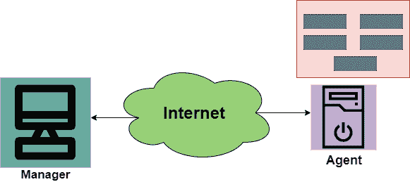
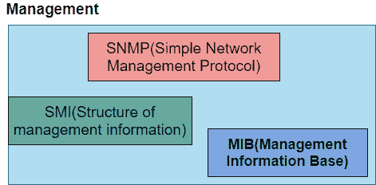

> 原文：<https://www.studytonight.com/computer-networks/snmp-protocol>

[← Prev](/computer-networks/pop-protocol "POP Protocol")[Next →](/computer-networks/telnet-in-computer-networks "TELNET")

<nav aria-label="breadcrumb">

1.  [家](/)
2.  [计算机网络](/computer-networks)
3.  简单网络协议

</nav>

<article>

# 简单网络协议

在本教程中，我们将详细介绍应用层的 SNMP。

*   SNMP 主要代表简单网络管理协议。

*   它基本上是一个框架，用于通过使用 TCP/IP 协议套件来管理互联网上的设备。

*   基本上，SNMP 提供了一套基本的操作来监控和维护互联网。

*   它是由互联网工程任务组定义的应用层协议。

*   该协议主要用于监控网络，检测网络中的故障，有时也用于配置远程设备。

## SNMP 的概念

SNMP 协议利用了管理器和代理；其中管理器通常是控制和监视代理集的主机。

*   SNMP 是一种应用层协议，它由几个管理站组成，主要控制一组代理。该协议主要是在应用层设计的，因此它可以监控主要由不同制造商制造并安装在不同物理网络上的设备。

因此，在 SNMP 的体系结构中有三个组件:

*   简单网络管理协议管理器

*   snmp 代理

*   管理信息库

### 简单网络管理协议管理器

它基本上是一个集中式系统，主要用于监控和管理与网络连接的设备。SNMP 管理器通常是一台计算机，用于运行一个或多个网络管理系统。

下面给出了 SNMP 管理器的主要功能:

1.  从代理收集响应。

2.  确认来自代理的异步事件。

3.  在代理中设置变量。

4.  查询代理

### snmp 代理

SNMP 代理基本上是封装在网元中的软件程序。主要安装在被管设备上，被管设备可以是交换机、服务器、路由器、PC 等。

代理主要将信息保存在数据库中，经理也可以访问数据库中的值。

下面给出了 SNMP 代理的主要职责:

*   SNMP 代理主要收集关于其本地环境的管理信息

*   SNMP 代理主要向管理器发送事件信号。

*   SNMP 代理还充当一些非 SNMP 可管理网络节点的代理。

因此，使用 SNMP 的管理主要基于这些给定的思想:

1.SNMP 管理器通过请求主要反映 SNMP 代理行为的信息来检查代理。

2.SNMP 管理器还通过重置代理数据库中的值来强制代理执行任务。

3.管理过程也是由代理贡献的，只需向 SNMP 管理器发出异常情况的警告。

## 管理组件

为了执行管理任务，SNMP 协议使用了另外两种协议，即 SMI 和 MIB。我们也可以说，互联网上的管理是通过三种协议的合作来完成的，这三种协议是 SNMP、MIB、SMI。

## 

让我们逐一讨论他们的角色；

### 简单网络管理协议的作用

SNMP 协议在网络管理中扮演一些特定的角色；

*   它主要定义需要从管理器发送到代理的数据包的格式，反之亦然。

*   SNMP 还用于解释结果和创建统计数据。

*   管理器和代理之间交换的数据包包含对象的名称(变量)及其状态(值)。

*   SNMP 还负责读取和更改这些值。

### 中芯国际的作用

为了使用 SNMP，需要一些规则，这些规则用于命名对象。现在是时候看看中芯国际的角色了:

*   管理信息结构主要用于定义对象命名的一般规则。

*   它还用于定义包括的对象类型(范围和长度)。

*   这也用于展示如何对对象和值进行编码。

*   SMI 没有定义实体应该管理的对象数量。

*   它也没有定义对象及其值之间的关联。

### 多边投资银行的作用

为了管理每个实体，该协议主要用于定义对象的数量，然后根据 SMI 定义的规则对它们进行命名，然后将类型与每个命名的对象相关联。

*   MIB(管理信息库)主要用于创建一组对象，这些对象是为类似于数据库的每个实体定义的。

*   因此，MIB 主要创建命名对象的集合，它们的类型。

## SNMP 协议的优点

下面给出了使用 SNMP 的一些好处:

1.  它是标准的网络管理协议。

2.  该协议独立于操作系统和编程语言。

3.  该协议的功能设计是可移植的。

4.  SNMP 基本上是一组核心操作，在所有受管设备上保持不变。因此，SNMP 支持可扩展性。

5.  SNMP 是一个普遍接受的协议。

6.  这是一个轻量级协议。

7.  该协议允许分布式管理访问。

### 不足之处

SNMP 的一些缺点如下:

*   该协议导致网络带宽的减少。

*   访问控制、身份验证和数据隐私是使用它的一些最大的安全问题。

*   SNMP 处理的信息既不详细，也没有足够好的组织。

</article>

* * *

* * *