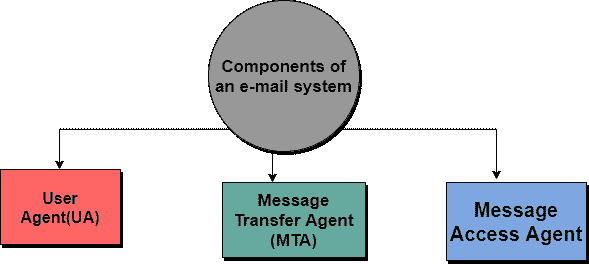
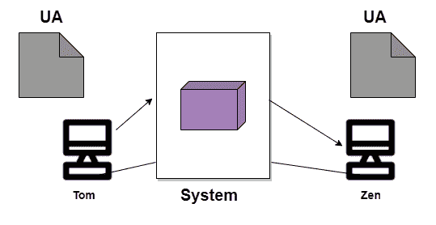
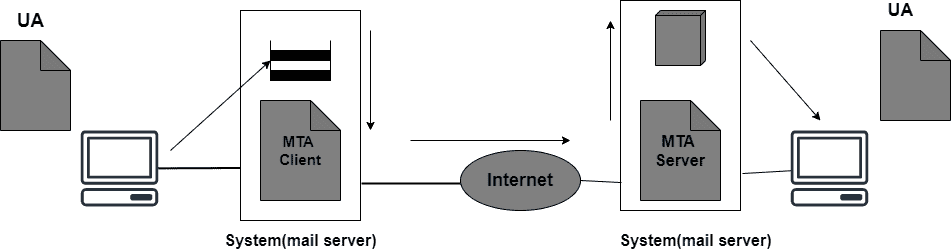
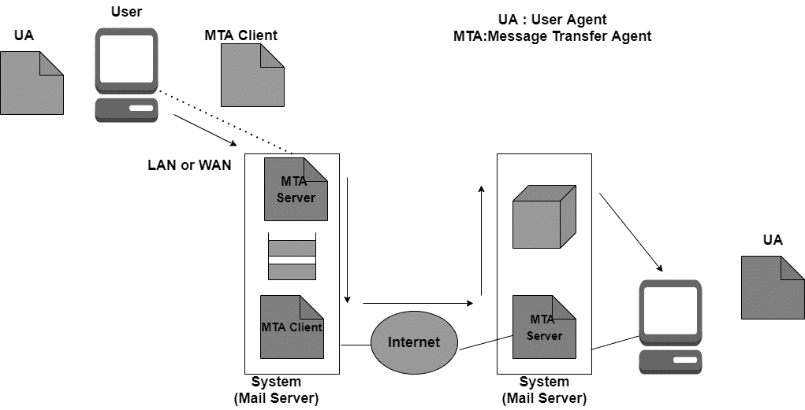
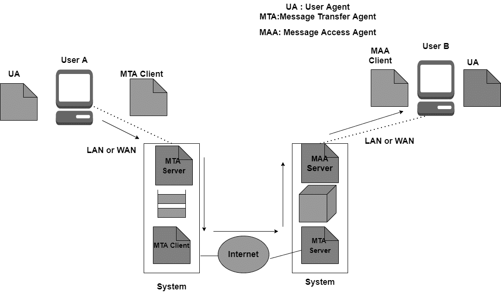

> 原文：<https://www.studytonight.com/computer-networks/electronic-mail>

# 电子邮件

在本教程中，我们将详细介绍最流行的互联网服务之一电子邮件。

电子邮件通常被称为电子邮件，是一种用于**交换数字信息**的方法。

*   电子邮件主要是为**人使用**而设计的。

*   它允许消息包括**文本、图像、音频**以及**视频**。

*   该服务允许将一条消息**发送给一个或多个接收者**。

*   电子邮件系统主要基于**存储转发模型**，其中电子邮件服务器系统代表只需要连接到电子邮件基础设施的用户接受、转发、传递和存储消息。

*   **发邮件的人**被称为**发件人**，而收到邮件的人被称为**收件人**。

## 需要电子邮件

通过使用电子邮件，我们可以随时向任何人发送任何消息。

*   我们可以同时向几个民族发出同样的信息。

*   这是一种非常快速有效的信息传递方式。

*   与邮政系统相比，电子邮件系统速度非常快。

*   信息可以很容易地转发给同事，而无需重新输入。

## 电子邮件系统的组件

电子邮件系统的基本组件如下:

 

 

## 1.用户代理

它是一个主要用于发送和接收电子邮件的程序。它也被称为电子邮件阅读器。用户代理用于撰写、发送和接收电子邮件。

*   它是电子邮件的第一个组成部分。

*   用户代理也处理邮箱。

*   用户代理主要向用户提供服务，以简化消息的发送和接收过程。

以下是用户代理提供的一些服务:

1.阅读信息

2.回复邮件

3.撰写邮件

4.转发消息。

5.处理消息。

## 2.消息传输代理

传送电子邮件的实际过程是通过邮件传送代理(MTA)完成的。

*   为了发送电子邮件，系统必须有一个 MTA 客户端。

*   为了接收电子邮件，系统必须有一个 MTA 服务器。

*   主要用于定义互联网上的 MTA 客户端和 MTA 服务器的协议称为 SMTP(简单邮件传输协议)。

*   SMTP 主要定义命令和响应必须如何来回发送

## 3.消息访问代理

在电子邮件传递的第一和第二阶段，我们使用了 SMTP。

*   SMTP 基本上是一个推送协议。

*   电子邮件传递的第三阶段主要需要 pull 协议，在这一阶段使用消息访问代理。

*   用于访问消息的两个协议是 POP 和 IMAP4。

## 电子邮件体系结构

现在是时候借助四个场景来看看电子邮件的体系结构了:

### 第一种情况

当电子邮件的发送者和接收者在同一个系统上时，只需要两个用户代理。

## 

### 第二种情况

在这种情况下，电子邮件的发送者和接收者基本上是两个不同系统上的用户。此外，消息需要通过互联网发送。在这种情况下，我们需要使用用户代理和消息传输代理(MTA)。

### 第三种情况

在这种情况下，发送方通过点对点广域网连接到系统。它可以是拨号调制解调器或电缆调制解调器。而接收器直接连接到系统，就像在第二种情况下一样。

同样在这种情况下，发送者需要一个用户代理来准备消息。准备好消息后，发送方通过局域网或广域网通过一对 MTA 发送消息。

### 第四种情况

在这种情况下，接收者也可以借助广域网或局域网连接到他的邮件服务器。

当消息到达时，接收者需要检索消息；因此，需要另一组客户机/服务器代理。收件人利用 MAA(邮件访问代理)客户端来检索邮件。

在这种情况下，客户端将请求发送到邮件访问代理(MAA)服务器，然后请求传输邮件。

这种场景是当今最常用的。

## 邮件的结构

该消息主要由两部分组成:

1.页眉

2.身体

### 页眉

电子邮件的标题部分通常包含发件人的地址以及收件人的地址和邮件的主题。

### 身体

消息正文包含对接收者来说有意义的实际信息。

## 电子邮件地址

为了发送电子邮件，邮件处理系统必须使用具有唯一地址的寻址系统。

地址由两部分组成:

*   本地部分

*   域名

### 本地部分

用于定义特殊文件的名称，一般称为用户邮箱；它是为用户接收的所有邮件的存储位置，供消息访问代理检索。

### 域名

地址的第二部分是域名。

在@的帮助下，本地部分和域名被分开。

* * *

* * *