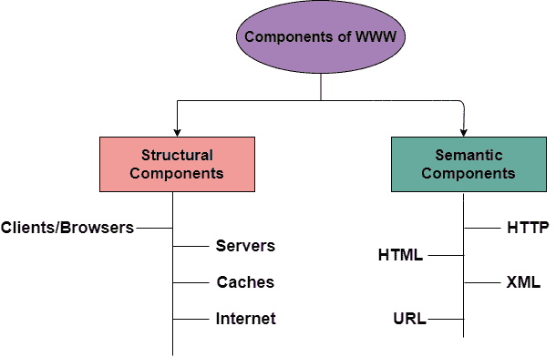
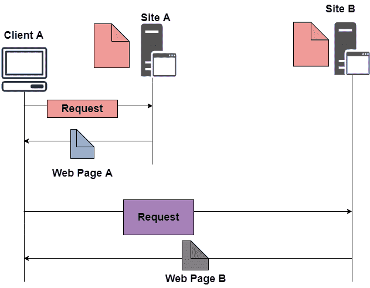
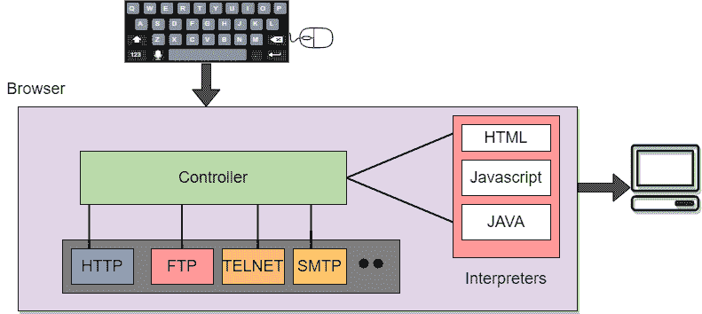

> 原文：<https://www.studytonight.com/computer-networks/world-wide-web>

# 环球信息网

在本教程中，我们将介绍计算机网络中万维网的概念。

**万维网**或网络基本上是从世界各地的点链接在一起的信息的集合。也简称为 **WWW。**

*   万维网提供了灵活性、可移植性和用户友好的特性。

*   它主要包括世界范围内的电子文档集合(即网页)。

*   它基本上是互联网上计算机之间交换信息的一种方式。

*   万维网主要是由互联网上的图像、文本和声音组成的网页网络，可以通过浏览器软件在浏览器上简单地查看。

*   这是蒂姆·伯纳斯·李发明的。

## 万维网的组件

万维网的组件主要分为两类:

1.  结构部件

2.  语义成分

## 万维网体系结构

**WWW** 主要是分布式**客户端/服务器**服务，使用浏览器的客户端可以使用服务器访问该服务。所提供的服务分布在许多不同的地方，通常称为**网站/网站。**

*   每个网站保存一个或多个文档，通常称为**网页。**

*   其中每个网页都包含指向同一网站或其他网站上其他网页的链接。

*   使用浏览器可以检索和查看这些页面。

在上述情况下，客户端发送一些属于**站点 A** 的信息。它通常通过浏览器发送一个请求(它是一个用来在网上获取文档的程序)。

此外，请求通常还包含其他信息，如网站地址、网页(网址)。

位于**站点 A** 的服务器找到该文档，然后将其发送给客户端。之后，当用户或客户在**网站 B** 找到另一个包含网页的文档的引用时。

参考文献通常包含站点 b 的网址。客户也有兴趣看一下这个文档。然后在客户端向新站点发送请求，然后检索新页面之后。

现在我们将详细介绍万维网的组件。

## 1.Client/Browser

客户端/网络浏览器基本上是一个用于与互联网上的网络服务器通信的程序。

*   每个浏览器主要由三个组件组成，它们是:
    *   控制器

    *   解释者

    *   客户端协议

*   控制器主要接收来自输入设备的输入，然后使用客户端程序来访问文档。

*   在访问文档后，控制器利用解释器在屏幕上显示文档。

*   解释器可以是 Java、HTML、javascript，这主要取决于文档的类型。

*   客户端协议可以是 FTP、HTTP、TELNET。

## 2.计算机网络服务器

主要用于网络资源并根据请求向另一台计算机提供服务的计算机通常被称为**服务器。**

*   网页主要存储在服务器上。

*   每当客户端的请求到达时，相应的文档就被发送给客户端。

*   客户端和服务器之间的连接是 TCP。

*   通过多线程或多处理，它可以变得更加高效。因为在这种情况下，服务器一次可以回答多个请求。

## 3.统一资源定位器

网址是**统一资源定位符的缩写。**

*   它基本上是一个标准，用于指定互联网上的任何类型的信息。

*   为了访问任何页面，客户通常需要一个地址。

*   为了便于访问世界各地的文档，HTTP 通常使用定位器。

网址主要定义了四件事:

*   **协议**
    主要用于检索文档的客户端/服务器程序。一个常用的协议是 HTTP。

*   **主机**
    就是信息所在的计算机。它不是强制的，因为它是任何承载网页的计算机的名称。

*   **端口**
    网址可以选择包含服务器的端口号。如果包含端口号，则通常将其插入主机和路径之间，并且通常用冒号与主机隔开。

*   **路径**
    表示信息所在文件的路径名。

## 4.HTML

HTML 是超文本标记语言的缩写。

*   它通常用于创建网页。

*   它主要用于定义网页的内容、结构和组织。

## 5.可扩展置标语言

XML 是可扩展标记语言的缩写。它主要帮助定义语义网中的通用语法。

## 万维网的特点

以下是万维网提供的一些功能:

*   提供超文本信息系统

*   开放标准和开源

*   已分发。

*   主要利用网络浏览器为许多服务提供单一界面。

*   动态的

*   相互作用的

*   跨平台

## 万维网的优势

以下是万维网提供的好处:

*   它主要免费提供所有信息。

*   提供快速互动的沟通方式。

*   从任何地方都可以到达。

*   它已经成为媒体的全球来源。

*   它主要是促进大量数据的交换。

## 万维网的缺点

万维网有一些缺点，如下所示:

*   对一些信息进行优先排序和过滤是很困难的。

*   无法保证找到一个人想要的东西。

*   在信息霸主的情况下会出现一些危险。

*   对可用数据没有质量控制。

*   没有规定。

* * *

* * *