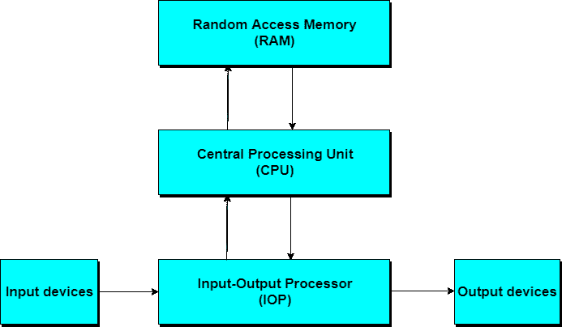

# 什么是数字计算机？

> 原文：<https://www.studytonight.com/computer-architecture/digital-computers>

**数字计算机**是执行各种计算任务的数字系统。**数字**这个词意味着计算机中的信息由取有限数量离散值的变量来表示。这些值由能够保持有限数量离散状态的组件在内部处理。

十进制数字 0，1，2，...例如，9 提供 10 个离散值。第一台电子数字计算机发展于 20 世纪 40 年代末，主要用于数值计算，离散元素是数字。从这个应用中出现了术语**数字**计算机。

实际上，如果只使用两种状态，数字计算机的运行会更加可靠。由于组件的物理限制，并且由于人类逻辑趋向于二进制(即真或假、是或否语句)，被约束为取离散值的数字组件被进一步约束为只取两个值，并且被称为**二进制**。

数字计算机采用二进制数字系统，有两位数:`0`和`1`。二进制数字称为**位**。信息在数字计算机中是以比特组表示的。通过使用各种编码技术，比特组不仅可以表示二进制数，还可以表示其他离散符号，如十进制数字或字母表中的字母。

* * *

## 数字计算机:计算机组织

计算机组织关注的是硬件组件的运行方式以及它们连接在一起形成计算机系统的方式。

假设各种组件都已就位，任务是调查组织结构，以验证计算机部件是否按预期运行。

* * *

## 数字计算机:计算机设计

计算机设计是关于计算机的硬件设计。一旦制定了计算机规范，设计师的任务就是为系统开发硬件。

计算机设计关心的是确定应该使用什么硬件以及部件应该如何连接。计算机硬件的这一方面有时被称为**计算机实现**。

* * *

## 数字计算机:计算机体系结构

计算机体系结构关注的是用户所看到的计算机的结构和行为。

它包括信息、格式、指令集和内存寻址技术。计算机系统的体系结构设计与各种功能模块(如处理器和存储器)的规格有关，并将它们组合成一个计算机系统。

计算机体系结构的两种基本类型是:

1.  **冯·诺依曼建筑**
2.  **哈佛建筑**

* * *

### 1.冯·诺依曼架构

冯·诺依曼架构描述了计算机硬件、程序和数据应该遵循的一般框架或结构。尽管已经设计并实现了其他计算结构，但今天使用的绝大多数计算机都是按照冯·诺依曼体系结构运行的。

冯·诺依曼设想计算机系统的结构由下列部件组成:

1.  **算术逻辑单元:****算术逻辑单元**，执行计算机的计算和逻辑功能。
2.  **RAM:** 内存；更具体地说，计算机的主存储器，也就是快速存储器，也被称为**随机存取存储器**。
3.  **控制单元**:这是一个指挥计算机其他部件执行某些动作的部件，比如指挥从内存中取数据或指令，由 ALU 处理；和
4.  **人机界面；**即输入输出设备，如输入用键盘和输出用显示监视器。

**数字计算机的框图**

基于冯·诺依曼体系结构的计算机体系结构的一个例子是台式个人计算机。

* * *

### 2.哈佛建筑

**哈佛架构**使用物理分离的**存储**和**信号路径**来存储指令和数据。该术语起源于**哈佛标记 I** 和继电器锁存器中的数据(23 位数宽)。

在哈佛架构的计算机中，CPU可以同时从内存中读取指令和数据，从而将内存带宽增加一倍。

**微控制器**(基于单片机的计算机系统)和 **DSP** (基于数字信号处理器的计算机系统)都是哈佛架构的例子。

* * *

* * *