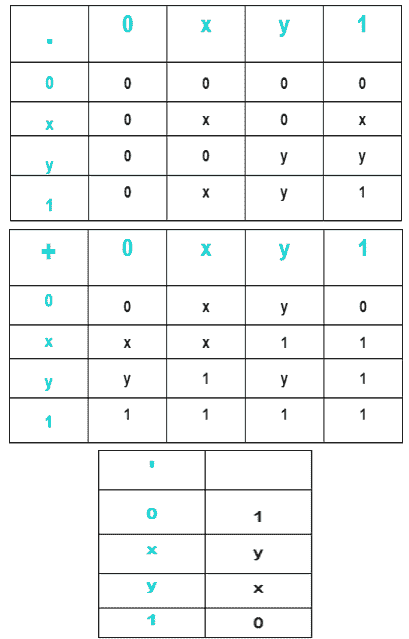
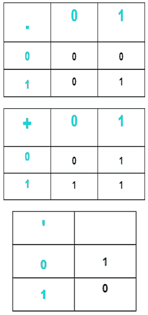
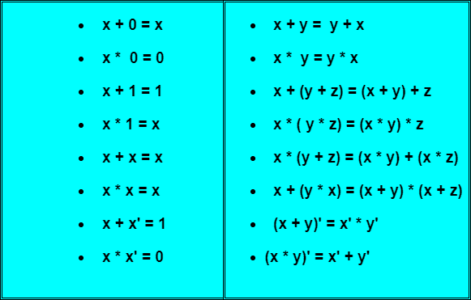

# 布尔代数导论

> 原文：<https://www.studytonight.com/computer-architecture/boolean-algebra>

布尔代数是一个代数(集合、运算、元素)，由集合 B 和集合上定义的三个运算组成，集合 B 有> =2 个元素，这三个运算是:**和**运算(布尔积)、**或**运算(布尔和)和**非**运算(补数)，因此对于任何元素 a、B、c。在 B 的集合中，a*b，a+b 和 a’在 B 中。

**例如:**

*   Consider the four-element Boolean algebra **B4 = ( {0, x, y, 1}; *, +, '; 0, 1)**. The **AND**, **OR** and **NOT** operations are described by the following tables:

    

*   Consider the two-element Boolean algebra **B2 = ({0,1}; *, +, '; 0, 1)**. The three operations ***(AND)**, **+(OR)** and **'(NOT)** are defined as follows:

    

* * *

## 一些关键术语

以下是布尔代数的一些关键术语及其简要描述:

### 布尔函数

布尔代数是处理二进制变量和逻辑运算的交换代数。变量由字母如 A、B、x 和 y 表示，三种基本的逻辑运算是 and、OR 和 NOT。布尔函数可以用二元变量、逻辑运算符号、括号和等号用代数表示。对于给定的变量值组合，布尔函数可以是 1 或 0。例如，考虑布尔函数:

```
F = x + y'z
```

如果 x 为 1 或 y '和 z 都等于 1，则函数 F 等于 1；否则 f 等于 0。

* * *

### 真值表

函数与其二进制变量之间的关系可以用真值表来表示。为了在真值表中表示一个函数，我们需要一个由 n 个二进制变量组合而成的列表。

* * *

### 逻辑图

布尔函数可以从代数表达式转换成由与门、或门和非门组成的逻辑图。

* * *

布尔代数的目的是便于数字电路的分析和设计。它提供了一个方便的工具来:

*   用代数形式表示二元变量之间的真值表关系。
*   用代数表示逻辑图的输入输出关系。
*   为相同的功能找到更简单的电路。

真值表指定的布尔函数可以用许多不同的方式用代数表示。布尔表达式的两种形成方式是**规范**和**非规范**形式。

#### 语言的语音典型

它表示布尔函数的每个乘积(与)或和(或)项中的所有二进制变量。要确定布尔函数 **F(A，B，C) = A'B + C' + ABC** 的标准乘积和形式，该形式为**非标准形式**，使用以下步骤:

```
F = A'B + C' + ABC
  = A'B(C + C') + (A + A')(B + B')C' + ABC
```

其中**x+x’= 1**是布尔代数的基本恒等式

```
= A'BC + A'BC' + ABC' + AB'C' + A'BC' + A'B'C' + ABC
= A'BC + A'BC' + ABC' + AB'C' + A'B'C' + ABC
```

通过根据布尔代数规则操纵布尔表达式，可以获得需要更少门的更简单的表达式。

下表列出了布尔代数最基本的恒等式。表中所有的恒等式都可以通过真值表来证明。



* * *

* * *