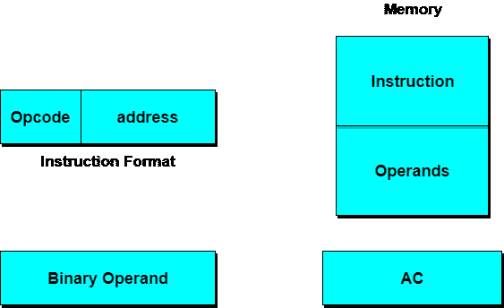

# 计算机体系结构:指令代码

> 原文：<https://www.studytonight.com/computer-architecture/instruction-codes>

众所周知，一个**程序**是一组指令，规定了操作、操作数和处理必须发生的顺序。**指令代码**是一组告诉计算机执行特定操作部分的位。

## 指令代码:操作代码

指令的操作码是一组定义诸如加、减、乘、移和补等操作的位。操作码所需的位数取决于计算机上可用的操作总数。对于给定的 **2^n** 操作，操作码必须至少由 **n 位**组成。指令代码的操作部分指定要执行的操作。

* * *

## 指令代码:寄存器部分

必须对寄存器中存储的数据执行操作。因此，指令代码不仅指定了要执行的操作，还指定了将找到操作数(数据)的寄存器以及必须存储结果的寄存器。

* * *

### 存储程序组织

组织一台计算机最简单的方法是将**处理器寄存器**和指令代码分成两部分。第一部分指定要执行的操作，第二部分指定地址。内存地址告诉内存中的操作数将在哪里找到。

指令存储在内存的一部分，数据存储在另一部分。

具有单处理器寄存器的计算机被称为**累加器(AC)** 。该操作是用内存操作数和交流内容执行的。

* * *

### 公共总线系统

基本计算机有 8 个寄存器、一个存储单元和一个控制单元。必须提供路径将数据从一个寄存器传输到另一个寄存器。在系统中传输数据的一种有效方法是使用**公共总线系统**。寄存器和存储器的输出连接到公共总线。

* * *

### 负载

公共总线的线路连接到每个寄存器的输入和存储器的数据输入。其 **LD** 输入被使能的特定寄存器在下一个*时钟脉冲转换*期间从总线接收数据。

在学习指令格式之前，让我们先学习操作数地址部分。

当指令代码的第二部分指定操作数时，该指令被称为具有**立即操作数**。当指令代码的第二部分指定操作数的地址时，该指令被称为具有**直接地址**。在**间接地址**中，指令代码的第二部分指定了内存字的地址，在该内存字中找到了操作数的地址。

* * *

## 计算机指令

基本计算机有三种指令代码格式。指令的**操作码**(操作码)部分包含 3 位，其余 13 位取决于遇到的操作码。

有三种格式:

#### 1.内存引用指令

用`12 bits`指定地址，`1 bit`指定寻址方式( **I** )。 **I** 等于`0`为*直接地址*`1`为*间接地址*。

#### 2.寄存器参考指令

这些指令由操作码`111`识别，在指令的最左侧有一个`0`。其他 12 位指定要执行的操作。

#### 3.输入输出指令

这些指令由操作码`111`识别，在指令的最左侧有一个`1`。其余 12 位用于指定输入输出操作。

* * *

### 教学格式

指令的格式被描绘在一个矩形框中，表示指令的位。指令格式的基本字段如下:

1.  指定要执行的操作的操作码字段。
2.  指定存储器地址或寄存器的地址字段。
3.  一种模式字段，指定确定有效地址操作数的方式。

计算机可能有不同长度的指令，包含不同数量的地址。指令格式中地址字段的数量取决于其寄存器的内部组织。

* * *

* * *