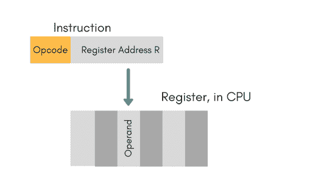
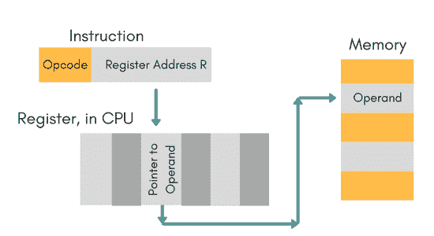
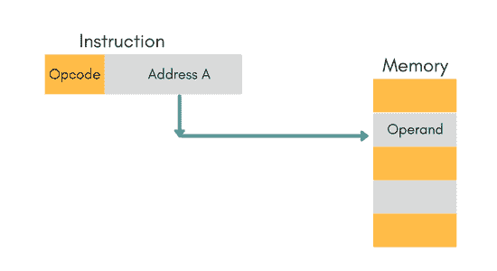
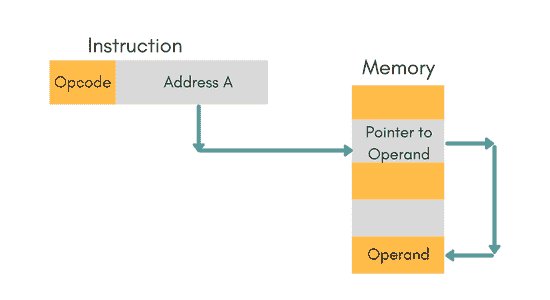
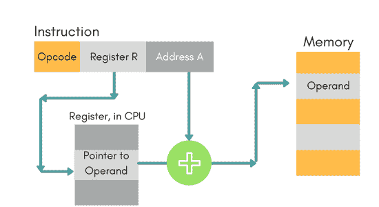

# 处理模式和指令周期

> 原文：<https://www.studytonight.com/computer-architecture/addressingmodes-instructioncycle>

指令的操作字段指定要执行的操作。该操作将对存储在计算机寄存器或主存储器中的一些数据执行。程序执行期间选择任何操作数的方式取决于指令的寻址模式。使用寻址模式的目的如下:

1.  为用户提供编程通用性。
2.  减少指令寻址字段中的位数。

* * *

## 寻址模式的类型

下面我们逐一讨论了不同类型的寻址模式:

### 即时模式

在这种模式下，操作数在指令本身中指定。立即模式指令有一个操作数字段，而不是地址字段。

例如:`ADD 7`，表示累加器的内容加 7。7 是这里的操作数。

* * *

### 注册模式

在这种模式下，操作数存储在寄存器中，该寄存器存在于中央处理器中。指令有存储操作数的寄存器地址。

#### 优势

*   指令更短，取指令更快。
*   对操作数的更快内存访问

#### 不足之处

*   非常有限的地址空间
*   使用多个寄存器有助于提高性能，但会使指令复杂化。

* * *

### 注册间接模式

在这种模式下，指令指定寄存器，其内容给出内存中操作数的地址。因此，寄存器包含操作数的地址，而不是操作数本身。

* * *

### 自动递增/递减模式

在这种情况下，寄存器在其值被使用之后或之前递增或递减。

* * *

### 直接寻址模式

在这种模式下，操作数的有效地址存在于指令本身。

*   访问数据的单一内存引用。
*   无需额外计算即可找到操作数的有效地址。

**例如:** `ADD R1, 4000` -这里的 4000 是操作数的有效地址。

**注意:**有效地址是操作数存在的位置。

* * *

### 间接寻址模式

在这种情况下，指令的地址字段给出有效地址存储在存储器中的地址。这降低了执行速度，因为这包括多次内存查找来查找操作数。

* * *

### 位移寻址模式

在这种情况下，索引寄存器的内容被添加到指令的地址部分，以获得操作数的有效地址。

`EA = A + (R)`，在这种情况下，地址字段保存两个值，A(是基值)和 R(保存位移)，反之亦然。

* * *

### 相对寻址模式

它是置换寻址模式的一个版本。

在这种情况下，程序计数器的内容被添加到指令的地址部分，以获得有效地址。

`EA = A + (PC)`，其中 EA 为有效地址，PC 为程序计数器。

操作数是远离当前单元格的单元格(电脑指向的单元格)

* * *

### 基本寄存器寻址模式

这也是置换寻址模式的一个版本。这可以定义为`EA = A + (R)`，其中 A 为位移，R 为指向基址的指针。

* * *

### 堆栈寻址模式

在这种模式下，操作数位于堆栈的顶部。例如:`ADD`，该指令将*弹出*栈顶两项，相加，然后*将结果推送到栈顶。*

* * *

## 指令周期

指令周期，也称为**取-解码-执行周期**是计算机的基本运算过程。从计算机启动到关机，这个过程由中央处理器不断重复。

以下是指令周期中发生的步骤:

### 1.获取指令

指令从存储在个人计算机(程序计数器)中并存储在指令寄存器 IR 中的存储器地址中取出。在提取操作结束时，PC 递增 1，然后指向要执行的下一条指令。

### 2.解码指令

红外指令由解码器执行。

### 3.阅读有效地址

如果指令有间接地址，则从存储器中读取有效地址。否则，在立即操作数指令的情况下，直接读取操作数。

### 4.执行指令

控制单元将信息以控制信号的形式传递给中央处理器的功能单元。生成的结果存储在主存储器中或发送到输出设备。

* * *

然后通过获取下一条指令来重复该循环。因此，以这种方式，指令周期被连续重复。

* * *

* * *