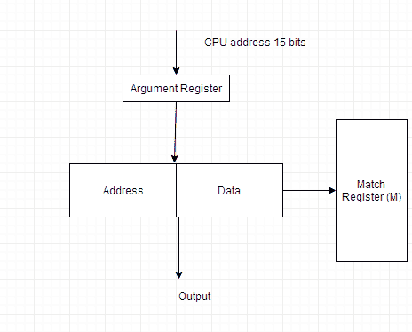
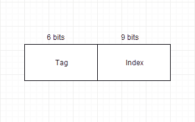
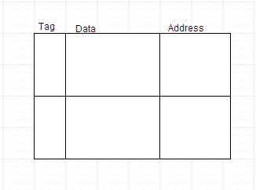
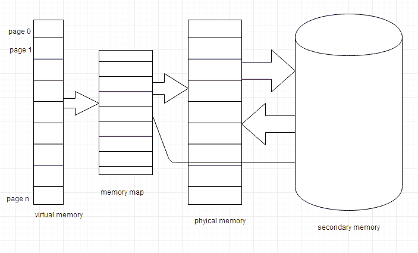

# 内存映射与虚拟内存的概念

> 原文：<https://www.studytonight.com/computer-architecture/mapping-and-virtual-memory>

数据从主存到缓存的转换称为映射。有 3 种主要的映射类型:

*   关联映射
*   直接映射
*   集合关联映射

* * *

### 关联映射

关联存储器存储地址和数据。15 位的地址值是 5 位八进制数，数据是 4 位八进制数中的 12 位字。15 位的中央处理器地址被放置在**参数寄存器**中，并且在关联存储器中搜索匹配的地址。

* * *

### 直接映射

15 位的 CPU 地址分为 2 个字段。在这种情况下，9 个最低有效位构成**索引**字段，其余 6 个位构成**标签**字段。索引字段中的位数等于访问高速缓存所需的地址位数。

* * *

### 集合关联映射

直接映射的缺点是索引地址相同的两个字不能同时驻留在缓存中。这个问题可以通过集合关联映射来克服。

在这种情况下，我们可以在同一个索引地址下存储两个或更多的内存字。每个数据字都与其标签存储在一起，这样就形成了一个集合。

* * *

## 替换算法

使用替换算法，缓存内存中的数据不断被新数据替换。以下是使用的两种替换算法:

*   先进先出。最旧的项目会被最新的项目取代。
*   LRU -最近最少使用。CPU 最近最少使用的项目被删除。

* * *

## 虚拟内存

虚拟内存是逻辑内存和物理内存的分离。当只有少量物理内存可用时，这种分离为程序员提供了大量虚拟内存。

虚拟内存是用来给程序员一种错觉，他们有一个非常大的内存，即使计算机有一个小的主内存。它使编程任务变得更容易，因为程序员不再需要担心可用的物理内存量。

* * *

* * *