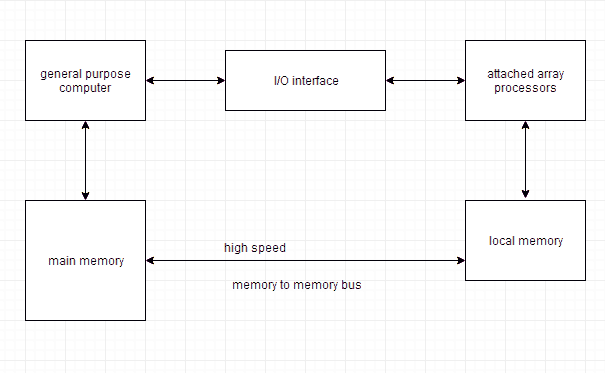
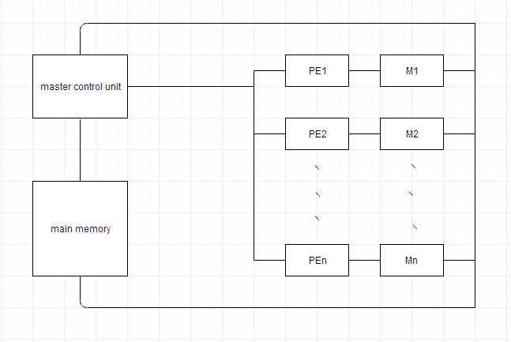

# 向量（数组）处理器及其类型

> 原文：<https://www.studytonight.com/computer-architecture/array-processor>

数组处理器也被称为多处理器或向量处理器。他们对大量数据进行计算。因此，它们被用来提高计算机的性能。

* * *

## 数组处理器的类型

数组处理器基本上有两种类型:

1.  附加数组处理器
2.  SIMD 数组处理器

* * *

### 附加数组处理器

附属数组处理器是一种附属于通用计算机的处理器，其目的是提高和改善该计算机在数值计算任务中的性能。它通过多个功能单元的并行处理来实现高性能。

* * *

### SIMD 数组处理器

SIMD 是包含多个并行运行的处理器的单个计算机的组织。使处理单元在公共控制单元的控制下操作，从而提供单个指令流和多个数据流。

数组处理器的一般框图如下所示。它包含一组相同的处理元件，每个处理元件都有一个本地存储器 m。每个处理器元件包括一个 **ALU** 和**寄存器**。主控制单元控制处理器元件的所有操作。它还对指令进行解码，并确定如何执行指令。

主存储器用于存储程序。控制单元负责获取指令。向量指令被同时发送到所有的 PE，结果被返回到内存。

最著名的 SIMD 数组处理器是由 T2·巴勒斯兵团开发的伊利亚克四号计算机。SIMD 处理器是高度专业化的计算机。它们只适用于可以用向量或矩阵形式表示的数值问题，不适用于其他类型的计算。

* * *

### 为什么使用数组处理器

*   数组处理器提高了整体指令处理速度。
*   由于大多数数组处理器与主机 CPU 异步运行，因此它提高了系统的整体容量。
*   数组处理器有自己的本地内存，因此可以为内存不足的系统提供额外的内存。

* * *

* * *