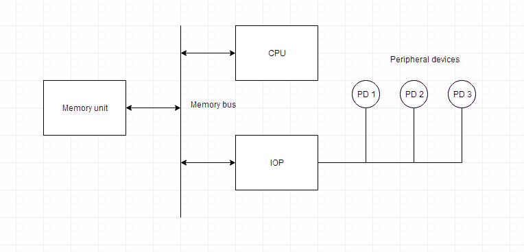

# 计算机体系结构:输入/输出处理器

> 原文：<https://www.studytonight.com/computer-architecture/input-output-processor>

输入输出处理器是一种具有直接内存访问能力的处理器。在这种情况下，计算机系统被分成一个存储单元和多个处理器。

每个 IOP 控制和管理输入输出任务。IOP 类似于 CPU，只是它只处理输入/输出处理的细节。IOP 可以获取并执行自己的指令。这些 IOP 指令仅用于管理输入/输出传输。

* * *

## 输入输出处理器框图

下面是一台带有各种输入输出处理器的计算机的框图。存储单元占据中心位置，可以与每个处理器通信。

CPU处理解决计算任务所需的数据。IOP 为外围设备和内存之间的数据传输提供了路径。CPU分配启动输入输出程序的任务。

IOP 独立于 CPU 运行，并在外围设备和内存之间传输数据。

IOP 和设备之间的通信类似于传输的程序控制方法。并且与存储器的通信类似于直接存储器存取方法。

在大型计算机中，每个处理器都独立于其他处理器，任何处理器都可以启动操作。

CPU可以充当主处理器，而 IOP 充当从处理器。CPU分配启动操作的任务，但执行指令的是 IOP，而不是CPU。CPU指令提供开始输入/输出传输的操作。IOP 通过中断请求 CPU。

由 IOP 从内存中读取的指令也称为*命令*，以将其与由CPU读取的指令区分开来。命令由程序员准备并存储在内存中。命令字使程序适合 IOP。CPU通知 IOP 在内存中哪里可以找到命令。

* * *

* * *