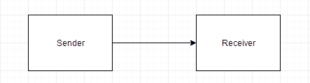
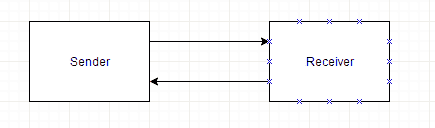
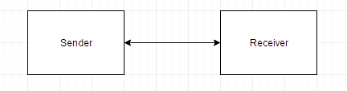

# 串行数据通信

> 原文：<https://www.studytonight.com/computer-architecture/serial-communication>

让我们从了解什么是数据通信处理器开始，

## 数据通信处理器

数据通信处理器是一种输入/输出处理器，它从通过电话和其他通信线路连接到计算机的许多远程终端分发和收集数据。它是一种专用的输入/输出处理器，旨在与数据通信网络进行通信。

这种通信网络由各种设备组成，例如打印机、显示设备、数字传感器等。同时服务许多用户。数据通信处理器通过一对导线与每个终端通信。它还以与任何输入/输出处理器相同的方式与中央处理器和内存通信。

* * *

## 什么是调制解调器？

在数据通信网络中，远程终端通过电话线或其他导线连接到数据通信处理器。这种电话线是专门为语音通信设计的，计算机使用它们以数字信号进行通信，因此需要一些转换。这些转换称为调制解调器(调制解调器)。

调制解调器将数字信号转换成音频信号，通过电话线传输，还将音频信号转换成数字信号，供机器使用。

* * *

### 传播方式

数据可以通过三种不同的模式在两点之间传输:

#### 单一的

单工线路只在一个方向传送信息。在这种模式下，接收方不能与发送方通信来指示错误的发生，这意味着只有发送方可以发送数据，而接收方不能。**例如:**广播电视广播。

* * *

#### 半双工

在半双工模式下，系统能够双向传输数据，但一次只能向一个方向传输数据。这种模式需要一对导线。**例如:**对讲机。

* * *

#### 全双工

在这种模式下，数据可以在两个方向同时发送和接收。在这种情况下，使用四线连接。**例如:**视频通话、音频通话等。

* * *

## 什么是协议？

任何传输中使用的通信线路、调制解调器和其他设备统称为**数据链路**。数据链路中数据的有序传输可以通过协议来实现。

A **协议**是互联设备遵循的一组规则，以确保所有数据都正确无误地通过。

* * *

### 协议的类型

有两种类型的协议:

#### 面向字符的协议

它基于字符集的二进制代码。代码多用于 **ASCII** 。它包括大写和小写字母、数字和各种特殊符号。控制传输的字符称为**通信控制字符**。

#### 面向比特的协议

它在其控制字段中不使用字符，并且独立于任何代码。它允许传输任何长度的串行比特流，而不涉及字符边界。

* * *

* * *