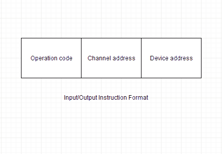

# 输入/输出通道

> 原文：<https://www.studytonight.com/computer-architecture/input-output-channels>

通道是一个独立的硬件组件，负责协调一组控制器的所有输入/输出。使用输入/输出通道的计算机系统具有处理所有输入/输出操作的特殊硬件组件。

通道使用单独的、独立的和低成本的处理器来运行，这些处理器被称为通道处理器。

通道处理器很简单，但包含足够的内存来处理所有输入/输出任务。当输入/输出传输完成或检测到错误时，通道控制器使用中断与 CPU 通信，并将错误或任务完成通知 CPU。

每个通道支持一个或多个控制器或设备。**通道程序**包含通道本身和各种连接的控制器或设备的命令列表。一旦操作系统准备好输入/输出命令列表，它就执行单个输入/输出机器指令来启动通道程序，然后通道承担对输入/输出操作的控制，直到它们完成。

* * *

## IBM 370 输入输出通道

IBM 370 计算机中的输入输出处理器被称为**通道**。计算机系统配置包括连接到一个或多个输入/输出设备的多个通道。

* * *

## 输入输出通道的类别

以下是输入/输出通道的不同类别:

#### 多路器

多路复用器通道可以连接到许多低速和中速设备。它能够同时操作多个输入/输出设备。

* * *

#### 选择器

该通道一次只能处理一个输入/输出操作，用于一次控制一个高速设备。

* * *

#### 块多路复用器

它结合了多路复用器和选择器通道的特性。

CPU 可以通过控制线直接与通道通信。下图显示了通道操作的文字格式。

计算机系统可以具有多个通道，并且每个通道被分配一个地址。每个通道可以连接到几个设备，并且每个设备被分配一个地址。

* * *

* * *