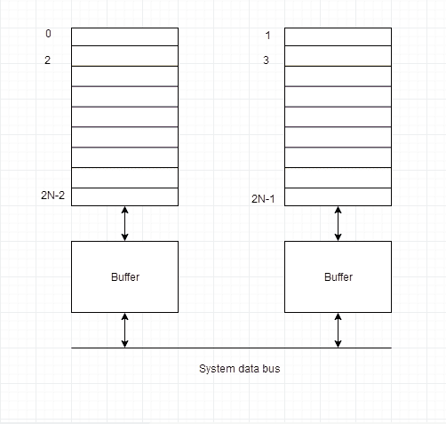

# 什么是交错内存？

> 原文：<https://www.studytonight.com/computer-architecture/interleaved-memory>

这是一种补偿动态随机存取存储器相对较慢速度的技术。在这种技术中，主存储器被分成多个存储体，这些存储体可以被单独访问，而不依赖于其他存储体。

**例如:**如果我们有 4 个存储体(4 路交错存储器)，每个包含 256 个字节，那么面向块的方案(无交错)将把虚拟地址 0 到 255 分配给第一个存储体，256 到 511 分配给第二个存储体。但是在交错存储器中，虚拟地址 0 将与第一存储体在一起，1 与第二存储体在一起，2 与第三存储体在一起，3 与第四存储体在一起，然后 4 再次与第一存储体在一起。

因此，CPU可以立即访问替代部分，而无需等待内存被缓存。有多个存储体轮流提供数据。

内存交错是一种提高内存速度的技术。这是一个使系统更加高效、快速和可靠的过程。

**例如:**在上述 4 个存储体的示例中，虚拟地址为 0、1、2 和 3 的数据可以同时访问，因为它们驻留在 spearate 存储体中，因此我们不必等待数据提取完成，才能开始下一个。

具有 n 个存储体的交错存储器被称为 **n 路交错**。在交错存储系统中，仍然有两个动态随机存取存储器库，但从逻辑上讲，该系统似乎有一个两倍大的存储库。

在下面具有 2 个存储体的交错存储体表示中，存储体 0 的第一个长字被存储体 1 的长字所覆盖，随后是存储体 0 的第二个长字，接着是存储体 1 的第二个长字，以此类推。

下图显示了 n 个长单词的两个物理库的组织。逻辑存储体的所有偶数长字位于物理存储体 0 中，所有奇数长字位于物理存储体 1 中。

## 交错的类型

内存交错有两种方法:

### 双向交错

两个存储块同时被访问以进行写和读操作。

### 4 路交错

同时访问四个内存块。

* * *

* * *