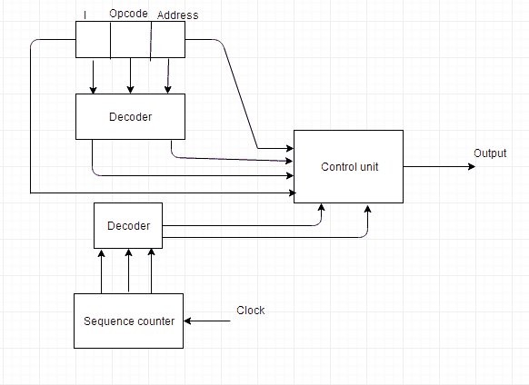

# 控制单元的设计

> 原文：<https://www.studytonight.com/computer-architecture/design-of-control-unit>

控制单元为计算机的操作产生定时和控制信号。控制单元与算术逻辑单元和主存储器通信。它还控制处理器、内存和各种外设之间的传输。它还指示算术逻辑单元对数据执行哪个操作。

控制单元可通过以下两种方法设计:

### 硬连线控制单元

它是借助门、触发器、解码器等来实现的。在硬件上。控制单元的输入是指令寄存器、标志、定时信号等。如果我们必须使控制单元变大，这个组织可能会非常复杂。

如果设计必须修改或改变，所有的组合电路都必须修改，这是一项非常困难的任务。

* * *

## 微程序控制单元

它是用编程方法实现的。通过执行由微指令组成的程序来执行一系列微操作。在这种组织中，程序员可以通过更新控制存储器中的微程序来进行任何修改或改变。

* * *

### 硬连线控制和微程序控制的区别

| 硬连线控制 | 微程序控制 |
| 技术是基于电路的。 | 技术是基于软件的。 |
| 它是通过触发器、门、解码器等实现的。 | 微指令产生控制指令执行的信号。 |
| 固定指令格式。 | 可变指令格式(每条指令 16-64 位)。 |
| 指令基于寄存器。 | 指令不是基于寄存器的。 |
| 没有使用 ROM。 | 使用了 ROM。 |
| 它用于 RISC。 | 它在 CISC 使用。 |
| 解码速度更快。 | 解码速度较慢。 |
| 难以修改。 | 容易修改。 |
| 芯片面积更少。 | 芯片面积大。 |

* * *

* * *