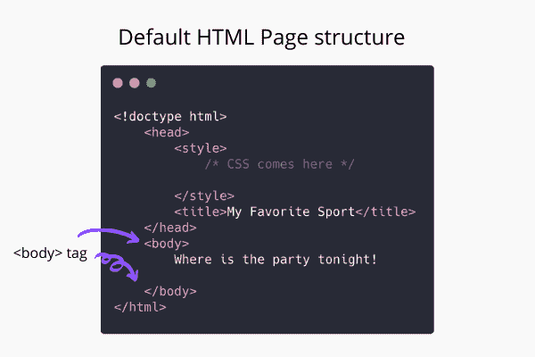

# HTML 正文标签

> 原文：<https://www.studytonight.com/html5-references/html-body-tag>

HTML `<body>`标签用于定义 HTML 文档的正文部分。`<body>`标签**包含文档**的主要内容。`<body>`标签放置在关闭 `<head>`标签后。这是一个默认的 HTML 标记，在创建一个 HTML 文档时使用。



*   `<body>`标签包括**文本**、**图像**、**超链接**、**列表**、**段落**、**标题**等。，以及其他可以成为 HTML 网页一部分的内容。

*   `<body>`标签是**HTML 元素( [< html >标签](https://www.studytonight.com/html5-references/html-html-tag))的第二个直接子**，仅次于`<head>`标签。

*   `<body>`标签用于**显示网站的主要内容**，在浏览器中访问网站的访问者可以看到。需要注意的一点是，不能在单个 HTML 文档中使用多对`<body>`标签。

你在浏览器窗口的网页上看到的一切都在`<body>`标签里面。

## HTML `<body>`标签-语法和用法

`<body>`标签需要**开启(开始)标签**和**关闭(结束)标签**。

以下是使用`<body>`标签的语法:

```
<body>
    <!-- the whole webpage code comes here -->
</body>
```

## HTML `<body>`标签属性

HTML `<body>`标签支持[全局属性](https://www.studytonight.com/html5-references/html-global-attributes)和[事件属性](https://www.studytonight.com/html5-references/html-event-attributes)，一些常见的事件属性如下:

| **属性** | **描述** |
| --- | --- |
| `onafterprint` | 它在用户打印完文档后调用一个函数。 |
| `onbeforeprint` | 当用户请求打印文档时，它会调用一个函数。 |
| `onbeforeunload` | 当文档即将被卸载时，它会调用一个函数。 |
| `onhashchange` | 当当前网页的网址的散列部分改变时，它调用一个函数。比如当***studytonight.com/code/html/web-beginner#1***变为***studytonight.com/code/html/web-beginner#2*** |
| `onload` | 当页面完成加载时，它会调用一个函数。 |
| `onfocus` | 它用于在访问者关注当前页面时调用函数。 |
| `onunload` | 它用于在访问者离开页面时调用一个函数。 |
| `onblur` | 它用于在网页失去焦点时调用函数。 |
| `onerror` | 该属性用于在网页加载失败时调用函数 |
| `onmessage` | 它用于在文档收到消息时调用函数。 |
| `onresize` | 它用于在调整文档大小时调用函数。 |
| `onredo` | 它用于在用户在撤消事务历史中向前移动时调用一个函数。 |
| `onlanguagechange` | 当首选语言改变时，此属性用于调用函数。 |
| `onstorage` | 该属性用于在存储区域发生变化时调用函数。 |
| `onundo` | 它用于在用户在撤消事务历史中向后移动时调用一个函数。 |
| `onoffline` | 当互联网连接断开时，它会调用一个函数。 |
| `ononline` | 当互联网连接恢复时，它会调用一个函数。 |

在 HTML 4 中还有一些其他的属性，比如`rightmargin`、`topmargin`、`leftmargin`、`bottommargin`、`vlink`、`link`、`text`等等。在`<body>`标签中可用，但是在 HTML 5 中这些已经被**否决了。**

## HTML `<body>`标签基本示例

任何一个 HTML 网页的例子都有`<body>`标签，但是，让我们再举一个例子来看看它是如何工作的，尽管每当你写任何 HTML 代码时`<body>`标签总是在工作的:

## HTML `<body>`标签的默认 CSS 样式

以下是默认情况下应用于`<body>`标签的默认 CSS 样式规则。这可能会因浏览器而略有变化。

```
body
{
    display:block;
    margin:8px;
}
```

## 对 HTML `<body>`标签的浏览器支持

**所有浏览器都支持**，不过，为了这一节，以下浏览器支持这个属性:

*   Firefox 1+

*   谷歌 Chrome 1+

*   Internet Explorer 2+

*   Apple Safari 1+

*   Opera 2.1+

* * *

* * *