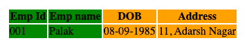

# HTML `<col>`标签

> 原文：<https://www.studytonight.com/html5-references/html-col-tag>

HTML `<col>`标签用于**分别定义表格每一列**的属性。

*   `<col>`标签定义在 [<列组>标签](https://www.studytonight.com/html5-references/html-colgroup-tag)内，该标签本身定义在`<table>`标签内。

*   `<colgroup>`标签中的每个`<col>`标签代表表格的一列。通过使用`span`属性，一个单独的< col >标签也可以表示多个连续的列。

*   `<col>`标签没有**结束标记**。

## HTML `<col>`标签-语法和用法

`<col>`元素需要**开始(开始)标记**，其所需语法如下:

```
<col style=" " />
```

## HTML `<col>`标签基本示例

下面我们有一个`<col>`标签的基本例子:

在上面的代码示例中，我们指定了 4 个`<col>`标签来设置表格的 4 列的样式。现在，让我们来看看如何使用单个`<col>`标签来为表格的多列设置样式。

在下面的例子中，我们有 2 个`<col>`标签，覆盖了表的 4 列，每个标签使用带有值 **2** 的`span`属性。

```
<table>
    <colgroup>
        <col span="2" style="background-color:green" />
        <col span="2" style="background-color:orange" />
    </colgroup>
    <tr>
        <th>Emp Id</th>
        <th>Emp name</th>
        <th>DOB</th>
        <th>Address</th>
    </tr>
    <tr>
        <td>001</td>
        <td>Palak</td>
        <td>08-09-1985</td>
        <td>11, Adarsh Nagar</td>       
    </tr>
</table>
```



在下面的例子中，我们有 2 个覆盖表格 4 列的`<col>`标签，使用带有值 **3** 的`span`属性和一个不带`span`属性的`<col>`标签。

```
<table>
    <colgroup>
        <col span="3" style="background-color:green" />
        <col style="background-color:orange" />
    </colgroup>
    <tr>
        <th>Emp Id</th>
        <th>Emp name</th>
        <th>DOB</th>
        <th>Address</th>
    </tr>
    <tr>
        <td>001</td>
        <td>Palak</td>
        <td>08-09-1985</td>
        <td>11, Adarsh Nagar</td>       
    </tr>
</table>
```


## HTML `<col>`标签属性

虽然此元素支持[全局属性](https://www.studytonight.com/html5-references/html-global-attributes)和[事件属性](https://www.studytonight.com/html5-references/html-event-attributes)，但它没有任何特定属性。

`<col>`标签的主要属性是`span`属性，用于定义`<col>`标签将覆盖多少列。

## HTML `<col>`标签的默认 CSS 样式

```
col
{
   display:table-column;
} 
```

## 对 HTML `<col>`标签的浏览器支持

以下浏览器支持此属性:

*   Firefox 1+

*   谷歌 Chrome 1+

*   Internet Explorer 4+

*   Apple Safari 1+

*   Opera 7+

* * *

* * *