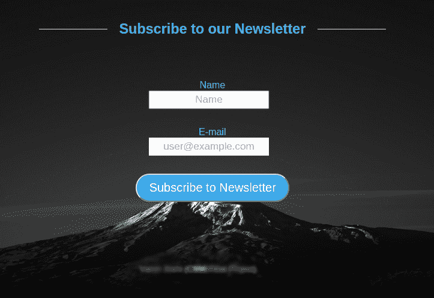

# CSS 简介

> 原文：<https://www.studytonight.com/cascading-style-sheet/introduction-to-css>

> ***注:**以下教程期望读者对 HTML 有一定的基础知识。如果没有，我们强烈建议您参考这里的 HTML 课程[。](/code/html/)*

假设你有一个很棒的创业想法，或者想为你的企业创建一个网站。对于有抱负的网络开发人员来说，时间和金钱可能是主要的考虑因素。幸运的是，仅仅通过掌握 HTML 和 CSS，你就可以开发出令人惊叹的网站，既节省了时间和金钱，又改善了访问者的体验。

**层叠样式表([www.w3.org/Style/CSS/](http://www.w3.org/Style/CSS/))**提供了网页设计师多年来一直叫嚣的东西:对网站布局的更多控制。您可能已经知道，HTML 也可以用于格式化网页上的内容。例如，许多 HTML 标签支持`align`属性，这为文本对齐提供了简单的支持。

```
<h1 align = "center">BIG CENTERED TEXT!</h1>
```

现在，对于那些只来自 HTML 背景的人来说，知道标签的作用，align 属性在某种程度上是一个双赢的局面。然而，大多数 HTML 标签也包含像大小、颜色等属性。纯粹是表象。

考虑`<blink>`标签。以下标记将导致文本在 Mozilla Firefox 上闪烁:

```
<blink>Firefox is the King of Internet Browsers!</*blink*>
```

使用 HTML 进行格式化的问题是，HTML 不太擅长格式化，也不是为格式化而设计的。幸运的是，我们有更好的方式来格式化我们的网页-**样式表**。

以下是你应该考虑使用 CSS 来设计网站风格的 5 个原因:

1.  **Consistency**

    通过对 CSS 文件进行一次更改，您可以更改整个网站的外观。你的网站越大，CSS 为你节省的时间就越多。此外，使用 CSS，您网站上的所有样式都是一致的。

2.  **Bandwidth Reduction**

    当我们在一个 CSS 文件中单独编写样式代码时，我们在 HTML 页面中留下了纯内容，从而减小了它的大小。当一个网站被加载时，CSS 文件被加载一次，然后被浏览器缓存，对于连续的请求，只请求 HTML 页面，因此大大减少了带宽的使用。您减少的带宽需求将导致更快的加载时间，并可能削减您的网络托管成本。

3.  **Search Engines**

    CSS 被认为是一种干净的编码技术，这意味着搜索引擎不必费力去**读取**它的内容。此外，使用 CSS 会让你的网站内容多于代码——而内容对你的搜索引擎成功至关重要。

4.  **Browser Compatibility**

    CSS 样式表增加了您网站的适应性，并确保更多的访问者能够以您想要的方式查看您的网站。

5.  **Viewing options**

    另一个常见的网页设计问题是越来越需要为不同的媒体提供网站。CSS 可以通过允许相同的标记页面以不同的查看样式呈现来帮助您应对这一挑战，例如，您可以为打印或移动设备创建单独的样式表。

`CSS1`在 1996 年第一次标志着它的出现，`CSS2`很快紧随其后，做出了一些重大改进。当前版本`CSS3`增加了许多有用的功能。新的浏览器在性能和支持方面比旧的浏览器好得多，但是问题仍然存在。浏览器缺陷仍然存在，开发者教育和吸收滞后。

不过不用担心！我们在这里帮助您一步一步地学习设计网页的艺术。现在，在我们开始第一次看 CSS 之前，先看看下面的图片。只有 HTML，你可以构建非常基本的表单，但是添加一点 CSS，你的服务就会有一个好看得多的网页！


**CSS 前**



**CSS 后**

* * *

* * *