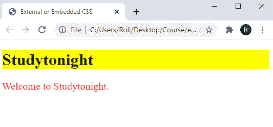

# 将 CSS 添加到 HTML 中

> 原文：<https://www.studytonight.com/cascading-style-sheet/add-css-into-html>

让我们先来看看**级联样式表**。您可能已经知道，所有编程语言都有自己的语法，虽然 HTML 和 CSS 并不完全是编程语言，但它们确实有自己的语法。

CSS 语法不是很麻烦。CSS 规则被定义为一个**属性名**后跟一个**冒号**，然后一个**属性值**后跟一个**分号**。单个规则以**分号**结束，最终规则有一个可选的分号。唷！让我们更仔细地看看这句话。

```html
property: value; property: value;
```

一般来说，在 HTML 文档中添加 CSS 有三种方法，它们是:

*   内嵌 CSS
*   内部或嵌入式 CSS
*   外部 CSS

## 内嵌 CSS

**内嵌 CSS** 是为任何 HTML 标签提供样式的最快方式。当您想要为任何单个 HTML 标记设置样式属性时，可以使用它。要内联设置 CSS 属性，必须在开始的 HTML 标签中添加**样式**属性。然后，你要以**属性的形式添加 CSS 属性:value**对。

### 内嵌 CSS 的语法

```html
<p style="background-color: yellow;">Welcome to Studytonight.</p>
```

### 示例:指定内联 CSS

在本例中，我们使用 **< p >** 标记创建了一个段落，然后使用**内嵌 CSS** 将`background-color` 设置为**黄色**。

```html
<!DOCTYPE html>
<html>
<head>
	<title>Inline CSS</title>	
</head>
<body>
	<p style="background-color: yellow;">Welcome to Studytonight.</p>
</body>
</html>
```

### 输出:

### 

## 内部或嵌入式 CSS

内联 CSS 是为任何 HTML 标记设置样式的快速有效的方法，但是它也有一些限制，例如如果您想要为两个不同的段落设置相同的样式。然后，您必须分别为每个段落添加相同的内嵌样式。为了克服这个问题，引入了嵌入式 CSS。

嵌入式 CSS 用于为多个 HTML 标签设置相同的样式属性。它在 HTML 文档中为编写 CSS 属性提供了专用空间。

要使用嵌入式或内部 CSS 设置 CSS 属性，必须先添加开合 **<样式>** 标签。 **<样式>** 标签必须放置在开合 **<头部>** 标签之间。所有的 CSS 样式属性都可以写在开合 **<样式>** 标签之间。

### 内部或嵌入式 CSS 的语法

```html
<head>
	<style>
		p{ 
			background-color: yellow;
		 }
	</style>
</head>
```

### 示例:指定内部 CSS

在给定的示例中，我们使用 **< h1 >** 标记创建了一个标题，使用 **< p >** 标记创建了一个段落。然后使用内部 CSS 方法设置 CSS 样式属性。我们已经将标题的**文本颜色**设置为**红色**。对于**段**，我们已经将`background-color` 设置为**黄色**`font-size`设置为 **20px** 。

```html
<!DOCTYPE html>
<html>
<head>
	<title>External or Embedded CSS</title>
	<style>
		h1{
			color: red;
		}
		p{ 
			background-color: yellow;
			font-size: 20px;
		 }
	</style>
</head>
<body>
	<h1>Studytonight</h1>
	<p>Welcome to Studytonight.</p>
</body>
</html>
```

### 输出:

### 

## 外部 CSS

当 CSS 代码非常长或者开发人员不想将两个代码(HTML 和 CSS)都放在一个文件中时，就使用外部 CSS。这也将提高代码的可读性。

要创建一个外部 CSS 文件，你必须先用**保存文件。css** 文件扩展名。然后，您必须借助 **<链接>** 标签将该 CSS 文件链接到 HTML 文件。 **<链接>** 标签可以放置在开合 **<头部>** 标签之间。

### 示例:指定外部 CSS

在给定的示例中，我们创建了两个文件，一个是扩展名为. html 的 HTML 文件，另一个是扩展名为. css 的 CSS 文件。

### External.html 档案

该文件仅由 HTML 代码组成。

```html
<!DOCTYPE html>
<html>
<head>
	<title>External or Embedded CSS</title>
	<link rel="stylesheet" href="style.css">
</head>
<body>
	<h1>Studytonight</h1>
	<p>Welcome to Studytonight.</p>
</body>
</html>
```

### style.css 文件

该文件仅由 CSS 代码组成。

```html
h1{
	background-color: yellow;
}

p{
	color: red;
	font-size: 20px;
}
```

### 输出:

### 

## 结论

在本课中，我们学习了如何在 HTML 文档中指定 CSS。有三种方法可以指定 HTML 文档中的 CSS，如下所示:

*   内联方法
*   内部或嵌入式方法
*   外部方法

* * *

* * *